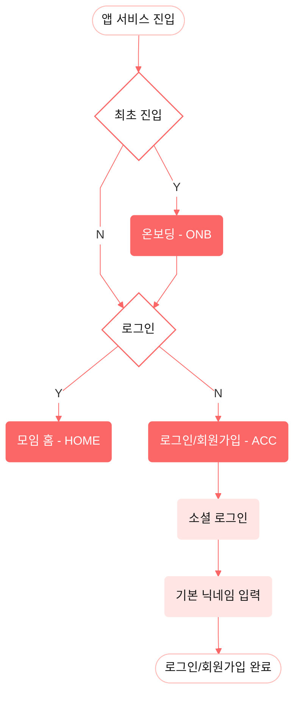

<!-- 위치 규칙: 이 문서는 user-flow-diagram 스킬의 렌더링 규약(디자인 미러)이다.
     라우트/컴포넌트/상태/API 같은 구현 뷰 요소는 범위 밖이다. -->

# render-conventions — mermaid 렌더링 규약

moyeo 유저 플로우 다이어그램의 **6개 노드 타입**·색 프리셋·레이아웃·출력 경로·신선도 헤더 규약.
색은 **Figma User Flow 전용 표현 팔레트**이며 앱 UI의 `accessible` 토큰과 별도로 관리한다.
**항상 아래 프리셋을 그대로** 쓴다. 산출물은 레포 `docs/`에 들어가는 표준 ```mermaid 코드 블록이다.

> quick render와 merge는 이 표현 규약을 공통으로 사용한다. merge의 식별자 병기·최종 문서 구조는
> [`merge-policy.md`](./merge-policy.md) §6을 따른다.

## 1. 노드 타입 6종

각 노드는 "이 노드가 화면인가, 화면 안의 동작인가, 흐름의 분기인가"로 타입을 고른다.

| 타입             | 의미 (언제 쓰나)                                                        | Mermaid 문법           | class         | fill        | Figma 표현                              |
| ---------------- | ----------------------------------------------------------------------- | ---------------------- | ------------- | ----------- | --------------------------------------- |
| **시작 / 끝**    | 플로우의 진입점·종료점 (예: `앱 서비스 진입`, `회원가입 완료`)          | `id([텍스트])` stadium | `terminal`    | `#ffffff`   | white + glow                            |
| **메인 화면**    | 서비스의 주요 화면 (예: `모임 홈`, `모임 생성`, `모임 현황`)            | `id(텍스트)` round     | `main`        | `#FB6666`   | 진한 코랄 배경·테두리 + 흰 글씨         |
| **세부 화면**    | 메인에서 파생되는 하위 화면 (예: `기본 정보 입력`, `진행상황 확인`)     | `id(텍스트)` round     | `detail`      | `#FFBBB7`   | 연한 코랄 배경·테두리                   |
| **조건부 화면**  | 특정 조건에서만 나타나는 화면 (예: `일정 정하기`, `중간지점 찾기`)      | `id(텍스트)` round     | `conditional` | `#FFBBB799` | 세부 화면색 60% + 진한 코랄 점선 테두리 |
| **화면 내 기능** | 화면 안에서 일어나는 동작·항목 (예: `내 정보 수정`, `소셜 로그인`)      | `id(텍스트)` round     | `feature`     | `#FFE6E4`   | 가장 연한 코랄 배경·테두리              |
| **분기**         | 조건에 따라 흐름이 갈리는 지점 (예: `로그인`, `모임 유형`, `참여 가능`) | `id{텍스트}` diamond   | `branch`      | `#ffffff`   | 흰 배경 + `#FB6666` 테두리              |

메인 화면의 텍스트는 `#FFFFFF`, 나머지 노드와 엣지 라벨의 텍스트는 `#171717`을 쓴다.
Figma의 분기 도형은 약 `175×85px`
사각형에 내접한 마름모지만, Mermaid는 텍스트와 렌더러에 따라 크기를 자동 계산한다. 따라서
`diamond` 형태와 색만 보존하고 정확한 픽셀 크기는 강제하지 않는다.

**타입 선택 팁**

- 이름 그 자체가 "화면"이면 `main`/`detail`, 화면 **안**의 버튼·항목·액션이면 `feature`.
- "~인가?", "유형", "가능/불가"처럼 **갈림길**이면 `branch`(diamond).
- 조건(예: 특정 모임 유형)에서만 등장하는 화면이면 `conditional`(점선).
- 플로우의 맨 처음/맨 끝 캡슐만 `terminal`.

## 2. 복사용 프리셋 (init + classDef)

flowchart 본문 **위**에 init 지시자를, **아래**에 classDef를 둔다. 방향은 세로 흐름이면
`TD`(위→아래), 컬럼이 여러 개인 큰 플로우면 `LR`도 가능하다.

```mermaid
%%{init: {'theme':'base','themeVariables':{'background':'#f7f7f7','fontFamily':'SUIT, Pretendard, sans-serif','textColor':'#171717','lineColor':'#FB6666','edgeLabelBackground':'#ffffff'}, 'flowchart':{'curve':'linear'}, 'themeCSS':'.edgeLabel,.edgeLabel p{color:#171717!important;opacity:1!important;}'}}%%
flowchart TD
  %% ── 여기에 노드/엣지를 작성 ──

  classDef terminal    fill:#ffffff,stroke:#FFBBB7,stroke-width:1px,color:#171717;
  classDef main        fill:#FB6666,stroke:#FB6666,stroke-width:1px,color:#ffffff;
  classDef detail      fill:#FFBBB7,stroke:#FFBBB7,stroke-width:1px,color:#171717;
  classDef conditional fill:#FFBBB799,stroke:#FB6666,stroke-width:1.5px,stroke-dasharray:5 3,color:#171717;
  classDef feature     fill:#FFE6E4,stroke:#FFE6E4,stroke-width:1px,color:#171717;
  classDef branch      fill:#ffffff,stroke:#FB6666,stroke-width:1.5px,color:#171717;
```

- 노드에 타입 적용은 `노드정의:::class` 또는 별도 줄 `class A,B,C main;` 둘 다 가능하다.
- `lineColor:#FB6666`으로 모든 연결선을 Figma User Flow의 진한 코랄에 맞춘다.
- `background:#f7f7f7` 로 차트 캔버스를 `neutral-20`에 고정한다. 렌더러의 라이트/다크
  테마와 무관하게 디자인 미러의 밝은 배경과 흰 노드·라벨 대비를 유지하기 위한 규칙이다.
- `textColor:#171717` 로 분기 엣지 라벨을 포함한 차트 기본 글자색을 `neutral-900`에 고정한다.
- `edgeLabelBackground:#ffffff` 로 분기 라벨(Y/N 등) 뒤의 기본 라벤더 박스를 없애고 흰 배경을
  사용한다. 라벨 배경은 연결선과 글자가 겹치는 것을 막으므로 투명하게 만들지 않는다.
- `themeCSS`의 `.edgeLabel,.edgeLabel p` 규칙으로 라벨 컨테이너와 내부 텍스트를 모두
  `neutral-900`, 불투명도로 고정한다. `textColor`만으로는 일부 렌더러의 내부 `<p>` 색상을
  덮지 못하므로 이 규칙을 생략하지 않는다.
- 글씨색은 메인 화면만 `#FFFFFF`, 나머지 노드와 라벨은 `#171717`로 고정한다.
- **연결선 곡선** `flowchart.curve:linear` 로 연결선을 반듯한 직선으로 만든다(기본값).
  문서 성격에 따라 `'curve':'step'`(직각으로 꺾이는 라우팅 — Figma 플로우 라우팅에 더 근접)으로
  바꿔도 된다. 곡선(`basis`/`bumpX`)은 시안과 어긋나므로 쓰지 않는다.

### 렌더 환경 전제 (고정된 밝은 배경)

- 이 팔레트는 **밝은 회색 배경(`neutral-20`)** 전제로 설계됐다. `background:#f7f7f7`을
  생략하지 말고, 흰 `terminal`/`branch` 노드와 흰 분기 라벨이 배경에서 구분되게 한다.
- VS Code·GitHub의 라이트/다크 테마에 따라 의미 색상이 바뀌지 않게 차트 배경과 기본 글자색을
  프리셋에서 고정한다. 별도의 다크모드 팔레트는 만들지 않는다.
- 정확한 확인은 **GitHub 라이트 모드에서 열거나, 밝은 배경으로 export**해서 본다.
- **폰트**: init의 `SUIT, Pretendard`는 **렌더 환경에 그 폰트가 로드돼 있을 때만** 적용된다.
  VS Code 프리뷰·GitHub 등에서는 대체 `sans-serif`로 보이며, 이는 정상이다.

### 드롭 섀도우(시작/끝 노드 glow) — 선택

시안의 시작/끝 노드에는 핑크 glow `box-shadow: 0px 0px 20px 8px #FFDDDACC` 가 있다.
Mermaid `classDef`는 `box-shadow`를 지원하지 않으므로, 필요하면 init에 `themeCSS`로
SVG용 `drop-shadow` 필터를 주입한다(spread 값은 필터에 없어 blur로 근사):

```
%%{init: {'theme':'base','themeVariables':{'background':'#f7f7f7','fontFamily':'SUIT, Pretendard, sans-serif','textColor':'#171717','lineColor':'#FB6666','edgeLabelBackground':'#ffffff'}, 'flowchart':{'curve':'linear'}, 'themeCSS':'.edgeLabel,.edgeLabel p{color:#171717!important;opacity:1!important;}.terminal rect{filter:drop-shadow(0 0 10px #FFDDDACC);}'}}%%
```

⚠️ `themeCSS` 필터는 mermaid-cli 등 호환 뷰어에서는 보이지만 **GitHub의 mermaid 렌더는
무시**할 수 있다. 그래서 기본 프리셋은 glow 없이도 구분되도록 `terminal`에 옅은 테두리를
둔다. glow가 꼭 필요한 문서에서만 위 `themeCSS`를 추가한다.

## 3. 작성 규칙

- **방향**: 기본 `TD`. 시안처럼 여러 시작점(진입/초대링크 등)이 병렬이면 서브그래프나 `LR`로 컬럼을 나눠도 된다.
- **분기 라벨**: diamond 에서 나가는 엣지엔 조건 라벨을 붙인다.
  - 예/아니오: `Y` / `N` (시안 표기 그대로)
  - 값 분기: `모임 유형` → `일정만`, `둘 다`, `장소만` 처럼 실제 조건 텍스트
  - 문법: `A -->|Y| B`, `A -->|장소만| C`
  - 스타일: 기본 글자색 `neutral-900`(`#171717`) + 흰 배경(`#ffffff`). 별도 임의 색이나
    투명 배경을 적용하지 않는다.
- **네이밍**: 노드 텍스트는 시안/기획의 화면·기능 이름을 그대로 쓴다(Ubiquitous Language 유지).
  화면 코드가 있으면 `모임 생성 (CRT)`처럼 괄호로 병기. (merge 모드는 식별자를 `<br/>CRT`처럼 줄바꿈 병기)
- **id 규칙**: 노드 id는 짧은 영문(예: `crt`, `home`, `login`). 텍스트는 한글 그대로.
- **하드코딩 금지 원칙 유지**: 색은 위 프리셋 밖의 임의 hex를 쓰지 않는다. 새 의미가 필요하면
  6종 안에서 고르고, 정말 없으면 사용자에게 확인한다.

### 레이아웃 규약 (여러 열 병렬 — 가장 중요)

실제 User Flow 시안은 **3열 병렬 + 열 간 교차 연결** 구조라서, 노드만 나열하면 mermaid 자동
레이아웃이 열을 섞어버려 금방 엉킨다. 큰 플로우는 다음을 지켜 "열"을 사람이 고정한다.

- **열 = `subgraph`**: 각 세로 흐름(예: 계정 진입 열 / 모임 생성 열 / 초대 참여 열)을 하나의
  `subgraph`로 묶는다. 서브그래프 제목은 그 열이 무엇인지 나타낸다.
- **방향 명시**: 최상단에 전체 방향(`flowchart LR` 또는 `TD`)을, 각 `subgraph` 안에는
  `direction TB`를 적어 열 내부 흐름 방향과 노드 순서를 고정한다. (예: 전체 `LR`로 열을 좌→우로
  놓고, 각 열은 `direction TB`로 위→아래.)
- **노드 순서 고정**: 열 안에서는 위에서 아래로 실제 화면 순서대로 노드를 **선언 순서 그대로** 둔다.
  mermaid는 선언·엣지 순서에 영향을 받으므로, 순서를 흐트러뜨리지 않는다.
- **열 간 교차 엣지 최소화**: 다른 열로 건너가는 엣지는 꼭 필요한 지점(예: `로그인/회원가입`
  → 다음 열의 `모임 참여`)에서만 만든다. 교차가 많아지면 한 장에 다 담으려 하지 말고 아래 §4로
  플로우를 쪼갠다. 불가피한 교차는 "열의 경계 노드에서만 연결"한다는 규칙을 지켜 선을 정리한다.

## 4. 스코프 분할 원칙 (한 장에 다 그리지 않기)

자동 레이아웃은 규모가 커질수록 가독성이 급격히 무너진다. 전체 유저 플로우를 한 장에 욱여넣지
말고 **서브플로우 단위로 쪼갠 여러 다이어그램**으로 만든다.

- **분할 단위**: 사용자 여정의 자연스러운 경계로 나눈다. 예) `계정 진입(온보딩·로그인/회원가입)`
  / `모임 생성(CRT)` / `초대 참여(INV)` / `모임 현황·확정(VIEW)`.
- **언제 쪼개나 (임계치)**: 아래 중 하나라도 넘으면 분할한다.
  - 병렬 **열이 3개 이상**이 되거나, 열 간 교차 엣지가 서너 개를 넘을 때
  - **노드 수 약 15개 이상**이 될 때
  - 하나의 diamond 분기가 3개 이상의 열/서브플로우로 흩어질 때
- **연결 방법**: 쪼갠 문서끼리는 각 서브플로우의 `terminal`(끝) 노드 이름을 다음 서브플로우의
  진입 노드 이름과 **동일하게** 맞춰 "이어짐"을 표현한다(예: `→ 모임 참여(INV)로 이어짐`).
  한 다이어그램 = 한 서브플로우가 기본이다.

### 출력 경로 규칙

산출물은 **디자인 시스템 문서와 같은 계층**에 둔다. 이 스킬은 디자인 미러(SoT=Figma+기획)이므로
구현 코드(`apps/web`)가 아니라 디자인 문서 옆에 사는 게 맞다.

- **기본 경로**: `docs/design-system/user-flow.md` — **단일 파일**로 시작한다.
- **폴더 승격**: 위 §4 분할로 서브플로우가 **3개 이상**이 되면 파일 하나로는 커지므로
  `docs/design-system/user-flow/` 폴더로 올리고 이렇게 나눈다.
  - `README.md` — 개요 맵(서브플로우 연결) + 각 파일 링크
  - 서브플로우별 파일 — 예: `account.md`(계정 진입) · `create.md`(모임 생성) ·
    `invite.md`(초대 참여) · `view.md`(모임 현황·확정)
  - `sources/` — merge 모드의 스냅샷(`figma.yaml` · `planning.yaml` · `mapping.yaml`).
    최종 md의 provenance이므로 함께 커밋한다([`source-schema.md`](./source-schema.md)).
- **이유는 문서에 주석으로 남긴다**: 나중에 왜 이 위치인지 헷갈리지 않도록, 산출 문서 맨 위에
  아래 주석을 넣는다.

```
<!-- 위치 규칙: 이 문서는 디자인 미러(SoT=Figma+기획)라 디자인 시스템 문서와 같은 계층(docs/design-system)에 둔다.
     구현 뷰(라우트/컴포넌트/상태/API)가 아니므로 apps/web 소스 옆이 아니다. -->
```

## 5. 출처/신선도 헤더 (필수)

**모든 다이어그램 파일(또는 mermaid 블록)의 맨 위**에 아래 헤더를 mermaid 주석(`%%`)으로 반드시
넣는다. 목적: 살아있어 보이지만 실제로는 낡은 다이어그램이 팀을 오도하는 것을 막는다.

quick render 모드(단일 출처)는 아래 base형을 쓴다. **`merge` 모드는 출처별 날짜로
확장**한다 → [`merge-policy.md`](./merge-policy.md) §7. (figma/planning 모드는 커밋되는
최종 문서를 렌더하지 않으므로 이 헤더의 대상이 아니다 — snapshot에는 `synced_at`만 둔다.)

```
%% ── 출처/신선도 (Source & Freshness) ──
%% 정본(Source of Truth): Figma User Flow — <Figma 링크 (node-id 포함)>
%% 기준 프레임(node): <node-id>   (예: 1411-13117 — 링크의 node-id= 값 그대로)
%% 마지막 동기화: <YYYY-MM-DD>
%% 생성 스킬: user-flow-diagram · 규칙 기준일 <YYYY-MM-DD>
%% ⚠ 정본은 Figma이며 이 mermaid는 위 시점의 참고본이다. 최신은 항상 Figma를 확인할 것.
```

- **버전 숫자를 지어내지 않는다.** 실제 Figma 상태와 무관한 가짜 버전(예: 임의의 `v1.2`)은
  신뢰를 깎는다. 팀에 실제 design 버전 규칙이 **없으면**, 버전 라벨 대신 **Figma node-id +
  스냅샷 날짜**로 시점을 고정한다.
- **링크**: `node-id=`가 포함된 URL을 쓰되(정확한 프레임을 가리킴), 세션 토큰(`&t=...`)은
  개인·임시값이므로 커밋 전에 제거한다.
- **날짜**: 다이어그램을 만들거나 시안과 맞춘 **그날의 절대 날짜**(YYYY-MM-DD).
- **생성 스킬 줄**: `규칙 기준일`은 스킬 규칙을 마지막으로 고친 날. 규칙이 바뀌면 이 값으로
  재생성 필요 여부를 판단한다.
- 값을 모르면 사용자에게 물어 채우고, 임시로 둘 때도 `<Figma 링크>`처럼 채울 자리를 명시적으로 남긴다.

## 6. 완성 예시 (로그인/회원가입 플로우)

시안 왼쪽 컬럼을 옮긴 예시. 이 형태를 템플릿으로 삼는다.



## 7. 렌더 체크리스트

- [ ] 출처/신선도 헤더가 블록 맨 위에 포함됐고, 가짜 버전 숫자를 넣지 않았다. (merge 모드는 출처별 날짜)
- [ ] `init`에 `flowchart.curve`가 설정됐다(기본 `linear`).
- [ ] 큰 플로우는 §4 기준으로 서브플로우로 분할했다(한 장에 욱여넣지 않음).
- [ ] 산출 경로 규칙(§4)을 지켰다: 기본 `docs/design-system/user-flow.md`, 서브플로우 3개+면 폴더 승격, 위치-이유 주석 포함.
- [ ] 여러 열은 `subgraph`로 구분하고 전체/서브그래프 방향·노드 순서를 지정했다.
- [ ] 모든 노드가 6종 타입 중 하나에 `:::class`로 배정됐다.
- [ ] 시작/끝만 `terminal`(stadium), 갈림길만 `branch`(diamond)다.
- [ ] 조건부 등장 화면은 `conditional`(점선)로 표시했다.
- [ ] 색은 프리셋 hex만 사용했다(임의 색 없음).
- [ ] 분기 엣지에 조건 라벨(`Y`/`N`/값)이 붙어 있다.
- [ ] 노드 텍스트가 기획/시안의 화면·기능 이름과 일치한다.
- [ ] `init` 지시자(background·fontFamily·textColor·lineColor·edgeLabelBackground)와 분기 라벨 `themeCSS`가 포함됐다.
