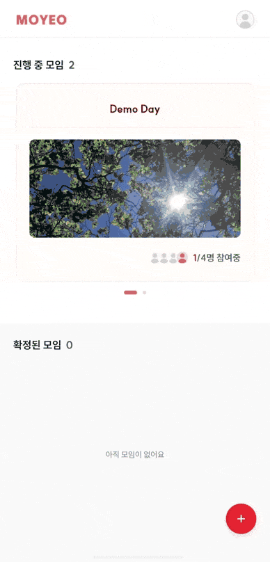
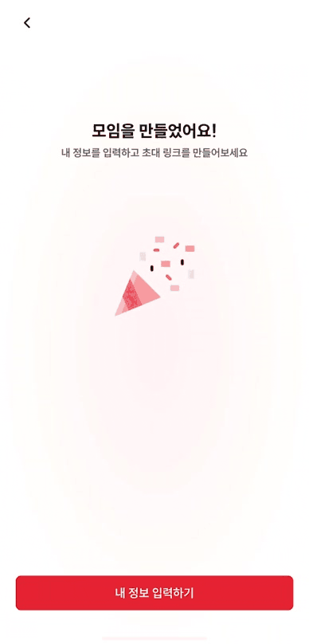
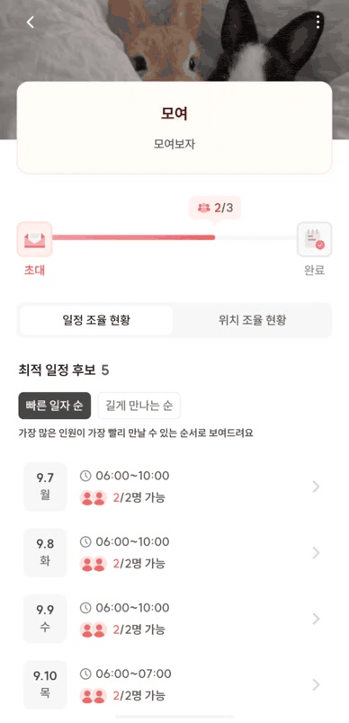
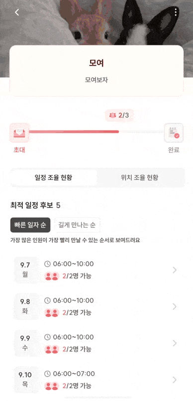

  

<h1 align="center">모여</h1>

<strong>함께 만나는 가장 쉬운 방법</strong>

  "모여"는 참여자의 가능한 일정과 출발지를 모아, 
  함께 만날 시간과 위치를 정하는 과정을 돕는 서비스입니다.

  
  
  

## About Moyeo

> **“언제 만날까?”부터 “어디서 만날까?”까지, 모임을 정하는 과정이 더 쉬워져요!**

**왜 만들었나요**

모임을 준비할 때는 각자의 가능한 일정을 맞추고, 서로 다른 출발지를 고려해 만날 곳을 정하기까지 긴 대화가 오갑니다. 모여는 흩어진 답변을 하나씩 정리하는 번거로움을 줄이고, 함께 만날 날짜 및 시간과 위치를 쉽게 정할 수 있도록 만들었습니다.

**어떻게 해결하나요**

- **응답 수집** — 초대 링크로 회원과 게스트의 가능한 일정과 출발지를 모아요.
- **일정 조율** — 참여자들의 가능한 일정을 모아 가장 많은 사람이 모일 수 있는 날을 추천해줘요.
- **위치 추천** — 참여자들의 출발지와 이동수단을 고려해 모두에게 공평한 위치를 추천해줘요.
- **모임 확정** — 모임장이 후보를 살펴보고 최적의 일정과 위치를 선택해 모임을 만들어요.

## 모여 사용 흐름

<table>
  <tr>
    <td width="42%" align="center">
      
    </td>
    <td width="58%" valign="top">

### 1. 모임 생성 — 기본 정보 입력

- 일정이나 위치만 조율할지, 둘을 함께 조율할지 선택해 모임 생성을 시작합니다.
- 모임 이름, 설명, 참여 인원 등의 기본 정보를 입력합니다.
- 일정 조율이 필요한 모임은 참여자가 선택할 수 있는 날짜 범위와 시간 범위를 설정할 수 있습니다.
- 시간 범위를 설정하지 않고 날짜만 조율하도록 할 수도 있습니다.
- 모임을 쉽게 구분할 수 있도록 커버 사진을 추가할 수 있습니다.

    </td>

  </tr>
  <tr>
    <td width="42%" align="center">
      
    </td>
    <td width="58%" valign="top">

### 2. 모임 생성 — 모임장 정보 입력

모임 생성 과정에서 모임장은 자신의 응답 정보를 입력합니다.

- 일정 조율이 포함된 모임에서는 모임장이 정한 날짜와 시간 범위 안에서 참여자들이 가능한 일정을 입력합니다.
- 위치 조율이 포함된 모임에서는 모임장이 자신의 출발지와 이용할 이동수단을 입력합니다.

    </td>
  </tr>
  <tr>
    <td width="42%" align="center">
      
    </td>
    <td width="58%" valign="top">

### 3. 모임 생성 완료 — 초대 링크 공유

- 모임이 생성되면 초대 링크를 확인할 수 있습니다.
- SMS, 카카오톡 공유 또는 링크 복사로 원하는 사람에게 모임 초대장을 보낼 수 있습니다.

    </td>

  </tr>
  <tr>
    <td width="42%" align="center">
      
    </td>
    <td width="58%" valign="top">

### 4. 모임 참여 — 회원 또는 게스트 응답

- 회원은 웹과 앱으로 모두 참여할 수 있으며, 게스트는 웹으로만 참여할 수 있습니다.
- 일정 조율이 필요한 모임에서는 가능한 날짜와 시간을, 위치 조율이 필요한 모임에서는 출발지와 이용할 이동수단을 입력합니다.
- 응답 마감 전이고 모임이 확정되기 전이라면 자신의 응답을 수정할 수 있습니다.

    </td>

  </tr>
  <tr>
    <td width="42%" align="center">
      
    </td>
    <td width="58%" valign="top">

### 5. 모임 조율 — 일정 후보와 추천 위치 확인

모여는 참여자들의 응답을 바탕으로 일정 후보와 추천 위치를 보여줍니다.

- 일정 후보는 참여 가능한 인원과 날짜·시간을 기준으로 확인할 수 있습니다.
- 날짜와 시간이 있는 모임에서는 **빠른 일자 순** 또는 **길게 만나는 순**으로 후보를 정렬할 수 있습니다.
- 날짜만 조율하는 모임에서는 **빠른 일자 순**으로 후보를 확인할 수 있습니다.
- 위치 후보는 참여자들의 출발지와 이동수단을 바탕으로 제공되며, 후보별 평균 이동 시간을 비교할 수 있습니다.

    </td>

  </tr>
  <tr>
    <td width="42%" align="center">
      
    </td>
    <td width="58%" valign="top">

### 6. 모임 확정

모임장은 추천된 일정과 위치 후보를 살펴본 뒤 모임의 일정과 위치를 확정합니다.

- 모임 유형에 따라 일정 또는 위치만 확정하거나, 두 항목을 함께 확정할 수 있습니다.

    </td>

  </tr>
  </table>

## 프로젝트 정보

### 개발 단계

| 단계 | 개발 기간               | 주요 구현 내용                                                       |
| ---- | ----------------------- | -------------------------------------------------------------------- |
| 1차  | 2026.06.27 ~ 2026.08.22 | 모임 생성, 초대 링크 공유, 일정·위치 응답, 추천 후보 확인, 모임 확정 |

### 프론트엔드 팀원

<table>
  <tr>
    <td align="center">
      <a href="https://github.com/hani0903">
         
        <b>조하은</b>
      </a>
    </td>
    <td align="center">
      <a href="https://github.com/hyeonjiroh">
         
        <b>노현지</b>
      </a>
    </td>
  </tr>
</table>

## 기술 스택과 구조

| 영역                    | 기술                                                                                                                                                                                                                                                                                                                                                                                                                                 | 역할                |
| ----------------------- | ------------------------------------------------------------------------------------------------------------------------------------------------------------------------------------------------------------------------------------------------------------------------------------------------------------------------------------------------------------------------------------------------------------------------------------ | ------------------- |
| Monorepo / Workspace    |                                                                                                                                                                                                                             | 앱·패키지 통합 관리 |
| Web Framework           |                                                                                                                                                                                                                               | 웹 화면·라우팅      |
| Mobile Framework        |                                                                                                                                                                                                                          | iOS·Android 앱      |
| Programming Language    |                                                                                                                                                                                                                                                                                                                       | 정적 타입 관리      |
| Routing                 |                                                                                                                                                                                                          | 웹·모바일 화면 이동 |
| Data Fetching / API     |                                                                                                                          | 서버 상태·API 타입  |
| State Management        |                                                                                                                                                                                                                                                                                                                                             | 클라이언트 상태     |
| Styling / UI            |                                                                                             | 스타일·공통 UI      |
| Component Documentation |                                                                                                                                                                                                                                                                                                                          | 컴포넌트 문서화     |
| Testing / Mocking       |     | 테스트·API 모킹     |
| Linting / Formatting    |                                                                                                                                                                                                                         | 코드 품질·포맷      |
| Build / Deployment      |                                                                                                                                                                                                                | 앱 빌드·배포 자동화 |
