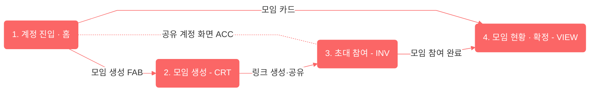

<!-- 위치 규칙: 이 문서는 디자인 미러(SoT=Figma)라 디자인 시스템 문서와 같은 계층(docs/design-system)에 둔다.
     구현 뷰(라우트/컴포넌트/상태/API)가 아니므로 apps/web 소스 옆이 아니다.
     서브플로우가 3개 이상이라 단일 파일(user-flow.md)에서 이 폴더로 승격했다(스킬 §4 출력 경로 규칙). -->

# moyeo User Flow

moyeo의 전체 유저 플로우를 `user-flow-diagram` 스킬 규약으로 옮긴 **디자인 미러(UX 뷰)** 문서.
정본은 Figma User Flow 시안이고, 각 mermaid는 특정 시점의 참고본이다.

> **⚠ 출처/신선도** — 정본(Source of Truth): **[Figma User Flow](https://www.figma.com/design/2aUk6ATnyVjjBTlhHRwsbT/CMC-19th--%EB%AA%A8%EC%97%AC-MOYEO-?node-id=2564-16578)** ·
> 기준 프레임(node): **2564-16578** · 마지막 동기화: **2026-07-21** ·
> 생성 스킬: **user-flow-diagram (규칙 기준일 2026-07-21)**
> 버전 숫자 대신 Figma node-id + 스냅샷 날짜로 시점을 고정한다(팀에 design 버전 규칙이 생기면 라벨 추가).

이 문서는 **UX 흐름**만 담는다. 라우트/컴포넌트/상태/API 같은 "구현 뷰"는 범위 밖이다(추후 별도 문서로 분리).

## 노드 범례

| 도형/색            | 타입          | 의미                                            |
| ------------------ | ------------- | ----------------------------------------------- |
| 흰 알약            | `terminal`    | 플로우 시작·종료(또는 다른 서브플로우로 이어짐) |
| 진한 코랄(흰 글씨) | `main`        | 서비스 주요 화면                                |
| 연한 코랄          | `detail`      | 메인에서 파생되는 하위 화면                     |
| 반투명 코랄 + 점선 | `conditional` | 조건에서만 나타나는 화면                        |
| 아주 연한 코랄     | `feature`     | 화면 내 동작·항목                               |
| 흰 마름모          | `branch`      | 조건 분기                                       |

색·도형 규약과 프리셋은 `.claude/skills/user-flow-diagram/SKILL.md` 참고.
직접 갱신할 때의 입력·출력과 요청 예시는
[팀원용 User Flow Diagram 스킬 사용법](../../conventions/skills/user-flow-diagram.md)을 참고한다.

## 서브플로우 구성

전체 플로우는 규모가 커서 스킬 §4 원칙대로 4개 서브플로우로 나눴다. 서브플로우 사이는
`terminal` 노드 이름을 다음 서브플로우의 진입 이름과 맞춰 이어진다.

| #   | 서브플로우              | 파일                       |
| --- | ----------------------- | -------------------------- |
| 1   | 계정 진입 · 홈          | [account.md](./account.md) |
| 2   | 모임 생성 (CRT)         | [create.md](./create.md)   |
| 3   | 초대 참여 (INV)         | [invite.md](./invite.md)   |
| 4   | 모임 현황 · 확정 (VIEW) | [view.md](./view.md)       |
