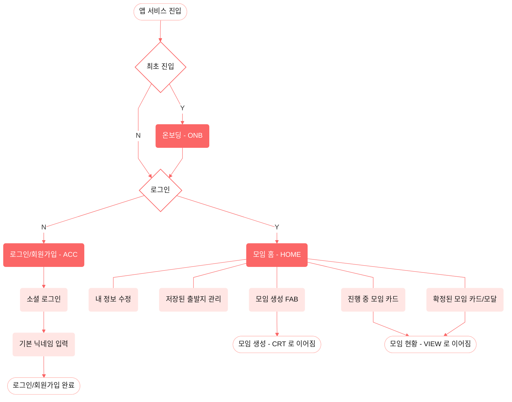

# 1. 계정 진입 · 홈

앱 진입 → 온보딩/로그인 분기 → 모임 홈(HOME) 또는 로그인/회원가입(ACC). HOME의 진입 항목에서
모임 생성(CRT)·모임 현황(VIEW)으로 이어진다. 개요·범례는 [README](./README.md) 참고.

```mermaid
%%{init: {'theme':'base','themeVariables':{'background':'#f7f7f7','fontFamily':'SUIT, Pretendard, sans-serif','textColor':'#171717','lineColor':'#FB6666','edgeLabelBackground':'#ffffff'}, 'flowchart':{'curve':'linear'}, 'themeCSS':'.edgeLabel,.edgeLabel p{color:#171717!important;opacity:1!important;}'}}%%
%% ── 출처/신선도 (Source & Freshness) ──
%% 정본(Source of Truth): Figma User Flow — https://www.figma.com/design/2aUk6ATnyVjjBTlhHRwsbT/CMC-19th--%EB%AA%A8%EC%97%AC-MOYEO-?node-id=2564-16578
%% 기준 프레임(node): 2564-16578
%% 마지막 동기화: 2026-07-21
%% 생성 스킬: user-flow-diagram · 규칙 기준일 2026-07-21
%% ⚠ 정본은 Figma이며 이 mermaid는 위 시점의 참고본이다. 최신은 항상 Figma를 확인할 것.
flowchart TD
  enter([앱 서비스 진입]):::terminal
  first{최초 진입}:::branch
  onb(온보딩 - ONB):::main
  login{로그인}:::branch
  home(모임 홈 - HOME):::main
  acc(로그인/회원가입 - ACC):::main
  social(소셜 로그인):::feature
  nick(기본 닉네임 입력):::feature
  done([로그인/회원가입 완료]):::terminal
  editme(내 정보 수정):::feature
  savedp(저장된 출발지 관리):::feature
  fab(모임 생성 FAB):::feature
  ongoing(진행 중 모임 카드):::feature
  fixed(확정된 모임 카드/모달):::feature
  toCrt([모임 생성 - CRT 로 이어짐]):::terminal
  toView([모임 현황 - VIEW 로 이어짐]):::terminal

  enter --> first
  first -->|Y| onb
  first -->|N| login
  onb --> login
  login -->|Y| home
  login -->|N| acc
  acc --> social --> nick --> done
  home --- editme
  home --- savedp
  home --- fab
  home --- ongoing
  home --- fixed
  fab --> toCrt
  ongoing --> toView
  fixed --> toView

  classDef terminal    fill:#ffffff,stroke:#FFBBB7,stroke-width:1px,color:#171717;
  classDef main        fill:#FB6666,stroke:#FB6666,stroke-width:1px,color:#ffffff;
  classDef detail      fill:#FFBBB7,stroke:#FFBBB7,stroke-width:1px,color:#171717;
  classDef conditional fill:#FFBBB799,stroke:#FB6666,stroke-width:1.5px,stroke-dasharray:5 3,color:#171717;
  classDef feature     fill:#FFE6E4,stroke:#FFE6E4,stroke-width:1px,color:#171717;
  classDef branch      fill:#ffffff,stroke:#FB6666,stroke-width:1.5px,color:#171717;
```
