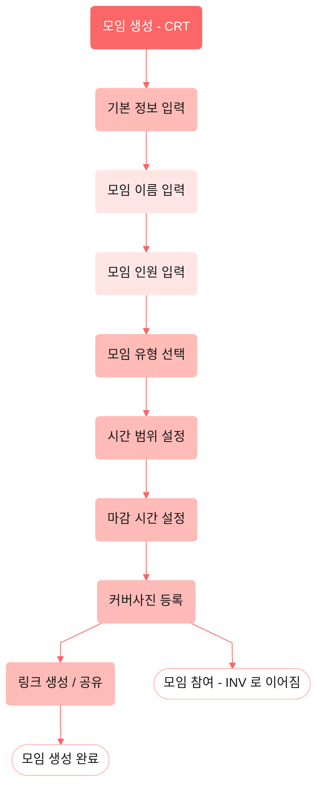

# 2. 모임 생성 (CRT)

모임 홈의 "모임 생성 FAB"에서 진입. **선형 위저드**로 기본 정보 → 유형 선택 → 시간 범위·마감 →
커버사진 → 링크 생성/공유 순으로 진행한다. 커버사진 등록 단계에서 **모임 참여(INV)로 이어지는 분기**가
있다(공유된 링크로 참여자가 진입 — [invite.md](./invite.md) 참고). 일정/위치 조율 분기는 생성이 아니라
참여(INV) 단계에 있다. 개요·범례는 [README](./README.md) 참고.

> **⚠ 반영 대기 — 역할/접근** (Figma 수정 요청됨): `모임 생성(CRT)`은 **회원 전용**이다. 커버사진 등록으로
> 모임이 생성되면 모임장도 참여자와 같은 입력 흐름(INV)에 합류하고, `링크 생성/공유`는 **모임장 전용**
> 페이지다. 이후 `이동수단 입력 → {모임장?}` 역할 게이트는 [invite.md](./invite.md)의 ⚠ 노트 참고.

