# 3. 초대 참여 (INV)

초대 링크로 진입 → 진행상황 확인 → 참여 가능/회원 분기 후 모임 참여(INV). 모임 유형
(일정만 / 위치만 / 둘 다)에 따라 일정 정보 입력·출발지 정보 입력이 조건부로 등장한다.
계정 화면(ACC)은 [account.md](./account.md)와 공유되는 화면이다. 개요·범례는 [README](./README.md) 참고.

> **⚠ 반영 대기 — 모임장/참여자 역할 게이트** (현 Figma 프레임 `2564-16578`에 없음 · Figma 수정 요청됨)
>
> `모임 참여(INV)` 입력 흐름(모임 유형 → 일정/출발지 → 이동수단)은 **모임장과 참여자가 공유**한다. 모임장은
> 회원 전용 `모임 생성(CRT)`으로 모임을 만든 뒤 이 흐름에 합류한다([create.md](./create.md)의
> `커버사진 등록 → 모임 참여(INV)` 분기). 입력을 마치면 역할로 갈린다:
> `이동수단 입력 → {모임장?}` → **Y(모임장)**: `링크 생성/공유`(모임장 전용) → `모임 생성 완료`,
> **N(참여자)**: `모임 참여 완료`.
> Figma 갱신 후 figma 모드로 재동기화하면 아래 다이어그램에 이 게이트가 들어간다(현재 mermaid는 시안 그대로라 게이트 없음).

```mermaid
%%{init: {'theme':'base','themeVariables':{'background':'#f7f7f7','fontFamily':'SUIT, Pretendard, sans-serif','textColor':'#171717','lineColor':'#FB6666','edgeLabelBackground':'#ffffff'}, 'flowchart':{'curve':'linear'}, 'themeCSS':'.edgeLabel,.edgeLabel p{color:#171717!important;opacity:1!important;}'}}%%
%% ── 출처/신선도 (Source & Freshness) ──
%% 정본(Source of Truth): Figma User Flow — https://www.figma.com/design/2aUk6ATnyVjjBTlhHRwsbT/CMC-19th--%EB%AA%A8%EC%97%AC-MOYEO-?node-id=2564-16578
%% 기준 프레임(node): 2564-16578
%% 마지막 동기화: 2026-07-21
%% 생성 스킬: user-flow-diagram · 규칙 기준일 2026-07-21
%% ⚠ 정본은 Figma이며 이 mermaid는 위 시점의 참고본이다. 최신은 항상 Figma를 확인할 것.
flowchart TD
  invEnter([초대 링크 진입]):::terminal
  linkin(링크 진입):::detail
  progress(진행상황 확인):::feature
  join(모임 참여):::feature
  canJoin{참여 가능}:::branch
  member{회원}:::branch
  guest(게스트 로그인):::feature
  acc(로그인/회원가입 - ACC):::main
  invJoin(모임 참여 - INV):::main
  type1{모임 유형}:::branch
  schedIn(일정 정보 입력):::conditional
  avail(가능 날짜/시간대 입력):::feature
  type2{모임 유형}:::branch
  depart(출발지 정보 입력):::conditional
  pStart(출발지 입력):::feature
  pMove(이동수단 입력):::feature
  invDone([모임 참여 완료]):::terminal

  invEnter --> linkin --> progress --> join --> canJoin
  canJoin -->|Y| member
  member -->|Y| acc
  member -->|N| guest
  guest --> invJoin
  acc --> invJoin
  invJoin --> type1
  type1 -->|일정만 / 둘 다| schedIn
  type1 -->|위치만| depart
  schedIn --> avail --> type2
  type2 -->|둘 다| depart
  type2 -->|일정만| invDone
  depart --> pStart --> pMove --> invDone

  classDef terminal    fill:#ffffff,stroke:#FFBBB7,stroke-width:1px,color:#171717;
  classDef main        fill:#FB6666,stroke:#FB6666,stroke-width:1px,color:#ffffff;
  classDef detail      fill:#FFBBB7,stroke:#FFBBB7,stroke-width:1px,color:#171717;
  classDef conditional fill:#FFBBB799,stroke:#FB6666,stroke-width:1.5px,stroke-dasharray:5 3,color:#171717;
  classDef feature     fill:#FFE6E4,stroke:#FFE6E4,stroke-width:1px,color:#171717;
  classDef branch      fill:#ffffff,stroke:#FB6666,stroke-width:1.5px,color:#171717;
```

