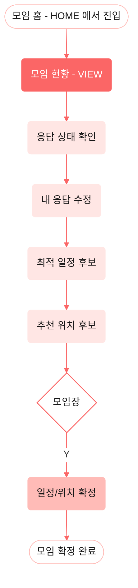

# 4. 모임 현황 · 확정 (VIEW)

모임 홈의 모임 카드(진행 중 / 확정된) 또는 모임 참여 완료 후 진입. 응답을 확인·수정하고,
모임장이면 일정/위치를 확정한다. 개요·범례는 [README](./README.md) 참고.

```mermaid
%%{init: {'theme':'base','themeVariables':{'background':'#f7f7f7','fontFamily':'SUIT, Pretendard, sans-serif','textColor':'#171717','lineColor':'#FB6666','edgeLabelBackground':'#ffffff'}, 'flowchart':{'curve':'linear'}, 'themeCSS':'.edgeLabel,.edgeLabel p{color:#171717!important;opacity:1!important;}'}}%%
%% ── 출처/신선도 (Source & Freshness) ──
%% 정본(Source of Truth): Figma User Flow — https://www.figma.com/design/2aUk6ATnyVjjBTlhHRwsbT/CMC-19th--%EB%AA%A8%EC%97%AC-MOYEO-?node-id=2564-16578
%% 기준 프레임(node): 2564-16578
%% 마지막 동기화: 2026-07-21
%% 생성 스킬: user-flow-diagram · 규칙 기준일 2026-07-21
%% ⚠ 정본은 Figma이며 이 mermaid는 위 시점의 참고본이다. 최신은 항상 Figma를 확인할 것.
flowchart TD
  fromHome([모임 홈 - HOME 에서 진입]):::terminal
  view(모임 현황 - VIEW):::main
  resp(응답 상태 확인):::feature
  editResp(내 응답 수정):::feature
  best(최적 일정 후보):::feature
  rec(추천 위치 후보):::feature
  isHost{모임장}:::branch
  confirm(일정/위치 확정):::detail
  viewDone([모임 확정 완료]):::terminal

  fromHome --> view
  view --> resp --> editResp --> best --> rec --> isHost
  isHost -->|Y| confirm --> viewDone

  classDef terminal    fill:#ffffff,stroke:#FFBBB7,stroke-width:1px,color:#171717;
  classDef main        fill:#FB6666,stroke:#FB6666,stroke-width:1px,color:#ffffff;
  classDef detail      fill:#FFBBB7,stroke:#FFBBB7,stroke-width:1px,color:#171717;
  classDef conditional fill:#FFBBB799,stroke:#FB6666,stroke-width:1.5px,stroke-dasharray:5 3,color:#171717;
  classDef feature     fill:#FFE6E4,stroke:#FFE6E4,stroke-width:1px,color:#171717;
  classDef branch      fill:#ffffff,stroke:#FB6666,stroke-width:1.5px,color:#171717;
```
