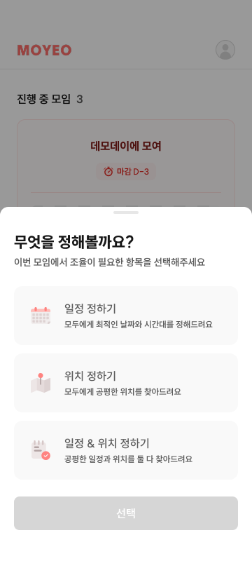
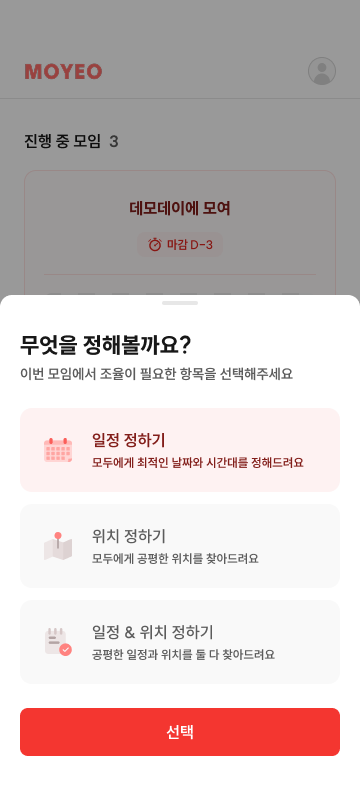

# CRT-01 모임 생성 - 모임 유형

## 1. 화면 개요

| 항목      | 내용                                           |
| --------- | ---------------------------------------------- |
| 화면 ID   | CRT-01                                         |
| 화면명    | 모임 생성 - 모임 유형                          |
| 형태      | **Drawer(바텀시트)** — 독립 라우트 없음        |
| 경로      | 없음 (HOME-01 위에 오버레이)                   |
| 진입 화면 | HOME-01 (`/home`) — 모임 생성 FAB(HOME-01-F06) |
| 다음 화면 | CRT-02 (`/meetings/new/basic`)                 |

모임에서 일정, 위치 또는 일정과 위치를 함께 조율할지 선택한다.
선택 결과(`planningType`)가 이후 모임 생성 전체의 스텝 구성을 결정하므로, **위저드에 들어가기 전에** 정한다.

> **⚠️ 기획 변경 (2026-07-27)**
>
> - 이 화면은 원래 위저드 2번째 **페이지**(구 CRT-02, `/meetings/new/type`)였으나,
>   **HOME의 FAB에서 열리는 Drawer**로 바뀌고 기본 정보 화면(구 CRT-01)과 **순서·번호가 교체**되었다.
> - 하단 버튼 문구는 `다음`이 아니라 **`선택`**이다.
> - **위저드 스텝이 아니므로 스텝 인디케이터(진행률) 분모에 포함되지 않는다.**
> - 라우트 `/meetings/new/type`은 제거한다.

## 2. 근거 자료

- 최신 기능 명세 기준일: 2026년 7월 27일
- Figma 화면:
  - [CRT-01-1.png](./CRT-01-1.png)
  - [CRT-01-2.png](./CRT-01-2.png)
  - ⚠️ 위 두 이미지는 **페이지 시안**이다. Drawer 시안으로 교체 필요(§9-1).
- 관련 화면 문서: [`home-01.md`](../../home/home-01.md) — HOME-01-F06 모임 생성 FAB / FAB Open
- 라우트:
  - [`home/page.tsx`](<../../../../apps/web/app/(protected)/home/page.tsx>)
  - [`basic/page.tsx`](<../../../../apps/web/app/(protected)/meetings/new/basic/page.tsx>)
- 생성 요청 필드:
  - [`createMeetingRequest.ts`](../../../../apps/web/src/shared/api/generated/schemas/createMeetingRequest.ts)
  - [`createMeetingRequestPlanningType.ts`](../../../../apps/web/src/shared/api/generated/schemas/createMeetingRequestPlanningType.ts)

## 3. 기능 명세

| 구분 | 기능 ID    | 기능명              | 설명                                                                                             | 참고                    | 우선순위 | 상태     | 완료 | 제외 | 수정일          |
| ---- | ---------- | ------------------- | ------------------------------------------------------------------------------------------------ | ----------------------- | -------- | -------- | ---- | ---- | --------------- |
| 회원 | CRT-01-F01 | Drawer 열기         | • HOME-01-F06(`+` FAB) 탭 시 하단에서 올라옴<br>• 배경 딤 처리, HOME 위에 오버레이               | HOME-01 FAB Open        | P0       | 작업가능 | ☐    | ☐    | 2026년 7월 27일 |
| 회원 | CRT-01-F02 | 모임 유형 선택 버튼 | • 일정 정하기<br>• 위치 정하기<br>• 일정 & 위치 정하기                                           |                         | P0       | 작업가능 | ☐    | ☐    | 2026년 7월 27일 |
| 회원 | CRT-01-F03 | 선택 버튼           | • 문구는 **`선택`**<br>• 유형 미선택 시 비활성<br>• 탭 시 **모임 생성 - 기본 정보(CRT-02)** 이동 | 구 `다음` 버튼에서 변경 | P0       | 작업가능 | ☐    | ☐    | 2026년 7월 27일 |
| 회원 | CRT-01-F04 | Drawer 닫기         | • 배경 탭 또는 아래로 스와이프<br>• HOME-01에 그대로 머물며 선택값을 저장하지 않는다             |                         | P0       | 작업가능 | ☐    | ☐    | 2026년 7월 27일 |

## 4. 라우트 및 화면 이동

| 사용자 동작               | 이동 경로             | 화면          |
| ------------------------- | --------------------- | ------------- |
| HOME-01에서 `+` FAB 탭    | (이동 없음)           | CRT-01 Drawer |
| 유형 선택 후 `선택` 탭    | `/meetings/new/basic` | CRT-02        |
| 배경 탭 / 아래로 스와이프 | (이동 없음)           | HOME-01       |

```text
/home
  └─ + FAB → [CRT-01 Drawer] 모임 유형 선택
                ├─ 선택 → /meetings/new/basic          (CRT-02 기본 정보)
                └─ 닫기 → /home                        (선택값 저장 안 함)
```

- 유형에 따른 분기는 이 화면이 아니라 **CRT-02(기본 정보) 다음**에서 갈린다.
  일정 계열 → CRT-03(시간 범위) · `PLACE_ONLY` → CRT-04(마감 시간).

## 5. 화면 입력 데이터

| 화면 선택          | 생성 요청 필드 | 저장 값              | 필수 |
| ------------------ | -------------- | -------------------- | ---- |
| 일정 정하기        | `planningType` | `SCHEDULE_ONLY`      | 필수 |
| 위치 정하기        | `planningType` | `PLACE_ONLY`         | 필수 |
| 일정 & 위치 정하기 | `planningType` | `SCHEDULE_AND_PLACE` | 필수 |

`planningType`은 세 값 중 하나만 선택할 수 있다. 이 화면에서 장소 추천 방식이나 확정 일정·장소를
추가로 선택하지 않는다.

선택값에 따른 생성 요청 범위는 다음과 같다.

| `planningType`       | 이후 생성 과정에서 필요한 정보 |
| -------------------- | ------------------------------ |
| `SCHEDULE_ONLY`      | 일정 관련 정보                 |
| `PLACE_ONLY`         | 위치 및 출발지 관련 정보       |
| `SCHEDULE_AND_PLACE` | 일정과 위치·출발지 관련 정보   |

## 6. Figma 화면

> ⚠️ 아래 두 이미지는 **페이지 시안**이다. 카드 3종의 구성·선택 강조는 그대로 유효하지만,
> 상단 프로그레스 바와 `다음` 버튼은 현재 기획과 다르다. Drawer 시안 확보 후 교체한다(§9-1).

### 선택 전



- `일정 정하기`, `위치 정하기`, `일정 & 위치 정하기` 카드가 표시된다.
- 선택된 유형이 없으며 하단 버튼은 비활성화되어 있다.

### 유형 선택



- 선택한 카드의 배경, 테두리, 아이콘과 텍스트 색상이 강조된다.
- 모임 유형을 선택하면 하단 버튼이 활성화된다.
- 첨부 이미지는 `일정 정하기`를 선택한 상태의 상세 화면이다.

## 7. 기능별 동작

### CRT-01-F01 Drawer 열기

- HOME-01의 `+` 플로팅 버튼(HOME-01-F06)을 탭하면 하단에서 Drawer가 올라온다.
- 열려 있는 동안 배경(HOME)은 딤 처리되고 스크롤되지 않는다.
- 진행률(스텝 인디케이터)을 표시하지 않는다. 이 화면은 위저드 스텝이 아니다.

### CRT-01-F02 모임 유형 선택 버튼

- 세 가지 모임 유형을 각각 선택 가능한 카드로 표시한다.
- 한 번에 하나의 유형만 선택할 수 있다.
- 카드를 탭하면 해당 유형을 선택하고 선택된 카드의 시각적 강조를 표시한다.
- 다른 카드를 탭하면 기존 선택을 해제하고 새 유형을 선택한다.
- 선택값은 다음과 같이 `planningType`에 대응한다.
  - 일정 정하기 → `SCHEDULE_ONLY`
  - 위치 정하기 → `PLACE_ONLY`
  - 일정 & 위치 정하기 → `SCHEDULE_AND_PLACE`

### CRT-01-F03 선택 버튼

- 버튼 문구는 **`선택`**이다.
- 선택된 모임 유형이 없으면 비활성화한다.
- 모임 유형을 하나 선택하면 활성화한다.
- 활성화된 버튼을 탭하면
  1. 이전 생성 시도의 draft를 초기화하고,
  2. 선택한 `planningType`을 draft에 저장한 뒤,
  3. `/meetings/new/basic`(CRT-02)으로 이동하고 Drawer를 닫는다.

### CRT-01-F04 Drawer 닫기

- 배경을 탭하거나 Drawer를 아래로 스와이프하면 닫힌다.
- 닫기만 한 경우 `planningType`을 저장하지 않으며 HOME-01에 그대로 머문다.

## 8. 검증 기준

- [ ] HOME-01에서 `+` FAB을 탭하면 모임 유형 Drawer가 열린다.
- [ ] Drawer에는 프로그레스 바가 표시되지 않는다.
- [ ] 세 가지 모임 유형 카드가 Figma와 동일한 순서로 표시된다.
- [ ] 선택된 유형이 없을 때 하단 버튼이 비활성화된다.
- [ ] 하단 버튼의 문구가 `선택`이다.
- [ ] 카드를 탭하면 해당 카드만 선택 상태로 강조된다.
- [ ] 다른 카드를 탭하면 선택값과 시각적 강조가 새 카드로 변경된다.
- [ ] `일정 정하기`가 `SCHEDULE_ONLY`에 대응한다.
- [ ] `위치 정하기`가 `PLACE_ONLY`에 대응한다.
- [ ] `일정 & 위치 정하기`가 `SCHEDULE_AND_PLACE`에 대응한다.
- [ ] 유형을 선택하면 하단 버튼이 활성화된다.
- [ ] `선택`을 탭하면 `/meetings/new/basic`(CRT-02)으로 이동하고 Drawer가 닫힌다.
- [ ] 배경을 탭하면 Drawer만 닫히고 HOME-01에 머문다.
- [ ] Drawer를 닫기만 하면 `planningType`이 저장되지 않는다.
- [ ] `/meetings/new/type`으로 접근해도 유형 선택 화면이 열리지 않는다(라우트 제거).

## 9. 확인 필요

1. **Drawer Figma 시안** — 현재 첨부는 페이지 시안이다. Drawer 높이, 핸들 유무, 타이틀 문구,
   `선택` 버튼 위치가 담긴 시안이 필요하다.
2. ~~**재진입 시 선택값 표시**~~ → **확정(2026-07-27).** CRT 플로우를 종료해 HOME으로
   돌아올 때 생성 draft를 초기화하므로, 다음에 Drawer를 열면 이전 유형이 선택되지 않은
   상태로 시작한다.
3. ~~**CRT-02에서의 뒤로가기**~~ → **확정(2026-07-27).** 생성 draft를 초기화한 뒤
   Drawer가 닫힌 HOME으로 이동한다. Drawer를 자동으로 다시 열지 않는다.
