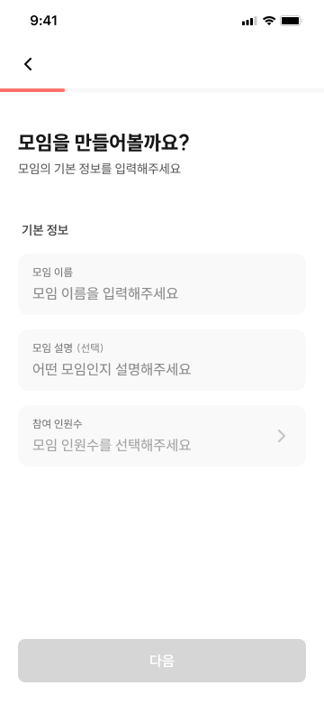
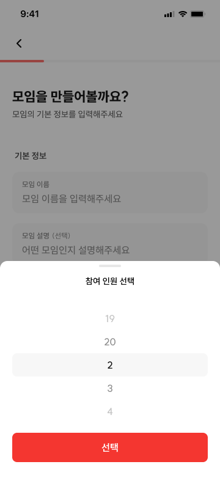
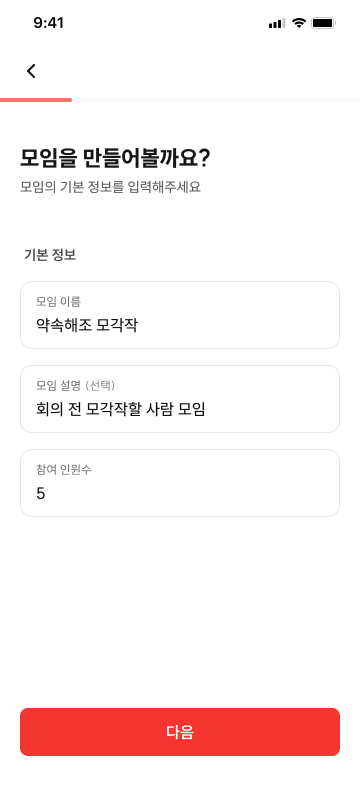

# CRT-02 모임 생성 - 기본 정보

## 1. 화면 개요

| 항목      | 내용                                                                                                        |
| --------- | ----------------------------------------------------------------------------------------------------------- |
| 화면 ID   | CRT-02                                                                                                      |
| 화면명    | 모임 생성 - 기본 정보                                                                                       |
| 경로      | `/meetings/new/basic`                                                                                       |
| 진입 화면 | CRT-01 (HOME-01의 모임 유형 Drawer)                                                                         |
| 다음 화면 | 선택 유형별 분기 — 일정 계열: CRT-03 (`/meetings/new/time-range`) · 위치: CRT-04 (`/meetings/new/deadline`) |

모임 생성 위저드의 **첫 번째 스텝**에서 모임 이름, 설명, 참여 인원수를 입력한다.

> **⚠️ 기획 변경 (2026-07-27)**
>
> - 이 화면은 원래 위저드 1번째 화면(구 CRT-01)이었고, 모임 유형 선택(구 CRT-02)이 그 다음이었다.
>   이제 **유형 선택이 앞으로 나가 HOME의 Drawer(CRT-01)가 되었고**, 두 화면의 **순서·번호가 교체**되었다.
> - 진입점이 `HOME-01`이 아니라 **CRT-01 Drawer**다. 이 화면에 도달한 시점에는 `planningType`이 이미 정해져 있다.
> - 다음 화면이 고정(구 CRT-02)이 아니라 **`planningType`에 따라 분기**한다.
> - 스텝 인디케이터 분모에서 **유형 선택은 제외**된다. 이 화면이 진행률상 1번째 스텝이다.
> - 뒤로가기를 누르면 CRT-01 Drawer를 다시 열지 않고 **닫힌 HOME으로 이동**한다. 이때 진행
>   중인 생성 draft를 초기화한다.

## 2. 근거 자료

- 최신 기능 명세 기준일: 2026년 7월 27일
- Figma 화면:
  - [CRT-02-1.png](./CRT-02-1.png)
  - [CRT-02-2.png](./CRT-02-2.png)
  - [CRT-02-3.png](./CRT-02-3.png)
- 관련 화면 문서: [`crt-01.md`](../crt-01/crt-01.md) — 진입 Drawer
- 라우트:
  - [`basic/page.tsx`](<../../../../apps/web/app/(protected)/meetings/new/basic/page.tsx>)
  - [`new/layout.tsx`](<../../../../apps/web/app/(protected)/meetings/new/layout.tsx>)
- 생성 요청 필드: [`createMeetingRequest.ts`](../../../../apps/web/src/shared/api/generated/schemas/createMeetingRequest.ts)

## 3. 기능 명세

| 구분 | 기능 ID    | 기능명          | 설명                                                                                                                                      | 참고                   | 우선순위 | 상태     | 완료 | 제외 | 수정일          |
| ---- | ---------- | --------------- | ----------------------------------------------------------------------------------------------------------------------------------------- | ---------------------- | -------- | -------- | ---- | ---- | --------------- |
| 회원 | CRT-02-F01 | 스텝 인디케이터 | • 상단 프로그레스 바<br>• **CRT-01에서 고른 모임 유형**에 따라 분모가 가변<br>• 유형 선택은 분모에 포함하지 않음<br>• 모임 생성 공통 적용 |                        | P0       | 작업가능 | ☐    | ☐    | 2026년 7월 27일 |
| 회원 | CRT-02-F02 | 모임 이름 입력  | • **필수 입력**, 최대 15자<br>• 플레이스홀더: `모임 이름을 입력해주세요`<br>• 탭 시 하단 키보드가 열리고 입력 가능                        | 글자 수 에러 처리 (§7) | P0       | 작업가능 | ☐    | ☐    | 2026년 7월 25일 |
| 회원 | CRT-02-F03 | 모임 설명 입력  | • **선택 입력**, 최대 100자<br>• 플레이스홀더: `어떤 모임인지 설명해주세요`<br>• 탭 시 하단 키보드가 열리고 입력 가능                     | 글자 수 에러 처리 (§7) | P0       | 작업가능 | ☐    | ☐    | 2026년 7월 25일 |
| 회원 | CRT-02-F04 | 모임 인원 입력  | • **필수 입력**, 인원 수 스크롤 피커<br>• 최소 2명~최대 20명, 방장 포함                                                                   |                        | P0       | 작업가능 | ☐    | ☐    | 2026년 7월 25일 |
| 회원 | CRT-02-F05 | 다음 버튼       | • **모임 이름·참여 인원이 모두 유효할 때** 활성화<br>• 일정 계열 → **시간 범위(CRT-03)**<br>• 위치 정하기 → **마감 시간(CRT-04)**         |                        | P0       | 작업가능 | ☐    | ☐    | 2026년 7월 27일 |
| 회원 | CRT-02-F06 | 뒤로가기 버튼   | • 좌상단 `<` 또는 `←` 버튼<br>• 탭 시 생성 draft 초기화<br>• Drawer가 닫힌 **홈(HOME-01)** 이동                                           | CRT 플로우 종료        | P0       | 작업가능 | ☐    | ☐    | 2026년 7월 27일 |

## 4. 라우트 및 화면 이동

| 사용자 동작                                | 이동 경로                  | 화면                  |
| ------------------------------------------ | -------------------------- | --------------------- |
| CRT-01 Drawer에서 `선택` 탭                | `/meetings/new/basic`      | CRT-02                |
| 일정 정하기 / 일정 & 위치 정하기 후 `다음` | `/meetings/new/time-range` | CRT-03                |
| 위치 정하기 후 `다음`                      | `/meetings/new/deadline`   | CRT-04                |
| 좌상단 뒤로가기 탭                         | draft 초기화 후 `/home`    | Drawer가 닫힌 HOME-01 |

```text
/home
  └─ + FAB → [CRT-01 Drawer] 유형 선택 → /meetings/new/basic
                                            ├─ 일정 / 일정&위치 → /meetings/new/time-range  (CRT-03)
                                            ├─ 위치 정하기      → /meetings/new/deadline    (CRT-04, 시간 범위 생략)
                                            └─ 뒤로가기         → draft.reset() → /home (Drawer 닫힘)
```

`위치 정하기`(`PLACE_ONLY`)는 서버 생성 요청에 시간 관련 필드를 보내지 않으므로 시간 범위(CRT-03)를 건너뛰고
마감 시간(CRT-04)으로 이동한다. `일정 정하기`·`일정 & 위치 정하기`는 CRT-03으로 이동한다.

## 5. 화면 입력 데이터

| 화면 항목   | 생성 요청 필드    | 필수     | 제약                          | 미입력 시          |
| ----------- | ----------------- | -------- | ----------------------------- | ------------------ |
| 모임 이름   | `name`            | **필수** | 1~15자 (`trim` 기준 1자 이상) | 다음 버튼 비활성화 |
| 모임 설명   | `description`     | 선택     | 최대 100자                    | 값 생략 가능       |
| 참여 인원수 | `maxParticipants` | **필수** | 2~20명, 방장 포함             | 다음 버튼 비활성화 |

이 화면에서는 위 세 값만 정한다. `planningType`은 **CRT-01 Drawer에서 이미 정해져 draft에 들어 있다.**
나머지 생성 요청 값은 이후 CRT 화면에서 정한다.

### 생성 draft 수명주기

- CRT 내부 경로(`/meetings/new/**`) 사이를 이동할 때는 draft를 유지한다.
- 새로고침, 앱 백그라운드 전환처럼 사용자가 생성 플로우를 종료하지 않은 경우에도 draft를 유지한다.
- CRT-02에서 뒤로가기를 눌러 HOME으로 이동할 때는 `planningType`을 포함한 생성 draft 전체를
  초기화한다.
- 다른 CRT 화면에서도 HOME이나 다른 기능처럼 `/meetings/new/**` 밖으로 **의도적으로
  이동하여 생성 플로우를 종료할 때** draft 전체를 초기화한다.
- 단순 컴포넌트 unmount를 reset 조건으로 사용하지 않는다. 새로고침이나 내부 라우트 이동도
  unmount를 일으킬 수 있기 때문이다.

> **필수 확정(2026-07-25):** 모임 이름·참여 인원은 필수, 모임 설명만 선택이다.
> 다음 버튼은 **이름(trim 1자 이상) + 참여 인원(2~20 선택됨)** 이 모두 충족돼야 활성화된다.
> 참여 인원 초기값은 `null`(미선택)이며 피커 최초 노출값은 2명이다 — 미선택 상태에서는 다음이 비활성이다.

화면의 `참여 인원수`는 생성 요청의 `maxParticipants`에 대응한다. Figma에 표시된 이름과 서버 필드명이
다르므로 구현 및 QA에서는 같은 값으로 취급한다.

## 6. Figma 화면

### 기본 화면



- 이름, 설명, 참여 인원수 모두 입력 전인 화면이다.
- 다음 버튼은 비활성화되어 있다.
- 참여 인원수 영역을 탭할 수 있음을 우측 꺾쇠로 표현한다.

### 참여 인원 선택



- 하단 시트에 `참여 인원 선택` 제목과 스크롤 피커가 열린다.
- 선택 가능 범위는 2명부터 20명까지다.
- `선택` 버튼을 탭하면 선택한 값을 기본 화면의 참여 인원수에 반영한다.

### 입력 완료



- 입력된 이름, 설명, 참여 인원수가 각 필드에 표시된다.
- 필수값인 모임 이름이 입력되어 다음 버튼이 활성화된다.

## 7. 기능별 동작

### CRT-02-F01 스텝 인디케이터

- 모임 생성 공통 레이아웃의 상단 앱 바 아래에 표시한다.
- CRT-01 Drawer에서 선택한 모임 유형에 따라 전체 스텝 수(분모)가 달라진다.
- **유형 선택(CRT-01)은 위저드 스텝이 아니므로 분모에 포함하지 않는다.** 이 화면이 1번째 스텝이다.
- 분모 계산 기준은 `docs/features/create-meeting-wizard/spec-fixed.md` §5-3을 따른다.

### CRT-02-F02 모임 이름 입력

- 필드를 탭하면 키보드가 열리고 텍스트를 입력할 수 있다.
- **필수 필드.** `trim()` 기준 1자 이상이어야 유효하다(공백만 입력은 무효).
- 입력 가능한 최대 길이는 15자다.
- **글자 수 에러 처리** (표시 정책 → [`input.md` §2-1](../../../design-system/components/input.md)):
  - 공백만 입력 → 테두리 `accessible-600` + 필드 아래 `모임 이름을 입력해주세요`
  - 15자 초과 입력 → 테두리 `accessible-600` + 필드 아래 `최대 15자까지 입력할 수 있어요`

### CRT-02-F03 모임 설명 입력

- 필드를 탭하면 키보드가 열리고 텍스트를 입력할 수 있다.
- **선택 필드.** 입력하지 않아도 다음 단계로 이동할 수 있다.
- 입력 가능한 최대 길이는 100자다.
- **글자 수 에러 처리** (→ [`input.md` §2-1](../../../design-system/components/input.md)):
  - 100자 초과 입력 → 테두리 `accessible-600` + 필드 아래 `최대 100자까지 입력할 수 있어요`
  - (선택 필드이므로 "공백만" 필수 에러는 적용하지 않는다.)

### CRT-02-F04 모임 인원 입력

- 참여 인원수 영역을 탭하면 하단 시트와 세로 스크롤 피커를 표시한다.
- 피커는 방장을 포함한 2~20명 중 하나를 선택할 수 있다.
- 하단 시트의 `선택` 버튼을 탭하면 값을 반영하고 시트를 닫는다.
- **필수 필드.** 인원을 선택하지 않으면(`null`) 다음 버튼이 비활성이다. 피커 최초 노출값은 2명이다.

### CRT-02-F05 다음 버튼

- **모임 이름(trim 1자 이상)과 참여 인원(2~20 선택)이 모두 유효할 때** 활성화한다.
- 둘 중 하나라도 미충족이면 비활성이다. (설명은 활성 조건에 영향 없음)
- 활성화된 버튼을 탭하면 CRT-01에서 고른 유형에 따라 이동한다.
  - `일정 정하기`·`일정 & 위치 정하기` → `/meetings/new/time-range` (CRT-03)
  - `위치 정하기` → `/meetings/new/deadline` (CRT-04, 시간 범위 화면 생략)

### CRT-02-F06 뒤로가기 버튼

- 화면 좌상단에 꺾쇠 형태의 뒤로가기 버튼을 표시한다.
- 버튼을 탭하면 생성 draft 전체를 초기화하고 `/home`으로 이동한다.
- HOME에 도착했을 때 CRT-01 Drawer는 닫혀 있다.
- 다음에 HOME의 `+` FAB을 탭하면 이전 `planningType`이 남지 않은 미선택 Drawer가 열린다.
- `router.back()`처럼 이전 history에 의존하지 않고, reset 후 HOME으로 이동하는 명시적 종료
  동작으로 처리한다.

## 8. 검증 기준

- [ ] CRT-01 Drawer에서 `선택`을 탭하면 `/meetings/new/basic`에서 CRT-02 화면이 열린다.
- [ ] 이 화면에 도달한 시점에 draft `planningType`이 이미 채워져 있다.
- [ ] 상단에 뒤로가기 버튼과 프로그레스 바가 표시된다.
- [ ] 프로그레스 바 분모에 유형 선택이 포함되지 않고, 이 화면이 1번째 스텝으로 표시된다.
- [ ] 이름 필드에 기획과 동일한 플레이스홀더가 표시된다.
- [ ] 설명 필드에 기획과 동일한 플레이스홀더가 표시된다.
- [ ] 이름이 비어 있을 때 다음 버튼이 비활성화된다.
- [ ] 1~15자의 유효한 이름을 입력하면 다음 버튼이 활성화된다.
- [ ] 이름에 15자를 초과해 입력했을 때 정해진 글자 수 에러 처리가 적용된다.
- [ ] 설명을 입력하지 않아도 다음 버튼 활성 여부에 영향을 주지 않는다.
- [ ] 설명에 100자를 초과해 입력했을 때 정해진 글자 수 에러 처리가 적용된다.
- [ ] 참여 인원수 영역을 탭하면 하단 스크롤 피커가 열린다.
- [ ] 피커에서 2명 미만 또는 20명 초과 값을 선택할 수 없다.
- [ ] 피커의 선택값이 참여 인원수 필드에 반영된다.
- [ ] `일정 정하기`·`일정 & 위치 정하기`로 진입한 경우 다음 버튼을 탭하면 `/meetings/new/time-range`로 이동한다.
- [ ] `위치 정하기`로 진입한 경우 다음 버튼을 탭하면 `/meetings/new/deadline`으로 이동한다.
- [ ] 뒤로가기 버튼을 탭하면 생성 draft의 모든 응답값이 초기화된다.
- [ ] 뒤로가기 버튼을 탭하면 Drawer가 닫힌 `/home`으로 이동한다.
- [ ] HOME에서 Drawer를 다시 열면 이전 `planningType`이 선택되어 있지 않다.
- [ ] CRT 내부의 이전·다음 이동과 새로고침에서는 draft가 초기화되지 않는다.
- [ ] 다른 화면에서도 생성 플로우를 명시적으로 종료하면 draft가 초기화된다.
- [ ] 키보드가 열린 상태에서도 현재 입력 필드와 다음 버튼에 접근할 수 있다.

## 9. 확인 필요

1. **프로그레스 바 계산 기준**
   - 유형별 전체 스텝 수(분모)와 이 화면에서 표시할 정확한 진행률을 확정해야 한다.
   - 현 구현 기준: 분모 = `created`(Bridge)와 유형 선택을 제외한 입력 스텝 수.
2. ~~**뒤로가기 시 Drawer 재노출**~~ → **확정(2026-07-27).** 생성 draft를 초기화한 뒤
   Drawer가 닫힌 HOME으로 이동한다. 다음에 Drawer를 열면 이전 선택값이 없는 상태다.
3. ~~**글자 수 에러 처리**~~ → **확정(2026-07-25).** §7 F02/F03 + [`input.md` §2-1](../../../design-system/components/input.md)
   참조. 입력 제한(maxLength)이 아니라 **에러 문구 노출** 방식: 공백만(이름)·최대치 초과(이름 15/설명 100)
   시 테두리 `accessible-600` + 필드 아래 메시지.
4. ~~**참여 인원수 미입력 표시**~~ → **확정(2026-07-25).** 참여 인원은 **필수**. 미선택(`null`)이면 다음
   비활성, 피커 최초값 2명. (기본 인원 자동 적용 없음 — 사용자가 선택해야 함)
5. ~~**공백 이름 처리**~~ → **확정(2026-07-25).** `trim()` 기준 1자 이상만 유효. 공백만 입력은 무효 +
   필수 에러 문구.
