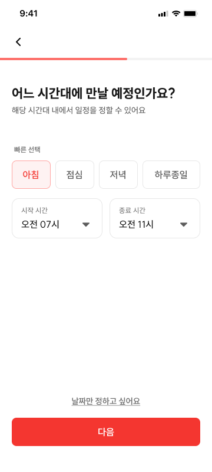

# CRT-03 모임 생성 - 시간 범위

## 1. 화면 개요

| 항목      | 내용                              |
| --------- | --------------------------------- |
| 화면 ID   | CRT-03                            |
| 화면명    | 모임 생성 - 시간 범위             |
| 경로      | `/meetings/new/time-range`        |
| 진입 화면 | CRT-02 (`/meetings/new/basic`)    |
| 다음 화면 | CRT-04 (`/meetings/new/deadline`) |

참여자에게 제시할 시간 범위를 정하거나 날짜만 조율하도록 선택한다.

## 2. 근거 자료

- 최신 기능 명세 기준일: 2026년 7월 27일
- Figma 화면:
  - [CRT-03-01.png](./CRT-03-01.png)
  - [CRT-03-2.png](./CRT-03-2.png)
- 라우트:
  - [`time-range/page.tsx`](<../../../../apps/web/app/(protected)/meetings/new/time-range/page.tsx>)
  - [`deadline/page.tsx`](<../../../../apps/web/app/(protected)/meetings/new/deadline/page.tsx>)
  - [`basic/page.tsx`](<../../../../apps/web/app/(protected)/meetings/new/basic/page.tsx>)
  - [`new/layout.tsx`](<../../../../apps/web/app/(protected)/meetings/new/layout.tsx>)
- 생성 요청 필드:
  - [`createMeetingRequest.ts`](../../../../apps/web/src/shared/api/generated/schemas/createMeetingRequest.ts)
  - [`createMeetingRequestScheduleInputType.ts`](../../../../apps/web/src/shared/api/generated/schemas/createMeetingRequestScheduleInputType.ts)

## 3. 기능 명세

| 구분 | 기능 ID    | 기능명                    | 설명                                                                                                                                    | 참고 | 우선순위 | 상태     | 완료 | 제외 | 수정일          |
| ---- | ---------- | ------------------------- | --------------------------------------------------------------------------------------------------------------------------------------- | ---- | -------- | -------- | ---- | ---- | --------------- |
| 회원 | CRT-03-F01 | 시간 범위 피커            | • 시작·종료 시간 기본값 없음<br>• 두 필드 플레이스홀더: **`시간 선택`**<br>• 종료 시간이 시작 시간보다 늦어야 함                        |      | P0       | 작업가능 | ☐    | ☐    | 2026년 7월 27일 |
| 회원 | CRT-03-F02 | 시간 빠른 선택 버튼       | • 탭 시 자동으로 피커 채움<br>◦ 아침: 6:00~12:00<br>◦ 점심: 12:00~18:00<br>◦ 저녁: 18:00~23:00<br>◦ 하루종일: 9:00~23:00                |      | P0       | 작업가능 | ☐    | ☐    | 2026년 7월 27일 |
| 회원 | CRT-03-F03 | 날짜만 정하고 싶어요 버튼 | • 탭 시 기존 시간 입력 폐기<br>• `DATE_ONLY` 저장 후 **마감 시간(CRT-04)으로 즉시 이동**<br>• CRT-04에서 돌아오면 CRT-03 초기 화면 표시 |      | P0       | 작업가능 | ☐    | ☐    | 2026년 7월 27일 |
| 회원 | CRT-03-F04 | 다음 버튼                 | • 유효한 시간 범위를 선택한 경우 탭 시 **모임 생성 - 마감 시간(CRT-04)** 이동                                                           |      | P0       | 작업가능 | ☐    | ☐    | 2026년 7월 27일 |
| 회원 | CRT-03-F05 | 뒤로가기 버튼             | • 좌상단 `<` 또는 `←` 버튼<br>• 탭 시 **모임 생성 - 기본 정보(CRT-02)** 이동                                                            |      | P0       | 작업가능 | ☐    | ☐    | 2026년 7월 19일 |

## 4. 라우트 및 화면 이동

| 사용자 동작                        | 이동 경로                                  | 화면   |
| ---------------------------------- | ------------------------------------------ | ------ |
| CRT-02에서 `다음` 탭               | `/meetings/new/time-range`                 | CRT-03 |
| 유효한 시간 범위 선택 후 `다음` 탭 | `/meetings/new/deadline`                   | CRT-04 |
| `날짜만 정하고 싶어요` 탭          | 시간 입력 폐기 후 `/meetings/new/deadline` | CRT-04 |
| 좌상단 뒤로가기 탭                 | `/meetings/new/basic`                      | CRT-02 |

```text
/meetings/new/basic
  └─ 다음 → /meetings/new/time-range
                ├─ 유효한 시간 범위 + 다음 → /meetings/new/deadline
                ├─ 날짜만 정하기 → 시간 입력 폐기 + DATE_ONLY 저장 → /meetings/new/deadline
                └─ 뒤로가기 → /meetings/new/basic
```

## 5. 화면 입력 데이터

| 화면 입력       | 생성 요청 필드       | 값·형식                                                | 적용 조건                            |
| --------------- | -------------------- | ------------------------------------------------------ | ------------------------------------ |
| 시간까지 정하기 | `scheduleInputType`  | `DATE_AND_TIME`                                        | 시간 범위를 사용하는 경우            |
| 날짜만 정하기   | `scheduleInputType`  | `DATE_ONLY`                                            | `날짜만 정하고 싶어요`를 선택한 경우 |
| 시작 시간       | `availableStartTime` | 초기 `null`, 선택 후 1시간 단위 시간 문자열            | `DATE_AND_TIME`인 경우               |
| 종료 시간       | `availableEndTime`   | 초기 `null`, 시작 시간보다 뒤인 1시간 단위 시간 문자열 | `DATE_AND_TIME`인 경우               |

`DATE_ONLY`를 선택하면 `availableStartTime`과 `availableEndTime`을 즉시 `null`로 초기화하고
생성 요청 값으로 사용하지 않는다. 빠른 선택 강조와 피커의 임시 선택값도 함께 초기화한다.
`scheduleInputType='DATE_ONLY'`는 이후 모임장 시간 입력 단계를 생략하기 위한 분기값으로 draft에
유지한다.

CRT-04에서 뒤로가 CRT-03에 재진입하면 화면은 CRT-03-1과 같은 초기 상태로 표시한다. 즉, 이전에
고른 빠른 선택이나 시작·종료 시간은 복원하지 않는다. 화면이 초기 상태처럼 보여도 내부
`scheduleInputType`은 이후 분기를 위해 `DATE_ONLY`로 유지될 수 있다. 사용자가 새 시간 범위를
선택하면 `scheduleInputType`을 `DATE_AND_TIME`으로 변경하고 새 시간값을 저장한다.

CRT-02에서 `PLACE_ONLY`를 선택한 경우에도 Orval 계약상 위 세 일정 관련 필드를 생성 요청에 포함하지 않는다.

### 빠른 선택 값

| 버튼     | 시작 시간 | 종료 시간 |
| -------- | --------- | --------- |
| 아침     | `06:00`   | `12:00`   |
| 점심     | `12:00`   | `18:00`   |
| 저녁     | `18:00`   | `23:00`   |
| 하루종일 | `09:00`   | `23:00`   |

## 6. Figma 화면

### 기본 화면


- 상단에 제목과 안내 문구, 빠른 선택 버튼, 시작·종료 시간 피커가 세로 순서로 표시된다.
- 시작·종료 시간 모두 선택 전에는 `시간 선택` 플레이스홀더를 표시한다.
- `날짜만 정하고 싶어요`는 다음 버튼 위에 별도 선택 동작으로 표시된다.
- 다음 버튼은 화면 하단에 표시된다.
- 이미지의 시작 `오전 11시`, 종료 `오후 11시`는 선택 완료 예시이며 기본값이 아니다.

### 빠른 선택



- 선택한 빠른 선택 버튼은 테두리, 배경과 텍스트 색상으로 강조된다.
- 빠른 선택 결과가 시작·종료 시간 피커에 즉시 반영된다.
- 시간 범위가 유효하면 다음 버튼이 활성화된다.
- 첨부 이미지는 `아침`을 선택한 상태지만 표시 시간이 최신 기능 명세와 다르다.

## 7. 기능별 동작

### CRT-03-F01 시간 범위 피커

- 시작 시간과 종료 시간을 각각 선택할 수 있는 피커를 표시한다.
- 시작·종료 시간의 기본값은 모두 `null`이다.
- 선택 전 두 필드에는 동일하게 `시간 선택` 플레이스홀더를 표시한다.
- 시간 선택 단위는 Orval 계약에 맞춰 1시간으로 제한한다.
- 종료 시간은 시작 시간보다 뒤여야 한다.
- 시작 시간보다 이르거나 같은 종료 시간 조합은 유효한 범위로 처리하지 않는다.
- 시작·종료 시간이 모두 선택되고 `종료 > 시작`을 만족해야 다음 버튼을 활성화할 수 있다.

### CRT-03-F02 시간 빠른 선택 버튼

- `아침`, `점심`, `저녁`, `하루종일` 순서로 표시한다.
- 버튼을 탭하면 기능 명세에 정의된 시작·종료 시간을 두 피커에 반영한다.
- 한 번에 하나의 빠른 선택 버튼만 강조한다.
- 빠른 선택 후 피커를 직접 변경했을 때의 강조 정책은 `확인 필요`에 따른다.

### CRT-03-F03 날짜만 정하고 싶어요 버튼

- 탭하면 별도의 `다음` 버튼 조작 없이 CRT-04로 즉시 이동한다.
- 이동 전에 기존 `availableStartTime`, `availableEndTime`, 빠른 선택 강조와 피커 임시값을
  초기화한다. 시간대를 설정하던 중이었더라도 해당 값은 저장하지 않는다.
- `scheduleInputType`은 이후 분기를 위해 `DATE_ONLY`로 저장한다.
- 이후 모임장 참여 과정에서는 날짜 캘린더만 표시하고 시간대 설정 화면은 표시하지 않는다.
- CRT-04에서 뒤로가기로 재진입하면 CRT-03-1과 같은 시간 미선택 초기 화면을 표시한다.
- 재진입 후 새 시간 범위를 선택하면 `DATE_AND_TIME`으로 전환하며, 폐기한 이전 시간은 복원하지 않는다.

### CRT-03-F04 다음 버튼

- 유효한 시작·종료 시간이 설정된 경우에만 활성화한다.
- 활성화된 버튼을 탭하면 `/meetings/new/deadline`으로 이동한다.
- 날짜만 정하기는 이 버튼을 사용하지 않고 CRT-03-F03에서 즉시 이동한다.

### CRT-03-F05 뒤로가기 버튼

- 화면 좌상단에 꺾쇠 형태의 뒤로가기 버튼을 표시한다.
- 버튼을 탭하면 `/meetings/new/basic`으로 이동한다.

## 8. 검증 기준

- [ ] `/meetings/new/time-range`에서 CRT-03 화면이 열린다.
- [ ] 상단에 뒤로가기 버튼과 모임 생성 공통 프로그레스 바가 표시된다.
- [ ] 빠른 선택 버튼이 `아침`, `점심`, `저녁`, `하루종일` 순서로 표시된다.
- [ ] 최초 진입 시 시작·종료 시간값이 모두 `null`이다.
- [ ] 선택 전 시작·종료 필드에 `시간 선택` 플레이스홀더가 표시된다.
- [ ] 시작·종료 시간 피커가 1시간 단위 값만 제공한다.
- [ ] 시작 시간보다 이르거나 같은 종료 시간을 유효한 범위로 확정할 수 없다.
- [ ] 아침을 선택하면 `06:00~12:00`이 피커에 반영된다.
- [ ] 점심을 선택하면 `12:00~18:00`이 피커에 반영된다.
- [ ] 저녁을 선택하면 `18:00~23:00`이 피커에 반영된다.
- [ ] 하루종일을 선택하면 `09:00~23:00`이 피커에 반영된다.
- [ ] 빠른 선택 시 선택한 버튼만 강조된다.
- [ ] 시간대를 설정하던 중 날짜만 정하기를 탭하면 기존 시작·종료 시간과 빠른 선택 상태가 초기화된다.
- [ ] 날짜만 정하기 선택값이 `DATE_ONLY`에 대응한다.
- [ ] 날짜만 정하기를 탭하면 별도의 다음 버튼 조작 없이 `/meetings/new/deadline`로 즉시 이동한다.
- [ ] CRT-04에서 뒤로가면 CRT-03-1과 같은 시간 미선택 초기 화면이 표시된다.
- [ ] CRT-03에 다시 들어왔을 때 이전 시작·종료 시간과 빠른 선택 강조가 복원되지 않는다.
- [ ] 재진입 후 시간 범위를 새로 선택하면 `DATE_AND_TIME`으로 변경된다.
- [ ] 시간을 사용하는 선택값이 `DATE_AND_TIME`에 대응한다.
- [ ] 유효한 입력이 있으면 다음 버튼이 활성화된다.
- [ ] 활성화된 다음 버튼을 탭하면 `/meetings/new/deadline`으로 이동한다.
- [ ] 뒤로가기 버튼을 탭하면 `/meetings/new/basic`으로 이동한다.

## 9. 확인 필요

1. ~~**기본 시간 불일치**~~ → **확정(2026-07-27).**
   - 시작·종료 시간에는 기본값을 두지 않는다.
   - 두 필드는 선택 전 `시간 선택` 플레이스홀더를 표시한다.
   - Figma의 `오전 11시`·`오후 11시`는 선택 완료 예시이며 초기값으로 사용하지 않는다.
2. **아침 빠른 선택 값 불일치**
   - 최신 기능 명세는 아침을 `06:00~12:00`으로 정의한다.
   - Figma 선택 화면은 `오전 7시~오전 11시`를 표시한다.
   - 이 문서는 최신 기능 명세를 기준으로 작성했으며 Figma 갱신 여부를 확인해야 한다.
3. **빠른 선택 후 직접 수정**
   - 빠른 선택으로 채운 시간을 피커에서 직접 변경할 때 선택 버튼의 강조를 해제할지 정해져 있지 않다.
4. ~~**날짜만 정하기 해제**~~ → **확정(2026-07-27).**
   - 날짜만 정하기는 토글이 아니라 CRT-04로 즉시 이동하는 동작이다.
   - 기존 시간 입력과 빠른 선택 상태는 폐기한다.
   - CRT-04에서 돌아오면 초기 화면을 표시하며 이전 시간을 복원하지 않는다.
5. **`PLACE_ONLY` 진입 처리** — ✅ 확정(2026-07-25)
   - `PLACE_ONLY`는 이 화면(CRT-03)을 **거치지 않는다.** CRT-02에서 곧바로 CRT-04(마감 시간)로 이동한다.
   - 즉 CRT-03의 진입 유형은 `SCHEDULE_ONLY`·`SCHEDULE_AND_PLACE`뿐이다. 스텝 파생·가드 처리는
     `docs/features/create-meeting-wizard/spec-fixed.md` §5-1을 따른다.
