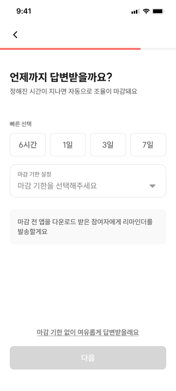
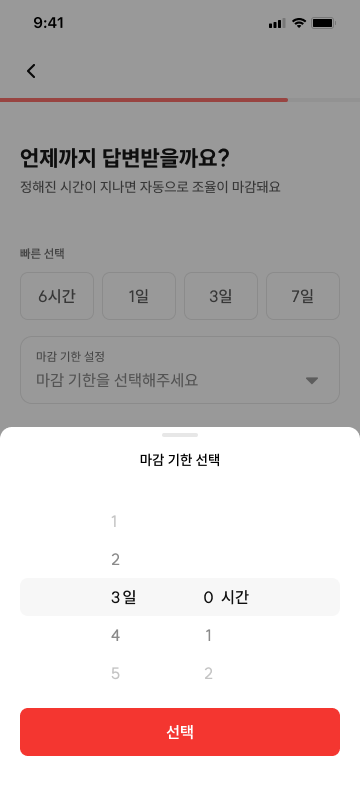
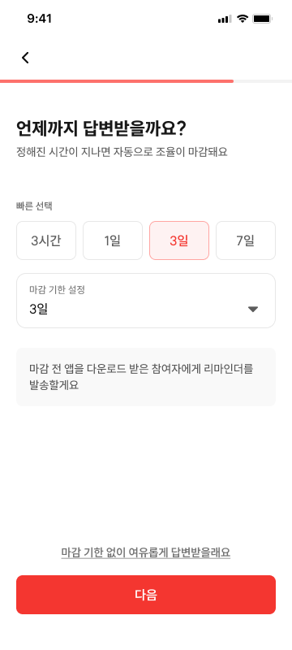

# CRT-04 모임 생성 - 마감 시간

## 1. 화면 개요

| 항목      | 내용                                                                                         |
| --------- | -------------------------------------------------------------------------------------------- |
| 화면 ID   | CRT-04                                                                                       |
| 화면명    | 모임 생성 - 마감 시간                                                                        |
| 경로      | `/meetings/new/deadline`                                                                     |
| 진입 화면 | 일정 유형: CRT-03 (`/meetings/new/time-range`) · 위치 정하기: CRT-02 (`/meetings/new/basic`) |
| 다음 화면 | CRT-06 (`/meetings/new/created`) — CRT-05는 1차 MVP 제외                                     |

참여자가 모임에 응답할 수 있는 마감 기한을 정하거나 기한 없이 응답받도록 선택한다.

## 2. 근거 자료

- 최신 기능 명세 기준일: 2026년 7월 27일
- Figma 화면:
  - [CRT-04-1.png](./CRT-04-1.png)
  - [CRT-04-2.png](./CRT-04-2.png)
  - [CRT-04-3.png](./CRT-04-3.png)
- 라우트:
  - [`deadline/page.tsx`](<../../../../apps/web/app/(protected)/meetings/new/deadline/page.tsx>)
  - [`created/page.tsx`](<../../../../apps/web/app/(protected)/meetings/new/created/page.tsx>)
  - [`time-range/page.tsx`](<../../../../apps/web/app/(protected)/meetings/new/time-range/page.tsx>)
  - [`new/layout.tsx`](<../../../../apps/web/app/(protected)/meetings/new/layout.tsx>)
- 생성 요청 필드: [`createMeetingRequest.ts`](../../../../apps/web/src/shared/api/generated/schemas/createMeetingRequest.ts)

## 3. 기능 명세

| 구분 | 기능 ID    | 기능명              | 설명                                                                                                                        | 참고                  | 우선순위 | 상태     | 완료 | 제외 | 수정일          |
| ---- | ---------- | ------------------- | --------------------------------------------------------------------------------------------------------------------------- | --------------------- | -------- | -------- | ---- | ---- | --------------- |
| 회원 | CRT-04-F01 | 마감 시간 입력      | • 일(0~7), 시간(0~23) 스크롤 피커                                                                                           |                       | P0       | 작업가능 | ☐    | ☐    | 2026년 7월 19일 |
| 회원 | CRT-04-F02 | 빠른 선택 버튼      | • 6시간/1일/3일/7일 탭 시 피커 자동 세팅<br>• 서버에서 시간 전송                                                            |                       | P0       | 작업가능 | ☐    | ☐    | 2026년 7월 19일 |
| 회원 | CRT-04-F03 | 마감 기한 없이 버튼 | • 탭 시 기존 마감 입력 폐기<br>• `noDeadline=true` 저장 후 **CRT-06으로 즉시 이동**<br>• CRT-06에서 돌아오면 초기 화면 표시 |                       | P0       | 작업가능 | ☐    | ☐    | 2026년 7월 27일 |
| 회원 | CRT-04-F04 | 다음 버튼           | • 유효한 마감 시간을 입력한 경우 활성화<br>• 탭 시 **모임 기본 정보 입력 완료(CRT-06)** 이동<br>• CRT-05는 1차 MVP 제외     | 네트워크 오류 시 정책 | P0       | 작업가능 | ☐    | ☐    | 2026년 7월 27일 |
| 회원 | CRT-04-F05 | 뒤로가기 버튼       | • 좌상단 `<` 또는 `←` 버튼<br>• 일정 유형: **시간 범위(CRT-03)** 이동<br>• 위치 정하기: **기본 정보(CRT-02)** 이동          |                       | P0       | 작업가능 | ☐    | ☐    | 2026년 7월 25일 |

## 4. 라우트 및 화면 이동

| 사용자 동작                               | 이동 경로                                                           | 화면            |
| ----------------------------------------- | ------------------------------------------------------------------- | --------------- |
| CRT-03에서 `다음` 탭 (일정 유형)          | `/meetings/new/deadline`                                            | CRT-04          |
| CRT-02에서 `다음` 탭 (위치 정하기)        | `/meetings/new/deadline`                                            | CRT-04          |
| 유효한 마감 시간을 선택하고 `다음` 탭     | `/meetings/new/created`                                             | CRT-06          |
| `마감 기한 없이 여유롭게 답변받을래요` 탭 | 기존 마감값 폐기 후 `/meetings/new/created`                         | CRT-06          |
| 좌상단 뒤로가기 탭                        | 일정 유형: `/meetings/new/time-range` · 위치: `/meetings/new/basic` | CRT-03 / CRT-02 |

```text
(일정 / 일정&위치)                         (위치 정하기 = PLACE_ONLY)
/meetings/new/time-range                   /meetings/new/basic
  └─ 다음 → /meetings/new/deadline           └─ 다음 → /meetings/new/deadline
                ├─ 유효한 마감 시간 + 다음 → /meetings/new/created
                ├─ 마감 기한 없이 → 마감값 폐기 + noDeadline 저장 → /meetings/new/created
                └─ 뒤로가기 → 진입한 화면(time-range 또는 basic)
```

CRT-04는 두 경로에서 진입한다. `위치 정하기`(`PLACE_ONLY`)는 CRT-03을 건너뛰고 CRT-02에서 직접 진입하므로,
뒤로가기 목적지는 진입 경로에 따라 달라진다(일정 유형 → CRT-03, 위치 → CRT-02).
CRT-05는 1차 MVP에서 제외하므로 CRT-04에서 CRT-06으로 직접 이동한다.

## 5. 화면 입력 데이터

| 화면 입력      | 생성 요청 필드    | 변환 값                      | 계약상 유효 여부        |
| -------------- | ----------------- | ---------------------------- | ----------------------- |
| 일·시간 피커   | `deadlineMinutes` | `(일 × 1,440) + (시간 × 60)` | 10~4,320분만 유효       |
| 6시간          | `deadlineMinutes` | `360`                        | 유효                    |
| 1일            | `deadlineMinutes` | `1,440`                      | 유효                    |
| 3일            | `deadlineMinutes` | `4,320`                      | 유효한 최댓값           |
| 7일            | `deadlineMinutes` | `10,080`                     | 현재 계약의 최댓값 초과 |
| 마감 기한 없이 | `deadlineMinutes` | `null`(값 생략)              | 유효                    |
| 마감 기한 없이 | `noDeadline`      | `true`                       | 유효                    |

Orval 생성 계약에서 `deadlineMinutes`는 생성 요청 처리 시점부터 마감까지 남은 상대 시간이다.
10분 단위, 최소 10분, 최대 4,320분(72시간)이며 이 화면은 시간 단위로 입력하므로 60분 단위 값으로
변환한다.

`마감 기한 없이`를 선택하면 기존 `deadlineMinutes`를 즉시 `null`로 초기화하고 빠른 선택 강조와
피커 임시값도 폐기한다. `noDeadline=true`는 마감을 선택하지 않은 미완성 상태와 의도적으로
기한 없이 선택한 상태를 구분하기 위해 draft에 유지한다.

CRT-06에서 뒤로가 CRT-04에 재진입하면 CRT-04-1과 같은 초기 화면을 표시한다. 이전에 선택한
마감 시간이나 빠른 선택 강조는 복원하지 않는다. 화면은 초기 상태처럼 보여도 내부
`noDeadline=true`는 분기값으로 유지될 수 있다. 사용자가 새 마감 시간을 선택하면
`noDeadline=false`로 변경하고 새 `deadlineMinutes`를 저장한다.

기획 피커의 전체 범위는 다음과 같다.

| 피커        | 기획 범위  | 생성 요청 환산 |
| ----------- | ---------- | -------------- |
| 일          | 0~7일      | 0~10,080분     |
| 시간        | 0~23시간   | 0~1,380분      |
| 조합 최댓값 | 7일 23시간 | 11,460분       |

현재 생성 요청의 최댓값은 4,320분이므로 3일을 초과하는 피커 값과 `7일` 빠른 선택은 그대로 전송할 수
없다.

## 6. Figma 화면

### 기본 화면



- 빠른 선택, 마감 기한 설정 영역, 리마인더 안내, 기한 없이 선택, 다음 버튼 순서로 표시된다.
- 마감 기한을 선택하지 않은 상태에서는 다음 버튼이 비활성화되어 있다.
- 마감 기한 설정 영역을 탭할 수 있음을 우측 꺾쇠로 표현한다.

### 마감 기한 피커



- 하단 시트에 `마감 기한 선택` 제목과 일·시간 스크롤 피커가 표시된다.
- `선택` 버튼을 탭하면 선택값을 기본 화면에 반영한다.
- 첨부 이미지는 `3일 0시간`을 선택한 상태다.

### 빠른 선택 완료



- 선택한 빠른 선택 버튼과 마감 기한 설정값을 함께 갱신한다.
- 유효한 마감 기한이 설정되면 다음 버튼이 활성화된다.
- 첨부 이미지의 첫 번째 프리셋은 `3시간`으로 표시되어 최신 기능 명세와 차이가 있다.

## 7. 기능별 동작

### CRT-04-F01 마감 시간 입력

- 마감 기한 설정 영역을 탭하면 하단 시트와 일·시간 스크롤 피커를 표시한다.
- 기획 기준으로 일은 0~7, 시간은 0~23 중 선택할 수 있다.
- 하단 시트의 `선택` 버튼을 탭하면 값을 반영하고 시트를 닫는다.
- `0일 0시간`은 Orval 최소값보다 작으므로 유효한 마감 시간으로 처리하지 않는다.
- 3일을 초과하는 값은 현재 Orval 계약과 충돌하므로 `확인 필요` 결정 전 구현을 확정하지 않는다.

### CRT-04-F02 빠른 선택 버튼

- `6시간`, `1일`, `3일`, `7일` 순서로 표시한다.
- 버튼을 탭하면 대응하는 일·시간 값을 마감 기한 설정 영역에 반영한다.
- 선택한 버튼만 시각적으로 강조한다.
- `7일`은 현재 Orval 계약의 최댓값을 초과하므로 `확인 필요` 결정 전 전송 가능한 값으로 처리하지
  않는다.

### CRT-04-F03 마감 기한 없이 버튼

- 탭하면 별도의 `다음` 버튼 조작 없이 CRT-06으로 즉시 이동한다.
- 이동 전에 기존 `deadlineMinutes`, 빠른 선택 강조와 피커 임시값을 초기화한다.
- `noDeadline=true`를 draft에 저장하고 생성 요청에서는 `deadlineMinutes`를 생략한다.
- CRT-06에서 뒤로가기로 재진입하면 CRT-04-1과 같은 마감 미선택 초기 화면을 표시한다.
- 재진입 후 새 마감 시간을 선택하면 `noDeadline=false`로 전환하며 폐기한 값은 복원하지 않는다.

### CRT-04-F04 다음 버튼

- 유효한 마감 시간을 입력한 경우에만 활성화한다.
- 활성화된 버튼을 탭하면 `/meetings/new/created`로 이동한다.
- 마감 기한 없이는 이 버튼을 사용하지 않고 CRT-04-F03에서 즉시 이동한다.
- 현재 라우트 골격상 이 버튼은 생성 요청을 보내지 않고 다음 화면으로 이동한다.

### CRT-04-F05 뒤로가기 버튼

- 화면 좌상단에 꺾쇠 형태의 뒤로가기 버튼을 표시한다.
- 버튼을 탭하면 진입한 화면으로 이동한다.
  - 일정 정하기·일정 & 위치 정하기 → `/meetings/new/time-range` (CRT-03)
  - 위치 정하기(`PLACE_ONLY`) → `/meetings/new/basic` (CRT-02)

## 8. 검증 기준

- [ ] `/meetings/new/deadline`에서 CRT-04 화면이 열린다.
- [ ] 상단에 뒤로가기 버튼과 모임 생성 공통 프로그레스 바가 표시된다.
- [ ] 빠른 선택 버튼이 `6시간`, `1일`, `3일`, `7일` 순서로 표시된다.
- [ ] 마감 기한 설정 영역을 탭하면 하단 일·시간 피커가 열린다.
- [ ] 일 피커에서 0~7, 시간 피커에서 0~23을 선택할 수 있다.
- [ ] `0일 0시간`에서 다음 버튼이 활성화되지 않는다.
- [ ] 6시간이 `deadlineMinutes: 360`에 대응한다.
- [ ] 1일이 `deadlineMinutes: 1440`에 대응한다.
- [ ] 3일이 `deadlineMinutes: 4320`에 대응한다.
- [ ] 피커 또는 빠른 선택값이 마감 기한 설정 영역에 반영된다.
- [ ] 마감 시간을 설정하던 중 마감 기한 없음을 탭하면 기존 마감값과 빠른 선택 상태가 초기화된다.
- [ ] 마감 기한 없이가 생성 요청의 `deadlineMinutes` 생략에 대응한다.
- [ ] 마감 기한 없이를 탭하면 `noDeadline=true`가 저장된다.
- [ ] 마감 기한 없이를 탭하면 별도의 다음 버튼 조작 없이 `/meetings/new/created`로 즉시 이동한다.
- [ ] CRT-06에서 뒤로가면 CRT-04-1과 같은 마감 미선택 초기 화면이 표시된다.
- [ ] 재진입 시 이전 마감 시간과 빠른 선택 강조가 복원되지 않는다.
- [ ] 유효한 마감 시간을 선택하면 다음 버튼이 활성화된다.
- [ ] 활성화된 다음 버튼을 탭하면 `/meetings/new/created`로 이동한다.
- [ ] 일정 유형으로 진입한 경우 뒤로가기 버튼을 탭하면 `/meetings/new/time-range`(CRT-03)로 이동한다.
- [ ] 위치 정하기로 진입한 경우 뒤로가기 버튼을 탭하면 `/meetings/new/basic`(CRT-02)로 이동한다.

## 9. 확인 필요

1. **기획 범위와 생성 요청 최댓값 충돌**
   - 기획은 최대 `7일 23시간`과 `7일` 빠른 선택을 요구한다.
   - 현재 Orval 계약은 최대 4,320분, 즉 3일까지만 허용한다.
   - 서버 최댓값을 11,460분 이상으로 확장할지, 화면 범위와 프리셋을 최대 3일로 줄일지 결정해야 한다.
   - 결정 전에는 3일 초과 값을 정상 제출 가능한 기능으로 확정할 수 없다.
2. **첫 번째 빠른 선택 값 불일치**
   - 최신 기능 명세와 Figma 기본 화면은 첫 번째 빠른 선택을 `6시간`으로 표시한다.
   - Figma 선택 완료 화면은 같은 위치에 `3시간`을 표시한다.
   - 이 문서는 최신 기능 명세의 `6시간`을 기준으로 작성했으며 선택 완료 이미지의 갱신 여부를 확인해야
     한다.
3. **빠른 선택 후 피커 수정**
   - 빠른 선택값을 피커에서 직접 변경할 때 버튼 강조를 해제할지 정해져 있지 않다.
4. ~~**마감 기한 없이 해제**~~ → **확정(2026-07-27).**
   - 마감 기한 없이는 토글이 아니라 CRT-06으로 즉시 이동하는 동작이다.
   - 기존 마감 시간과 빠른 선택 상태는 폐기한다.
   - CRT-06에서 돌아오면 초기 화면을 표시하며 이전 값을 복원하지 않는다.
5. **리마인더 안내 정책**
   - Figma에는 `마감 전 앱을 다운로드 받은 참여자에게 리마인더를 발송할게요`라는 안내가 표시된다.
   - 실제 알림 대상, 발송 시점과 발송 조건은 최신 기능 명세에 없다.
6. **네트워크 오류 정책 적용 시점**
   - 기능 명세는 다음 버튼 참고란에 네트워크 오류 정책을 기록한다.
   - 현재 1차 MVP 흐름에서 CRT-04 다음 버튼은 CRT-05를 건너뛰고 CRT-06으로 이동하며 생성
     요청은 아직 보내지 않는다.
   - 이 참고가 최종 모임 생성 요청의 오류 정책인지 CRT-04 이동 시 별도 요청을 요구하는지 확인해야 한다.
