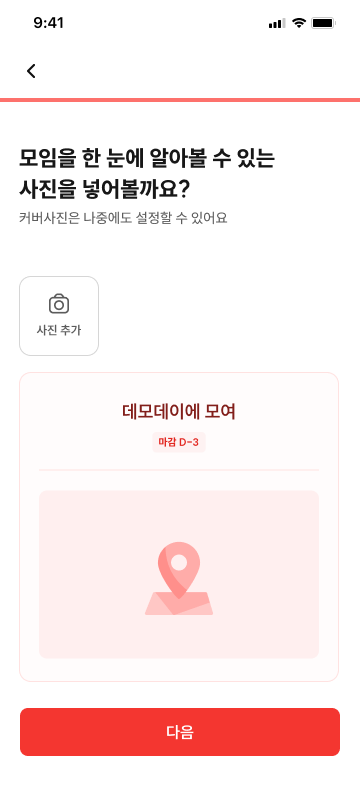
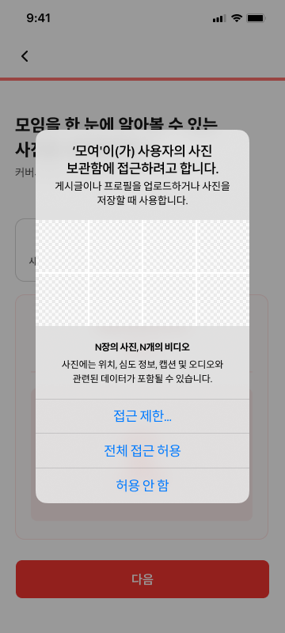
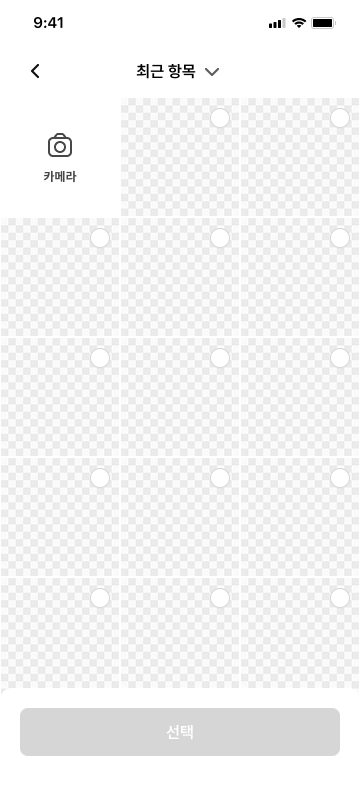
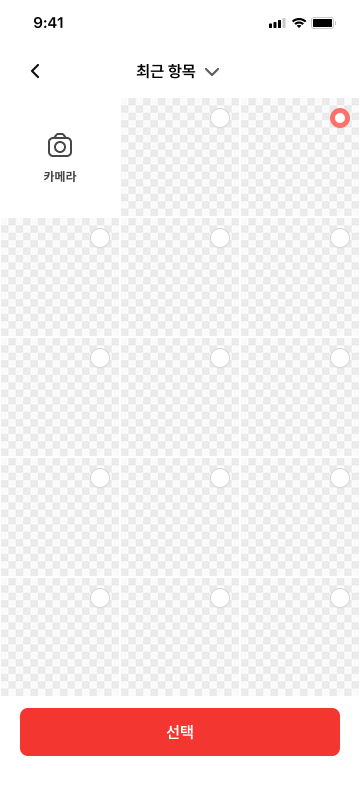
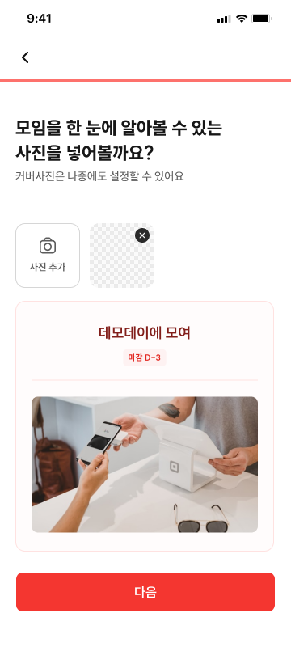

# CRT-05 모임 생성 - 커버사진 등록

> ⚠️ **1차 MVP 개발 제외(2026-07-27)**
>
> 커버사진 등록은 1차 MVP 구현 범위에서 제외한다. 화면 명세와 Figma 자료는 후속 개발을 위해
> 유지하지만, 현재 생성 흐름은 CRT-04에서 CRT-05를 건너뛰고 CRT-06으로 이동한다.
> `/meetings/new/cover`는 1차 MVP의 정상 생성 흐름에서 진입하지 않으며 Progress 분모에도
> 포함하지 않는다.

## 1. 화면 개요

| 항목      | 내용                              |
| --------- | --------------------------------- |
| 화면 ID   | CRT-05                            |
| 화면명    | 모임 생성 - 커버사진 등록         |
| 경로      | `/meetings/new/cover`             |
| 진입 화면 | CRT-04 (`/meetings/new/deadline`) |
| 다음 화면 | CRT-06 (`/meetings/new/created`)  |
| MVP 상태  | **1차 MVP 제외 · 후속 개발**      |

선택한 커버사진이 적용된 모임 카드 예시를 확인하고 생성 완료 화면으로 이동한다.

## 2. 근거 자료

- 최신 기능 명세 기준일: 2026년 7월 19일
- 제출 시점 수정: 2026년 7월 24일
- Figma 화면:
  - [CRT-05-1.png](./CRT-05-1.png)
  - [CRT-05-2.png](./CRT-05-2.png)
  - [CRT-05-3.png](./CRT-05-3.png)
  - [CRT-05-4.png](./CRT-05-4.png)
  - [CRT-05-5.png](./CRT-05-5.png)
- 라우트:
  - [`cover/page.tsx`](<../../../../apps/web/app/(protected)/meetings/new/cover/page.tsx>)
  - [`created/page.tsx`](<../../../../apps/web/app/(protected)/meetings/new/created/page.tsx>)
  - [`deadline/page.tsx`](<../../../../apps/web/app/(protected)/meetings/new/deadline/page.tsx>)
  - [`new/layout.tsx`](<../../../../apps/web/app/(protected)/meetings/new/layout.tsx>)
- 생성 요청 필드:
  - [`createMeetingWithCoverBodyTwo.ts`](../../../../apps/web/src/shared/api/generated/schemas/createMeetingWithCoverBodyTwo.ts)

## 3. 기능 명세

| 구분 | 기능 ID    | 기능명              | 설명                                                                                    | 참고                           | 우선순위 | 상태      | 완료 | 제외 | 수정일          |
| ---- | ---------- | ------------------- | --------------------------------------------------------------------------------------- | ------------------------------ | -------- | --------- | ---- | ---- | --------------- |
| 회원 | CRT-05-F01 | 사진 등록 버튼      | • 탭 시 사진 앨범으로 이동<br>• 최초 진입 시 사용 권한 여부 팝업                        | 이용약관 및 개인정보 동의 정책 | P0       | 후속 개발 | ☐    | ☑    | 2026년 7월 27일 |
| 회원 | CRT-05-F02 | 모임 홈 썸네일 예시 | • 모임 이름, 모임 설명, 커버사진이 적용된 썸네일 예시 표시<br>• 모임 홈의 썸네일과 동일 |                                | P0       | 후속 개발 | ☐    | ☑    | 2026년 7월 27일 |
| 회원 | CRT-05-F03 | 다음 버튼           | • 항상 활성화<br>• 탭 시 서버 요청 없이 **모임 생성 - 생성 완료(CRT-06)** 이동          | 제출 시점 수정                 | P0       | 후속 개발 | ☐    | ☑    | 2026년 7월 27일 |
| 회원 | CRT-05-F04 | 뒤로가기 버튼       | • 탭 시 **모임 생성 - 마감 시간(CRT-04)** 이동                                          |                                | P0       | 후속 개발 | ☐    | ☑    | 2026년 7월 27일 |

## 4. 라우트 및 화면 이동

아래는 **후속 개발에서 CRT-05를 다시 활성화할 때의 목표 흐름**이다. 1차 MVP에서는 적용하지
않으며 `CRT-04 → CRT-06`으로 직접 이동한다.

| 사용자 동작          | 이동 경로                | 화면   |
| -------------------- | ------------------------ | ------ |
| CRT-04에서 `다음` 탭 | `/meetings/new/cover`    | CRT-05 |
| `다음` 탭            | `/meetings/new/created`  | CRT-06 |
| 좌상단 뒤로가기 탭   | `/meetings/new/deadline` | CRT-04 |

```text
/meetings/new/deadline
  └─ 다음 → /meetings/new/cover
                ├─ 다음 → /meetings/new/created
                └─ 뒤로가기 → /meetings/new/deadline
```

## 5. 화면 입력 데이터

### 이 화면에서 선택하는 값

| 화면 입력 | 최종 생성 요청 필드 | 필수 | 제약               |
| --------- | ------------------- | ---- | ------------------ |
| 커버사진  | `coverImage`        | 선택 | JPEG 또는 PNG 파일 |

사진을 선택하면 모임 카드 예시에 즉시 반영하고 이후 최종 모임 생성 요청에서 `coverImage`로 사용한다.
사진을 선택하지 않으면 최종 생성 요청에서 `coverImage`를 생략한다. CRT-05의 다음 버튼을 탭하는
시점에는 서버로 전송하지 않는다.

## 6. Figma 화면

### 기본 화면



- 사진 추가 버튼과 모임 홈 카드 예시가 표시된다.
- 사진은 선택 입력이므로 다음 버튼은 사진 등록 전에도 활성화되어 있다.
- 카드 예시에는 모임 이름, 마감 정보와 기본 커버 이미지가 표시된다.

### 사진 접근 권한



- 최초 사진 접근 시 운영체제의 사진 보관함 권한 팝업이 표시된다.
- 사용자는 제한된 접근, 전체 접근 허용 또는 허용 안 함 중 하나를 선택할 수 있다.
- 팝업의 실제 문구와 선택지는 운영체제 버전에 따라 달라질 수 있다.

### 사진 선택



- 최근 항목의 사진 목록과 카메라 진입 항목이 표시된다.
- 사진을 선택하기 전에는 선택 버튼이 비활성화되어 있다.

### 사진 선택 완료



- 선택한 사진에 선택 표시를 적용한다.
- 사진을 선택하면 선택 버튼이 활성화된다.

### 커버사진 적용



- 선택한 사진의 작은 미리보기와 삭제 버튼을 사진 추가 버튼 옆에 표시한다.
- 모임 홈 카드 예시의 커버 영역에도 같은 사진을 반영한다.
- 다음 버튼은 계속 활성화되어 있다.

## 7. 기능별 동작

### CRT-05-F01 사진 등록 버튼

- 사진 추가 버튼을 탭하면 기기의 사진 선택 화면을 연다.
- 최초 접근에서는 운영체제 사진 접근 권한을 요청한다.
- 사진 한 장을 선택하면 작은 미리보기와 모임 카드 예시에 반영한다.
- 선택한 사진의 삭제 버튼을 탭하면 사진을 제거하고 기본 커버 예시로 되돌린다.
- 권한 거부, 사진 선택 취소 및 카메라 지원 범위는 `확인 필요`에 따른다.

### CRT-05-F02 모임 홈 썸네일 예시

- 실제 모임 홈 카드와 같은 구조로 미리보기를 표시한다.
- CRT-02에서 입력한 모임 이름과 설명, CRT-05에서 선택한 커버사진을 반영한다.
- 사진이 없으면 기본 커버 이미지를 표시한다.
- Figma에서 설명 노출 여부가 확인되지 않으므로 정확한 카드 정보는 `확인 필요`에 따른다.

### CRT-05-F03 다음 버튼

- 커버사진 선택 여부와 관계없이 항상 활성화한다.
- 탭하면 서버 요청 없이 `/meetings/new/created`로 이동한다.
- 선택한 커버사진은 이후 최종 모임 생성 시 사용할 값으로 유지한다.

### CRT-05-F04 뒤로가기 버튼

- 화면 좌상단에 꺾쇠 형태의 뒤로가기 버튼을 표시한다.
- 버튼을 탭하면 `/meetings/new/deadline`으로 이동한다.

## 8. 검증 기준

- [ ] `/meetings/new/cover`에서 CRT-05 화면이 열린다.
- [ ] 상단에 뒤로가기 버튼과 모임 생성 공통 프로그레스 바가 표시된다.
- [ ] 사진을 등록하지 않아도 다음 버튼이 활성화되어 있다.
- [ ] 최초 사진 접근 시 운영체제의 사진 권한 요청이 표시된다.
- [ ] 사진 한 장을 선택할 수 있다.
- [ ] 선택한 사진이 작은 미리보기와 모임 홈 카드 예시에 반영된다.
- [ ] 사진 삭제 시 미리보기에서 제거되고 기본 커버 예시로 돌아간다.
- [ ] 모임 홈 카드 예시에 CRT-02의 모임 이름과 설명이 반영된다.
- [ ] 다음 버튼을 탭해도 서버 생성 요청이 발생하지 않는다.
- [ ] 사진을 선택하지 않은 경우 이후 최종 생성 요청에서 `coverImage`를 생략할 수 있다.
- [ ] 사진을 선택한 경우 이후 최종 생성 요청에서 사용할 JPEG 또는 PNG 파일이 유지된다.
- [ ] 다음 버튼을 탭하면 `/meetings/new/created`로 이동한다.
- [ ] 뒤로가기 버튼을 탭하면 `/meetings/new/deadline`으로 이동한다.

## 9. 확인 필요

1. **최종 모임 생성 시점**
   - CRT-05에서는 서버 요청을 하지 않는 것으로 확정했다.
   - CRT-05에서 선택한 `coverImage`를 포함해 누적된 모임 정보를 실제로 제출하는 후속 화면을 CRT-06
     이후 흐름에서 명시해야 한다.
2. **사진 권한 거부 및 제한 접근**
   - 권한을 거부했을 때 설정 이동을 안내할지, 사진 없이 계속 진행하도록만 할지 정해져 있지 않다.
   - 제한 접근 권한에서 추가 사진 선택을 요청하는 방식도 확인이 필요하다.
3. **카메라 지원 범위**
   - 최신 기능 명세는 사진 앨범 이동만 명시하지만 Figma 사진 선택 화면에는 카메라 항목이 있다.
   - 카메라 촬영을 CRT-05 기능 범위에 포함할지 확정해야 한다.
4. **이미지 처리 제약**
   - Orval 계약은 JPEG 또는 PNG만 명시한다.
   - 최대 파일 크기, 이미지 비율, 크롭, 압축과 HEIC 변환 정책은 정해져 있지 않다.
5. **모임 홈 카드 정보 불일치**
   - 기능 명세는 모임 이름, 설명과 커버사진을 예시에 표시하도록 요구한다.
   - Figma에서는 이름, 마감 정보와 커버는 확인되지만 모임 설명은 확인되지 않는다.
   - 실제 모임 홈 카드와 동일하게 표시할 필드와 긴 텍스트 처리 기준을 확정해야 한다.
6. **이용약관 및 개인정보 동의**
   - 기능 명세 참고란에 동의 정책이 있으나 동의 시점, 별도 화면 또는 문구가 정의되어 있지 않다.
