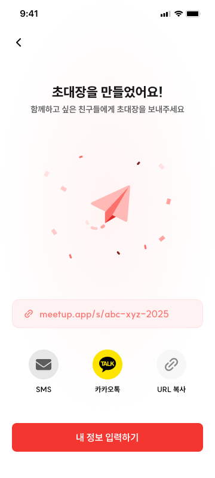
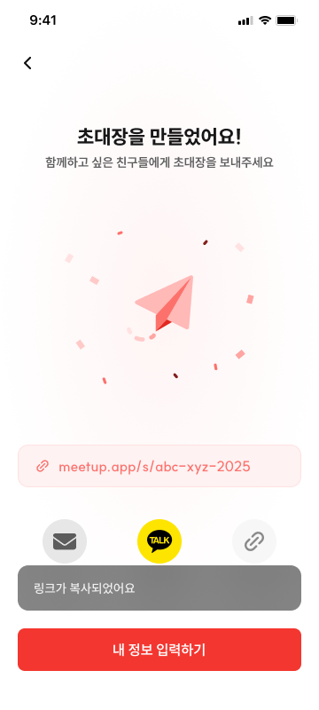

# CRT-07 모임 생성 - 링크 생성

## 1. 화면 개요

| 항목      | 내용                                                                    |
| --------- | ----------------------------------------------------------------------- |
| 화면 ID   | CRT-07                                                                  |
| 화면명    | 모임 생성 - 링크 생성                                                   |
| 경로      | `/meetings/[meetingId]/invite?code={inviteCode}`                        |
| 진입 조건 | 모임장 입력을 포함한 `POST /api/meetings` 요청이 HTTP 201로 성공        |
| 진입 화면 | 모임 유형별 마지막 모임장 참여 정보 입력 화면                           |
| 다음 화면 | 모임 카드 확인: VIEW-01 · 홈 이동: HOME-01 · 뒤로가기: 모임 유형별 분기 |

CRT-07은 기본 모임 정보와 모임장 참여 정보를 서버에 한 번에 저장하고 초대 링크 생성까지 성공한
뒤에만 표시하는 생성 완료 화면이다. 단계별 저장 화면이 아니며, 생성 요청 전이나 실패 상태에서는
CRT-07을 렌더링하지 않는다.

> **뒤로가기 정책 변경:** 이전 문서의 “완료된 CRT·INV 입력 플로우로 돌아가지 않는다” 정책은
> 폐기한다. 최신 명세에서는 뒤로가기 버튼을 탭하면 `planningType`에 맞는 모임장 참여 정보 입력
> 화면으로 이동한다.

## 2. 근거 자료

- 최신 기능 명세 기준일: 2026년 7월 28일
- Figma 화면:
  - [CRT-07-1.png](./CRT-07-1.png)
  - [CRT-07-2.png](./CRT-07-2.png)
- 문서 규격:
  - [`create/README.md`](../README.md)
- 실제 라우트:
  - CRT-07: [`invite/page.tsx`](<../../../../apps/web/app/(protected)/meetings/[meetingId]/invite/page.tsx>)
  - VIEW-01: [`[meetingId]/page.tsx`](../../../../apps/web/app/meetings/[meetingId]/page.tsx)
  - HOME-01: [`home/page.tsx`](<../../../../apps/web/app/(protected)/home/page.tsx>)
  - 모임장 일정 날짜: [`schedule/dates/page.tsx`](<../../../../apps/web/app/(protected)/meetings/new/schedule/dates/page.tsx>)
  - 모임장 일정 시간: [`schedule/times/page.tsx`](<../../../../apps/web/app/(protected)/meetings/new/schedule/times/page.tsx>)
  - 모임장 출발지: [`departure/page.tsx`](<../../../../apps/web/app/(protected)/meetings/new/departure/page.tsx>)
- 생성 API:
  - [`meeting.ts`](../../../../apps/web/src/shared/api/generated/meeting/meeting.ts)
  - [`meeting.msw.ts`](../../../../apps/web/src/shared/api/generated/meeting/meeting.msw.ts)
- Orval 생성 스키마:
  - [`createMeetingWithCoverBodyTwo.ts`](../../../../apps/web/src/shared/api/generated/schemas/createMeetingWithCoverBodyTwo.ts)
  - [`createMeetingRequest.ts`](../../../../apps/web/src/shared/api/generated/schemas/createMeetingRequest.ts)
  - [`createMeetingResponse.ts`](../../../../apps/web/src/shared/api/generated/schemas/createMeetingResponse.ts)
  - [`createMeetingRequestPlanningType.ts`](../../../../apps/web/src/shared/api/generated/schemas/createMeetingRequestPlanningType.ts)

## 3. 기능 명세

| 구분   | 기능 ID    | 기능명                                                                        | 설명                                                                                                                                                       | 참고                        | 우선순위 | 상태     | 완료 | 제외 | 수정일          |
| ------ | ---------- | ----------------------------------------------------------------------------- | ---------------------------------------------------------------------------------------------------------------------------------------------------------- | --------------------------- | -------- | -------- | ---- | ---- | --------------- |
| 회원   | CRT-07-F01 | 성공 애니메이션                                                               | • 성공 아이콘 • `함께하고 싶은 친구들에게 초대장을 보내주세요` 메시지 표시                                                                              | 생성 API HTTP 200 이후 노출 | P0       | 작업가능 | ☐    | ☐    | 2026년 7월 28일 |
| 회원   | CRT-07-F02 | 링크 URL 표시                                                                 | • 단축 URL `ex- meetup.app/s/{code}`를 텍스트 필드 형태로 노출 - 우리 라우트 경로에 맞춰서 수정 가능                                                       | 응답 필드 매핑 확인 필요    | P0       | 작업가능 | ☐    | ☐    | 2026년 7월 28일 |
| 회원   | CRT-07-F03 | 링크 복사 / 공유 버튼                                                         | • 메시지·카카오톡·복사 아이콘 버튼 • 메시지·카카오톡은 해당 앱 공유 시트 오픈 • 복사는 클립보드 저장 후 `링크가 복사되었어요` 토스트 표시            | 공유 후 현재 화면 유지      | P0       | 작업가능 | ☐    | ☐    | 2026년 7월 28일 |
| 회원   | CRT-07-F05 | 홈으로 돌아가기 버튼(화면에서는 디자인 오타로 내 정보 입력하기 문구로 표시됨) | • 탭 시 모임 홈(HOME-01) 이동                                                                                                                              | `/home`                     | P0       | 작업가능 | ☐    | ☐    | 2026년 7월 28일 |
| 회원   | CRT-07-F06 | 뒤로가기 버튼                                                                 | • 탭 시 모임 유형별 모임 참여 화면으로 이동 • 구체적인 분기 목적지는 기획 확인 후 구현                                                                  | 기획 답변 대기·구현 보류    | P0       | 작업가능 | ☐    | ☐    | 2026년 7월 28일 |
| 시스템 | CRT-07-F07 | 모임 정보 저장                                                                | • 링크 생성 후 모임 정보 서버 저장 • 단계별 저장하지 않음 • 모임장 일정·출발지 입력 정보도 동일 생성 요청으로 저장 • HTTP 200 성공 후 CRT-07 노출 | `POST /api/meetings`        | P0       | 작업가능 | ☐    | ☐    | 2026년 7월 28일 |

> 위 표는 기획 기능표 원문이다. 이후 확정된 사실과 다른 부분은 아래와 같으며, **동작 기준은
> §7·§8**이다.
>
> - `HTTP 200` → 생성 API의 성공 응답은 **201**이다(F01·F07).
> - `meetup.app/s/{code}` → 예시다. 실제 링크는 `{origin}/i/{inviteCode}`(F02, §9-1).
> - "응답 필드 매핑 확인 필요" → `inviteCode`로 확정됐다(§5).

## 4. 라우트 및 화면 이동

### 확정 라우트

| 화면                    | 경로                                             |
| ----------------------- | ------------------------------------------------ |
| CRT-07 링크 생성 완료   | `/meetings/[meetingId]/invite?code={inviteCode}` |
| 공유 링크(참여자 진입)  | `/i/{inviteCode}`                                |
| VIEW-01 모임 현황       | `/meetings/[meetingId]`                          |
| HOME-01 모임 홈         | `/home`                                          |
| INV-02 모임장 후보 날짜 | `/meetings/new/schedule/dates`                   |
| INV-02 모임장 가능 시간 | `/meetings/new/schedule/times`                   |
| INV-03 모임장 출발지    | `/meetings/new/departure`                        |

### 진입과 버튼 이동

| 사용자 동작·서버 결과                             | 이동 또는 처리                                                                |
| ------------------------------------------------- | ----------------------------------------------------------------------------- |
| `POST /api/meetings` HTTP 201 및 `meetingId` 수신 | `/meetings/[meetingId]/invite?code={inviteCode}`로 replace 하여 CRT-07 렌더링 |
| 생성 요청 진행 중                                 | 제출 화면 유지, 중복 요청 차단                                                |
| 생성 요청 실패 또는 유효한 `meetingId` 없음       | CRT-07로 이동하지 않고 입력과 오류 상태 유지                                  |
| 홈 이동 버튼                                      | `/home`의 HOME-01로 이동                                                      |
| 메시지 또는 카카오톡 버튼                         | 해당 앱 공유 시트를 열고 CRT-07 유지                                          |
| 복사 버튼                                         | 클립보드 복사 후 토스트를 표시하고 CRT-07 유지                                |

### CRT-07-F06 뒤로가기 분기

최신 명세에서 확인되는 범위는 “뒤로가기 버튼을 탭하면 모임 유형별로 모임 참여 화면으로
이동한다”까지다. 어떤 모임 유형이 어느 화면·경로로 이동하는지, `scheduleInputType`까지 분기
조건으로 사용하는지는 확정되지 않았다.

따라서 구체적인 경로 분기와 뒤로가기 동작은 기획 답변을 받은 뒤 구현한다. 현재 문서에서는
`/meetings/new/schedule/dates`, `/meetings/new/schedule/times`,
`/meetings/new/departure` 중 하나를 목적지로 임의 확정하지 않는다.

## 5. 화면 입력 데이터

CRT-07에서 사용자가 새로 입력하여 서버에 저장하는 값은 없다. 화면은 생성 API 성공 응답을
표시와 이동에 사용한다.

| 화면 사용 값 | 생성 응답 필드 | 용도                                    | 값이 없을 때                               |
| ------------ | -------------- | --------------------------------------- | ------------------------------------------ |
| 모임 식별자  | `meetingId`    | CRT-07·VIEW-01 동적 경로 구성           | CRT-07로 이동하지 않고 생성 응답 오류 처리 |
| 초대 코드    | `inviteCode`   | 공유 URL `{origin}/i/{inviteCode}` 구성 | 링크 표시·공유·복사 버튼을 비활성화        |

`meetingId`는 경로 세그먼트로, `inviteCode`는 `?code=` 쿼리로 전달받는다. 쿼리에 두는 이유는
새로고침과 직접 접근에서도 값이 남아야 하기 때문이다(§9-5).

> **`invitePath`는 사용하지 않는다.** 생성 응답에 함께 오는 `invitePath`
> (`/meetings/invitations/{inviteCode}`)는 API 리소스 경로라 앱에 없는 경로다. 공유 링크의
> 진입점은 `/i/{inviteCode}`로 확정돼 있고 그 아래에 인증·응답·완료 플로우가 걸려 있어,
> 서버 응답에 맞추면 리다이렉트가 한 번 더 생겨 링크 미리보기에도 불리하다.
> 2026-07-29 백엔드와 합의해 서버에서 해당 필드를 제거하기로 했다. 프론트는 이미 사용하지 않는다.

생성 요청은 다음 계약을 사용한다.

| 항목              | 내용                                                |
| ----------------- | --------------------------------------------------- |
| Method            | `POST`                                              |
| API 경로          | `/api/meetings`                                     |
| Content-Type      | `multipart/form-data`                               |
| `request` 파트    | `CreateMeetingRequest` 전체                         |
| `coverImage` 파트 | JPEG 또는 PNG, 선택 입력·1차 MVP에서는 생략 가능    |
| 성공 상태         | HTTP 201                                            |
| 성공 응답         | `CreateMeetingResponse` (`meetingId`, `inviteCode`) |

`request`에는 CRT 단계에서 정한 모임 기본 정보뿐 아니라 선택한 흐름에 맞는 모임장
`scheduleCandidateDates`, `scheduleResponse`, `departure`까지 함께 포함한다. CRT-07 자체가
저장 API를 다시 호출하는 것이 아니라, 마지막 입력 화면의 생성 요청이 성공한 결과로 CRT-07에
진입한다.

## 6. Figma 화면

### 기본 화면

- 상단 좌측에 뒤로가기 버튼이 있다.
- 완료 제목과 안내 문구 아래에 성공 그래픽이 표시된다.
- 단축 링크가 텍스트 필드 형태로 표시된다.
- 메시지, 카카오톡, URL 복사 버튼이 가로로 표시된다.
- 하단에 주요 이동 버튼이 표시된다.

### 링크 복사 완료

- 기본 화면 구성을 유지한다.
- URL 복사 성공 후 `링크가 복사되었어요` 토스트를 표시한다.

현재 이미지의 제목·안내 문구와 하단 버튼은 최신 기능표와 일부 다르다. 사용자가 제공한 최신
기능표를 동작 기준으로 사용하고, 이미지 갱신 또는 문구 확정이 필요한 차이는 §9에 기록한다.

## 7. 기능별 동작

### CRT-07-F01 성공 애니메이션

- `POST /api/meetings`가 HTTP 201로 성공하고 유효한 `meetingId`를 반환한 뒤 표시한다.
- 성공 아이콘 또는 성공 애니메이션과 `링크를 공유하고 참여자를 초대해보세요` 메시지를 표시한다.
- 생성 요청 중이거나 실패한 상태를 성공 화면으로 표시하지 않는다.

### CRT-07-F02 링크 URL 표시

- `{origin}/i/{inviteCode}` 형식의 링크를 텍스트 필드 형태로 표시한다.
  - 시안의 `meetup.app/s/{code}`는 예시이며, 기능표에도 "우리 라우트 경로에 맞춰서 수정 가능"으로
    적혀 있다. 실제 진입점인 `/i/{inviteCode}`를 쓴다.
  - `{origin}`은 현재 배포 origin(`window.location.origin`)이다. 별도 단축 도메인은 쓰지 않는다.
- `inviteCode`가 없으면 유효한 링크를 구성할 수 없으므로 공유·복사 버튼을 활성화하지 않는다.

### CRT-07-F03 링크 복사 / 공유 버튼

- 메시지, 카카오톡, 복사 버튼을 순서대로 표시한다.
- 메시지와 카카오톡 버튼은 단축 링크가 포함된 해당 앱 공유 시트를 연다.
- 공유를 완료하거나 취소한 뒤 CRT-07 화면을 유지한다.
- 복사 버튼은 표시된 단축 링크를 클립보드에 저장한다.
- 복사 성공 시 `링크가 복사되었어요` 토스트를 표시한다.

### CRT-07-F04 모임 카드 확인 버튼

- 탭하면 생성 응답의 `meetingId`를 사용해 `/meetings/[meetingId]`로 이동한다.
- VIEW-01에 이동한 뒤 생성 입력 화면으로 자동 복귀하지 않는다.

### CRT-07-F05 홈 이동 버튼

- 탭하면 `/home`으로 이동한다.
- HOME-01로 이동할 때 완료된 생성 draft를 재사용하지 않는다.

### CRT-07-F06 뒤로가기 버튼

- 최신 명세에 따라 모임 유형별 모임장 참여 정보 입력 화면으로 이동한다.
- 이전 명세의 “완료된 입력 플로우로 돌아가지 않는다” 동작을 사용하지 않는다.
- 모임 유형별 구체적인 화면과 경로는 기획 답변 전까지 확정하지 않는다.
- 기획 답변을 받은 뒤 분기 기준, 이동 방식과 생성 완료 상태 유지 정책을 함께 구현한다.

### CRT-07-F07 모임 정보 저장

- CRT·INV 단계에서는 서버에 단계별 저장하지 않는다.
- 모임 유형에 필요한 모든 모임 정보와 모임장 참여 정보를 `POST /api/meetings` 한 번으로
  전송한다.
- HTTP 201 성공 응답으로 받은 `meetingId`, `inviteCode`를 CRT-07에서 사용한다.
- 요청 실패 시 CRT-07을 렌더링하지 않는다.

## 8. 검증 기준

- [ ] CRT-07의 실제 경로가 `/meetings/[meetingId]/invite`이다.
- [ ] `POST /api/meetings` 요청 전에는 CRT-07이 렌더링되지 않는다.
- [ ] 생성 요청 진행 중에는 중복 제출되지 않는다.
- [ ] 생성 요청이 HTTP 201로 성공하고 유효한 `meetingId`를 반환한 경우에만 CRT-07로 이동한다.
- [ ] 생성 요청 실패 시 마지막 입력 화면을 유지하고 CRT-07로 이동하지 않는다.
- [ ] 모임 기본 정보와 모임장 일정·출발지 정보가 하나의 생성 요청에 포함된다.
- [ ] 생성 응답의 `inviteCode`로 `{origin}/i/{inviteCode}` 링크를 표시한다.
- [ ] `inviteCode`가 없으면 공유·복사 버튼이 비활성화된다.
- [ ] 메시지·카카오톡·복사 버튼이 표시된다.
- [ ] 메시지·카카오톡 버튼을 탭하면 해당 앱 공유 시트가 열린다.
- [ ] 복사 버튼을 탭하면 표시된 링크가 클립보드에 저장된다.
- [ ] 복사 성공 시 `링크가 복사되었어요` 토스트가 표시된다.
- [ ] 모임 카드 확인 버튼을 탭하면 `/meetings/[meetingId]`로 이동한다.
- [ ] 홈 이동 버튼을 탭하면 `/home`으로 이동한다.
- [ ] 기획 답변으로 확정된 모임 유형별 목적지에 맞춰 뒤로가기를 구현한다.
- [ ] 뒤로가기 구현 전 중복 생성 방지와 완료 상태 유지 정책을 함께 확정한다.
- [ ] 현재 placeholder가 최신 CRT-07 기능 화면으로 교체된다.

## 9. 확인 필요

1. ~~**단축 URL과 생성 응답 계약**~~ — **확정 (2026-07-29)**
   - 링크는 `{origin}/i/{inviteCode}`. 조립 주체는 **프론트**다.
   - `invitePath`는 쓰지 않는다(§5 참고). 백엔드가 필드를 제거하기로 했다.
   - 별도 단축 도메인은 도입하지 않는다. `{origin}`은 배포 origin을 그대로 쓴다.
   - 남은 것: 운영 도메인이 확정되면 시안의 `meetup.app` 표기를 갱신할지 정한다(표시 문구 문제).
2. **최신 기능표와 Figma 하단 버튼 불일치**
   - 최신 기능표는 `모임 카드 확인`과 `홈 이동` 두 버튼을 정의한다.
   - 현재 첨부 이미지에는 `내 정보 입력하기` 버튼 하나만 표시된다.
   - 기능 동작은 최신 기능표를 기준으로 기록했으며, Figma 이미지 또는 버튼 문구·개수를
     갱신해야 한다.
3. **최신 기능표와 Figma 안내 문구 불일치**
   - 최신 기능표는 `링크를 공유하고 참여자를 초대해보세요`를 요구한다.
   - 첨부 이미지에는 `초대장을 만들었어요!`, `함께하고 싶은 친구들에게 초대장을 보내주세요`가
     표시된다.
   - 최종 제목과 보조 문구를 확정해야 한다.
4. **생성 완료 후 뒤로가기와 중복 생성**
   - 최신 명세는 모임 유형별 모임 참여 화면으로 이동한다고만 정의한다.
   - 모임 유형별 구체적인 화면·경로와 `scheduleInputType`을 추가 분기 조건으로 사용할지는
     기획자에게 확인 중이다.
   - 목적지 화면에서 다음을 다시 탭할 경우 새 모임을 중복 생성할지, 기존 `meetingId`를 수정할지,
     제출을 막을지에 대한 API 정책도 함께 확인해야 한다.
   - **기획 답변과 중복 생성 방지 정책이 확정될 때까지 CRT-07-F06 구현을 보류한다.**
5. **CRT-07 직접 접근** — **부분 확정 (2026-07-29)**
   - `inviteCode`를 `?code=` 쿼리로 넘기므로 **새로고침에는 값이 남는다.** 링크 표시와 공유는
     그대로 동작한다.
   - 남은 것: `?code=` 없이 직접 접근했을 때. 지금은 링크를 만들 수 없으니 공유·복사 버튼을
     비활성화한다(§7 F02). 화면 자체를 막고 HOME-01 또는 VIEW-01로 보낼지는 미확정이다.
   - 생성 성공 여부를 서버에 되묻는 방법은 두지 않는다 — `GET /api/meetings/invitations/{code}`가
     비인증으로 열려 있어 코드만 있으면 조회할 수 있지만, 이 화면의 목적은 방금 만든 링크를
     보여주는 것이지 임의 모임을 조회하는 것이 아니다.
6. **공유 방식** — **확정 (2026-07-29)**
   - 카카오톡: **Kakao JS SDK** `Share.sendDefault`. `NEXT_PUBLIC_KAKAO_JS_KEY` 필요.
   - 메시지(SMS): **네이티브 브릿지** `SHARE_SMS`. WebView가 SMS 앱을 연다.
   - 둘 다 `feat/kakao-share-poc`에서 동작을 검증했다(Android `intent://` 스킴 파싱 포함).
     PoC의 테스트 카피·placeholder 이미지를 실제 초대 링크와 문구로 교체하는 것이 이번 작업이다.
   - 남은 것: 카카오 공유 카드의 썸네일 이미지. 앱이 인터넷에서 직접 불러오므로 **공개 https
     주소**여야 한다(localhost 불가).
7. **클립보드 복사 실패**
   - 권한 거부나 WebView 미지원 시 표시할 사용자 피드백을 정해야 한다.
