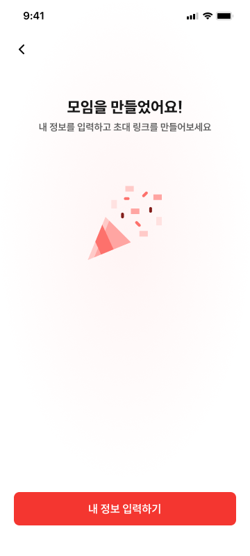

# CRT-06

> **🔄 1차 MVP 흐름 변경(2026-07-27)**
>
> CRT-05 커버사진 등록은 1차 MVP에서 제외한다. 현재 진입 화면은 CRT-04이며, 뒤로가기도
> CRT-04로 이동한다. 아래에 남아 있는 CRT-05 관련 상세 설명은 후속 커버사진 기능 재활성화
> 시 참고하기 위한 기록이며 현재 MVP 흐름에는 적용하지 않는다.

## 1. 화면 개요

| 항목      | 내용                     |
| --------- | ------------------------ |
| Domain    | CRT                      |
| 화면 ID   | CRT-06                   |
| 화면명    | 모임 기본 정보 입력 완료 |
| Owner     | planning                 |
| 관련 화면 | CRT-04, INV-02, INV-03   |

### 목적

모임 기본 정보 입력이 완료되었음을 사용자에게 안내하고,

모임장이 자신의 참여 정보를 입력할 수 있도록 INV(모임 참여) Flow로 연결하는 화면이다.

이 화면에서는 아직 서버 모임, `meetingId`, 참여 코드, 초대 링크가 생성되지 않는다. 모임장이
자신의 참여 정보를 모두 입력한 뒤 최종 생성 요청에서 함께 생성된다.

---

# 2. 기획 식별자

| ID         | Owner    | 기능                     | 설명                            |
| ---------- | -------- | ------------------------ | ------------------------------- |
| CRT-06     | planning | 모임 기본 정보 입력 완료 | Host 참여 정보 입력 Bridge 화면 |
| CRT-06-F01 | planning | 성공 애니메이션          | 체크 아이콘 및 완료 메시지 표시 |
| CRT-06-F02 | planning | 내 정보 입력 버튼        | INV Flow 이동                   |
| CRT-06-F03 | planning | 뒤로가기 버튼            | CRT-04 이동                     |

---

# 3. 화면 흐름

```text
CRT-04

↓

기본 정보 입력 완료

↓

CRT-06

├── 내 정보 입력
│      │
│      ├── 일정 정하기 / 일정 & 위치 정하기
│      │          ↓
│      │       INV-02
│      │
│      └── 위치 정하기
│                 ↓
│              INV-03
│
└── 뒤로가기
        ↓
     CRT-04
```

---

# 4. Wireframe 분석

## 기본 화면



확인 가능한 요소

- 뒤로가기 버튼
- 성공 아이콘
- 완료 메시지
- 안내 문구
- 내 정보 입력하기 버튼

---

## 성공 애니메이션

기획에는 성공 애니메이션으로 정의되어 있다.

Wireframe에서는 체크 아이콘만 표현되어 있으며,

애니메이션 여부는 확인되지 않는다.

---

## 완료 메시지

메인 문구

```text
모임을 만들었어요!
```

안내 문구

```text
내 정보를 입력하고 초대 링크를 만들어보세요
```

---

## 내 정보 입력 버튼

모임 유형에 따라

- 일정 정하기
- 일정 & 위치 정하기

↓

INV-02

또는

- 위치 정하기

↓

INV-03

으로 이동한다.

---

## 뒤로가기

1차 MVP에서는 CRT-04로 이동한다. CRT-05가 후속 개발에서 다시 활성화되면 CRT-05로 이동하도록
복원한다.

---

# 5. 기획 ↔ Wireframe 비교

| 기능              | 기획 | Wireframe | 결과               |
| ----------------- | ---- | --------- | ------------------ |
| 성공 애니메이션   | ✅   | ⚠️        | 체크 아이콘만 표현 |
| 완료 메시지       | ✅   | ✅        | 일치               |
| 내 정보 입력 버튼 | ✅   | ✅        | 일치               |
| 뒤로가기          | ✅   | ✅        | 일치               |

---

# 6. UI States

## Success

모임 기본 정보 입력 완료

---

## Navigating

INV Flow 이동 중

---

# 7. Frontend 후보

> owner: frontend

| ID                | 상태      | 설명        |
| ----------------- | --------- | ----------- |
| CRT-06/default    | candidate | 완료 화면   |
| CRT-06/navigating | candidate | INV 이동 중 |

---

# 8. Route 후보

```text
CRT-04

↓

CRT-06

↓

INV-02

또는

↓

INV-03
```

CRT와 INV Flow를 연결하는 Bridge 화면이다.

---

# 9. Component 후보

## Header

- BackButton

---

## Success

- SuccessAnimation
- SuccessMessage

---

## Footer

- EnterMyInfoButton

---

# 10. API 영향

## API 호출

이 화면에서는 별도의 API 호출이 발생하지 않는다.

모임 생성 API는 아직 호출되지 않은 상태이다.

내 정보 입력 버튼을 누르면 INV Flow로 이동하여

모임장이 자신의 참여 정보를 입력한다.

참여 정보 입력이 완료된 이후 최종 생성 API를 호출하고

- meetingId 발급
- 참여 코드·초대 링크 생성
- 공유 화면

으로 이어진다.

최종 생성 성공 후 CRT-07(`/meetings/[meetingId]/invite`)로 이동한다.

---

# 11. 상태(State)

## Screen

- Success

---

## Button

- Idle
- Pressed

---

## Navigation

- CRT → INV

---

# 12. Edge Case

- 뒤로가기 후 CRT-04 재진입
- 버튼 연속 클릭
- INV 화면 이동 실패
- 기본 정보 입력 완료 후 앱 종료
- 새로고침(Web)

---

# 13. QA

### 완료 화면

- 성공 화면 표시
- 성공 메시지 표시

---

### 버튼

- 일정 정하기 → INV-02 이동
- 일정 & 위치 정하기 → INV-02 이동
- 위치 정하기 → INV-03 이동

---

### Navigation

- CRT-04 복귀
- INV Flow 정상 진입

---

# 14. unresolved

### 1. 성공 애니메이션

기획에는 성공 애니메이션이라고 정의되어 있으나

Wireframe에서는 정적인 체크 아이콘만 표현되어 있다.

다음 사항은 정의되어 있지 않다.

- Lottie
- Fade Animation
- Scale Animation
- Haptic Feedback

→ 디자인 확인 필요

---

### 2. 뒤로가기 정책

아직 서버 생성 전이므로 CRT-04로 돌아가 draft를 수정할 수 있다. 다만 최종 생성 요청 중이거나
성공한 이후에는 완료된 draft로 복귀해 중복 생성하지 않도록 history를 교체한다.

→ 기획 확인 필요

---

### 3. INV 분기

모임 생성 시 선택한 meetingType에 따라

- INV-02
- INV-03

으로 이동하는 것으로 보이나,

아직 `meetingId`가 없으므로 이 분기는 검증된 `CreateMeetingDraft`의 설정을 기준으로 한다.

---

### 4. 안내 문구 표현

현재 문구는

```text
내 정보를 입력하고 초대 링크를 만들어보세요
```

라고 되어 있다.

실제로는

초대 링크가 즉시 생성되는 것이 아니라,

모임장이 INV Flow에서 자신의 참여 정보를 모두 입력한 이후 생성된다.

문구만 보면 즉시 생성되는 것으로 오해할 가능성이 있다.

→ UX 문구 검토 필요

---

## 구현 관점 메모

CRT-06은 Wizard의 마지막 화면가 아니라,

**Create Flow와 Invite Flow를 연결하는 Bridge Step**이다.

```
CRT-01 ~ CRT-04 (CreateMeetingDraft, CRT-05는 1차 MVP 제외)

↓

CRT-06

↓

Host Join (INV Flow)

↓

Host Response 입력 완료

↓

POST /meetings

↓

meetingId + 참여 코드 + 초대 링크 생성

↓

공유
```

따라서 구현에서는 CRT-04에서 draft를 폐기하지 않고 Host 참여 정보까지 같은 생성 draft에
유지한다. 최종 생성 성공 후에만 draft를 제거하고 CRT-07로 `replace`한다.
