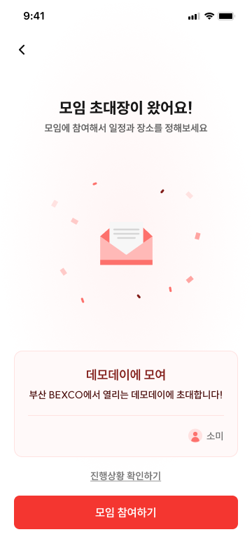
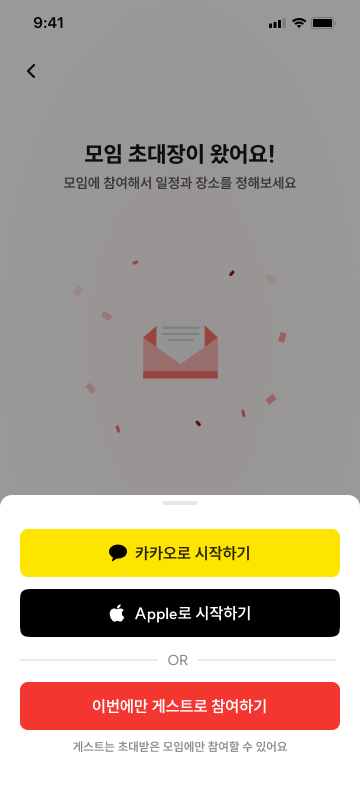
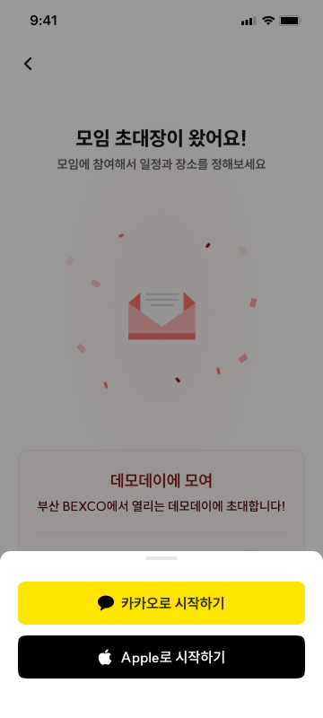

# INV-01 모임 참여 - 링크 진입

## 1. 화면 개요

| 항목      | 내용                                                                         |
| --------- | ---------------------------------------------------------------------------- |
| 화면 ID   | INV-01                                                                       |
| 화면명    | 모임 참여 - 링크 진입                                                        |
| 경로      | `/i/[inviteToken]`                                                           |
| 진입 조건 | 유효한 초대 링크로 진입                                                      |
| 진입 화면 | 외부 공유 링크 또는 VIEW-01에서 다시 진입                                    |
| 다음 화면 | 로그인·회원가입: ACC-01 · 참여 정보 입력: INV-02/INV-03 · 모임 현황: VIEW-01 |

INV-01은 초대 링크로 진입한 사용자에게 모임 정보와 현재 참여 가능 상태를 보여주고, 로그인 상태와
앱 실행 환경에 따라 참여 흐름 또는 모임 현황으로 연결하는 화면이다.

## 2. 근거 자료

- 최신 기능 명세 기준일: 2026년 7월 30일
- Figma 화면:
  - [INV-01 기본 화면](./inv-01-기본-화면.png)
  - [INV-01 딥링크 - 앱 미설치 사용자](./inv-01-딥링크-앱-미설치-유저.png)
  - [INV-01 딥링크 - 앱 설치 사용자](./inv-01-딥링크-앱설치-유저.png)
- 문서 규격:
  - [`fe-implement-spec/README.md`](../../README.md)
- 실제 라우트:
  - INV-01: [`app/i/[inviteToken]/page.tsx`](../../../../apps/web/app/i/[inviteToken]/page.tsx)
  - 회원 닉네임 설정: [`nickname/page.tsx`](../../../../apps/web/app/i/[inviteToken]/nickname/page.tsx)
  - 게스트 로그인: [`guest/page.tsx`](../../../../apps/web/app/i/[inviteToken]/guest/page.tsx)
  - 참여 일정 입력: [`respond/schedule/page.tsx`](<../../../../apps/web/app/i/[inviteToken]/(participant)/respond/schedule/page.tsx>)
  - 참여 출발지 입력: [`respond/departure/page.tsx`](<../../../../apps/web/app/i/[inviteToken]/(participant)/respond/departure/page.tsx>)
  - 참여 완료: [`complete/page.tsx`](<../../../../apps/web/app/i/[inviteToken]/(participant)/complete/page.tsx>)
- 화면 UI:
  - [`invite-landing-page.tsx`](../../../../apps/web/src/_pages/invite/ui/invite-landing-page.tsx)
  - [`meeting-invitation-card.tsx`](../../../../apps/web/src/entities/meeting/ui/meeting-invitation-card.tsx)
  - [`login-drawer.tsx`](../../../../apps/web/src/widgets/login-drawer/login-drawer.tsx)
- 세션:
  - [`use-session.ts`](../../../../apps/web/src/entities/session/model/use-session.ts)
- 초대 조회 API와 스키마:
  - [`meeting.ts`](../../../../apps/web/src/shared/api/generated/meeting/meeting.ts)
  - [`meetingInvitationResponse.ts`](../../../../apps/web/src/shared/api/generated/schemas/meetingInvitationResponse.ts)
  - [`participationStatusResponse.ts`](../../../../apps/web/src/shared/api/generated/schemas/participationStatusResponse.ts)

## 3. 기능 명세

| 구분   | 기능 ID    | 기능명             | 설명                                                                                                                                                                                                       | 참고                                  | 우선순위 | 상태     | 완료 | 제외 | 수정일          |
| ------ | ---------- | ------------------ | ---------------------------------------------------------------------------------------------------------------------------------------------------------------------------------------------------------- | ------------------------------------- | -------- | -------- | ---- | ---- | --------------- |
| 시스템 | INV-01-F01 | 진입 분기 처리     | • 링크 진입 시 정원 초과 여부와 참여 기한 경과 여부 확인 • 정원 이내이고 기한 이내이면 참여하기 버튼 활성화 • 둘 중 하나라도 충족하지 않으면 참여하기 버튼 비활성화                                  | 서버 `participationStatus` 사용       | P0       | 작업가능 | ☐    | ☐    | 2026년 7월 30일 |
| 공통   | INV-01-F02 | 안내 문구 표시     | • 기한 경과: `마감 기한이 지났어요` / `아쉽지만 현재는 더 이상 참여할 수 없어요` • 정원 초과: `모임 인원이 모두 찼어요` / `아쉽지만 현재는 더 이상 참여할 수 없어요` • 둘 다 해당하면 기한 문구 우선 | PageHeader title·description으로 표시 | P0       | 작업가능 | ☐    | ☐    | 2026년 7월 31일 |
| 공통   | INV-01-F03 | 모임 정보 표시     | • 모임명과 모임 설명 표시 • 모임장 프로필과 닉네임 표시                                                                                                                                                 | 최신 화면 기준으로 범위 축소          | P0       | 작업가능 | ☐    | ☐    | 2026년 7월 30일 |
| 공통   | INV-01-F04 | 참여하기 버튼      | • 탭 시 로그인·회원가입(ACC-01) 연결 • 앱 설치 사용자는 앱 연결 • 앱 미설치 사용자는 웹에서 흐름 유지                                                                                                | 로그인·실행 환경별 분기               | P0       | 작업가능 | ☐    | ☐    | 2026년 7월 30일 |
| 공통   | INV-01-F05 | 진행상황 확인 버튼 | • 탭 시 모임 현황(VIEW-01)으로 이동                                                                                                                                                                        | `meetingId` 사용                      | P0       | 작업가능 | ☐    | ☐    | 2026년 7월 30일 |

## 4. 라우트 및 화면 이동

### 확정 라우트

| 화면                    | 경로                                 |
| ----------------------- | ------------------------------------ |
| INV-01 링크 진입        | `/i/[inviteToken]`                   |
| 회원 모임용 닉네임 설정 | `/i/[inviteToken]/nickname`          |
| 게스트 로그인           | `/i/[inviteToken]/guest`             |
| 참여 일정 입력          | `/i/[inviteToken]/respond/schedule`  |
| 참여 출발지 입력        | `/i/[inviteToken]/respond/departure` |
| 참여 완료               | `/i/[inviteToken]/complete`          |
| VIEW-01 모임 현황       | `/meetings/[meetingId]`              |

`[inviteToken]`의 실제 값은 생성 응답의 `inviteCode`다.

### 진입과 버튼 이동

| 상태·사용자 동작                    | 이동 또는 처리                                                                                    |
| ----------------------------------- | ------------------------------------------------------------------------------------------------- |
| 초대 조회 중                        | 참여 가능 여부를 확정하지 않고 참여하기 버튼 비활성화 및 Skeleton/AppSplash 형태의 로딩 화면 표시 |
| 유효하지 않은 초대 코드(404)        | 유효하지 않은 초대 안내와 이탈 수단 표시                                                          |
| 초대 조회 실패(404 외)              | 실패 안내와 재시도·이탈 수단 표시                                                                 |
| `participationStatus.canJoin=false` | 사유 문구 표시, 참여하기 버튼 비활성화                                                            |
| 비로그인 사용자가 참여하기 탭       | 로그인 Drawer를 열어 소셜 로그인 또는 게스트 참여 선택 제공                                       |
| 로그인 사용자가 참여하기 탭         | 모임용 닉네임 또는 모임 유형에 맞는 첫 참여 입력 화면으로 이동                                    |
| 게스트 참여 선택                    | `/i/[inviteToken]/guest`로 이동                                                                   |
| 진행상황 확인 탭                    | 응답의 `meetingId`로 `/meetings/[meetingId]` 이동                                                 |

로그인 완료 후 어느 참여 화면으로 이동하는지는 사용자의 온보딩·모임용 닉네임 상태와
`planningType`, `scheduleMode`, `placeMode`에 따라 결정돼야 한다. 구체적인 분기 표는 §9의 확인
사항을 확정한 뒤 추가한다.

## 5. 화면 사용 데이터

INV-01에서 사용자가 직접 입력하는 값은 없다. 초대 조회 응답과 세션 상태를 표시 및 이동 분기에
사용한다.

| 화면 사용 값   | 출처·필드                     | 필수 여부            | 용도·제약                          | 값이 없을 때                           |
| -------------- | ----------------------------- | -------------------- | ---------------------------------- | -------------------------------------- |
| 초대 코드      | 경로 `inviteToken`            | 필수                 | 초대 조회와 후속 참여 경로 구성    | 유효하지 않은 링크 상태                |
| 모임 ID        | `meetingId`                   | VIEW-01 이동 시 필수 | 모임 현황 경로 구성                | 진행상황 확인 비활성 또는 오류 안내    |
| 모임명         | `name`                        | 필수                 | 초대 카드 제목                     | 초대 정보 실패 상태                    |
| 모임 설명      | `description`                 | 선택                 | 초대 카드 설명                     | 설명 영역 생략                         |
| 최대 참여 인원 | `maxParticipants`             | 상태 설명에 사용     | 정원 정보 표시 또는 서버 판정 보조 | 서버 `participationStatus`를 우선      |
| 현재 참여 인원 | `participantCount`            | 상태 설명에 사용     | 정원 정보 표시                     | 인원 수 표시 생략                      |
| 모임장 닉네임  | `hostNickname`                | 선택                 | 모임장 프로필 영역에 노출          | 모임장 영역 생략 또는 오류 정책 필요   |
| 참여 가능 여부 | `participationStatus.canJoin` | 필수                 | 참여하기 버튼 활성화               | 안전하게 비활성화                      |
| 참여 불가 사유 | `participationStatus.reason`  | 참여 불가 시 필수    | 기한·정원 안내 분기                | 서버 `message` 사용 또는 일반 오류     |
| 안내 문구      | `participationStatus.message` | 참여 불가 시 사용    | 서버가 계산한 참여 불가 문구 표시  | 사유 코드별 프론트 문구 사용 여부 확인 |
| 로그인 상태    | `useSession().status`         | 필수                 | Drawer·참여 경로 분기              | 복원 중 비활성, 오류 시 재시도         |
| 로그인 사용자  | `session.viewer`              | 로그인 시 필수       | 닉네임·온보딩 완료 여부 확인       | 세션 오류 처리                         |

최신 화면에는 모임장 프로필만 보이고 참여자 목록과 `[모임장]` 텍스트 표기는 없다. 현재
`MeetingInvitationResponse`에도 참여자 목록과 프로필 이미지가 없으므로 본문의 동작 기준은 최신
화면과 현재 API에 맞춘다. 기존 F03 요구의 변경 이력은 §9에 기록한다.

## 6. Figma 화면

### 기본 화면

- 상단에 뒤로가기 버튼과 초대 안내 문구를 표시한다.
- 중앙에 초대장 그래픽을 표시한다.
- 모임명, 설명과 모임장 정보를 카드로 표시한다.
- 하단 흰색 CTA 영역에 `진행상황 확인하기` 보조 행동과 `모임 참여하기` 주요 행동을 표시한다.
- 기본 시안에는 참여자 목록과 `[모임장]` 텍스트 표기가 없다. 최신 화면에 따라 제외하고 변경
  이력은 §9에 기록한다.

### 딥링크 - 앱 미설치 사용자

- 사용자가 `모임 참여하기`를 탭한 경우에만 INV-01 위에 하단 Login Drawer가 열린다.
- 카카오·Apple 소셜 로그인 버튼을 세로로 표시한다.
- 구분선 아래에 `이번에만 게스트로 참여하기` 버튼과 게스트 안내 문구를 표시한다.
- Drawer가 열린 동안 뒤의 INV-01 화면에는 dimmed overlay를 적용한다.

### 딥링크 - 앱 설치 사용자

- 사용자가 `모임 참여하기`를 탭한 경우에만 INV-01 위에 하단 Login Drawer가 열린다.
- 카카오·Apple 소셜 로그인 버튼만 표시한다.
- 앱 미설치 사용자 시안과 달리 게스트 참여 버튼과 안내 문구를 표시하지 않는다.
- Drawer 높이는 콘텐츠에 맞춰 앱 미설치 사용자 시안보다 낮다.

정확한 간격, 크기, 색상과 타이포그래피는 Figma Dev Mode와 디자인 토큰을 구현 기준으로 삼는다.
정원 초과와 기한 경과 상태 이미지는 아직 첨부되지 않았다.

## 7. 기능별 동작

### INV-01-F01 진입 분기 처리

- `GET /api/meetings/invitations/{inviteCode}`의 `participationStatus`를 기준으로 판단한다.
- 프론트에서 `deadlineAt`, `participantCount`, `maxParticipants`를 다시 계산해 서버 판정을
  덮어쓰지 않는다.
- `canJoin=true`이고 `reason=AVAILABLE`이면 참여하기 버튼을 활성화한다.
- `canJoin=false`이면 참여하기 버튼을 비활성화한다.
- 기한 경과와 정원 초과가 동시에 해당하면 서버 계약에 따라 `DEADLINE_PASSED`를 우선한다.
- 조회 중, 조회 실패 또는 `participationStatus`가 없으면 참여 가능으로 추측하지 않고 버튼을
  비활성화한다.

### INV-01-F02 안내 문구 표시

- `reason=DEADLINE_PASSED`이면 PageHeader에 다음 문구를 표시한다.
  - title: `마감 기한이 지났어요`
  - description: `아쉽지만 현재는 더 이상 참여할 수 없어요`
- `reason=PARTICIPANT_LIMIT_EXCEEDED`이면 PageHeader에 다음 문구를 표시한다.
  - title: `모임 인원이 모두 찼어요`
  - description: `아쉽지만 현재는 더 이상 참여할 수 없어요`
- 두 조건이 동시에 해당하면 기한 경과 안내를 우선한다.
- 참여 불가 상태의 별도 화면 이미지는 없으며 위 문구를 구현 기준으로 사용한다.
- 서버의 `participationStatus.message`보다 `reason`에 대응하는 위 PageHeader 문구를 우선한다.

### INV-01-F03 모임 정보 표시

- 초대 조회 응답의 `name`, `description`, `hostNickname`을 표시한다.
- 설명이 없으면 빈 설명 영역을 만들지 않는다.
- 최신 화면에 따라 모임장 프로필과 닉네임만 표시한다.
- 참여자 목록과 `[모임장]` 텍스트 표기는 표시하지 않는다.

### INV-01-F04 참여하기 버튼

- 초대 조회와 세션 복원이 끝나고 `participationStatus.canJoin=true`일 때만 활성화한다.
- `session.status='loading'`이면 로그인 여부를 추측하지 않고 비활성화한다.
- `session.status='error'`이면 오류 안내와 재시도 수단을 제공한다.
- `session.status='anonymous'`에서 탭하면 로그인 Drawer를 연다.
- Drawer는 소셜 로그인과 `이번에만 게스트로 참여하기` 선택지를 제공한다.
- 로그인 성공 후 원래 초대 코드와 후속 목적지를 잃지 않아야 한다.
- `session.status='authenticated'`에서 탭하면 사용자 상태와 모임 유형에 맞는 다음 참여 화면으로
  이동한다.
- 앱 설치 여부에 따른 앱 연결은 웹 라우트 분기와 별개로 딥링크·Universal Link 정책에 따른다.

### INV-01-F05 진행상황 확인 버튼

- 초대 조회 응답에 유효한 `meetingId`가 있을 때 `/meetings/[meetingId]`로 이동한다.
- 로그인 필요 여부와 공개 범위는 VIEW-01 정책을 따른다.
- `meetingId`가 없으면 잘못된 경로를 만들지 않고 버튼을 비활성화하거나 오류를 안내한다.

## 8. 검증 기준

- [ ] `/i/[inviteToken]`에서 INV-01이 렌더링된다.
- [ ] 경로의 `inviteToken`으로 공개 초대 조회를 요청한다.
- [ ] 초대 조회 중에는 로딩 화면이 보이고 참여하기 버튼이 비활성화된다.
- [ ] 유효하지 않은 초대 코드(404)에 유효하지 않은 초대 안내와 이탈 수단이 표시된다.
- [ ] 404 외 조회 실패에는 실패 안내와 재시도·이탈 수단이 표시된다.
- [ ] `canJoin=true`이면 참여하기 버튼이 활성화된다.
- [ ] `canJoin=false`이면 참여하기 버튼이 비활성화된다.
- [ ] 기한 경과와 정원 초과가 동시에 해당하면 기한 경과 안내가 우선한다.
- [ ] `DEADLINE_PASSED`에 `마감 기한이 지났어요`와 `아쉽지만 현재는 더 이상 참여할 수 없어요`가 표시된다.
- [ ] `PARTICIPANT_LIMIT_EXCEEDED`에 `모임 인원이 모두 찼어요`와 `아쉽지만 현재는 더 이상 참여할 수 없어요`가 표시된다.
- [ ] 모임명, 설명과 모임장 닉네임이 초대 조회 응답대로 표시된다.
- [ ] 참여자 목록과 `[모임장]` 텍스트 표기가 노출되지 않는다.
- [ ] 세션 복원 중에는 참여하기 버튼이 비활성화된다.
- [ ] 비로그인 사용자가 참여하기를 탭하면 게스트 선택지가 있는 로그인 Drawer가 열린다.
- [ ] 로그인 사용자가 참여하기를 탭하면 로그인 Drawer를 열지 않고 다음 참여 화면으로 이동한다.
- [ ] 로그인 완료 후에도 기존 `inviteToken`과 후속 목적지가 유지된다.
- [ ] 앱 미설치 사용자는 웹 참여 흐름을 계속 사용할 수 있다.
- [ ] 진행상황 확인을 탭하면 응답의 `meetingId`에 해당하는 VIEW-01로 이동한다.
- [ ] 유효한 `meetingId`가 없으면 진행상황 확인으로 잘못된 경로를 만들지 않는다.

## 9. 확인 필요

1. **F03 기획 범위 축소 정리**
   - 이전 기능표는 모임장 닉네임 옆 `[모임장]` 표기, 참여자 닉네임과 스크롤 가능한 프로필 영역을
     요구했다.
   - 최신 기본 화면에는 모임장 프로필과 닉네임만 있으며 참여자 목록과 `[모임장]` 표기는 없다.
   - 현재 `MeetingInvitationResponse`도 `hostNickname`만 제공하고 참여자 목록과 프로필 이미지는
     제공하지 않는다.
   - 최신 화면과 API가 일치하므로 기획 축소로 보고, 본문의 기능 명세·동작·검증 기준에서는 해당
     요구를 제거했다. 기존 기능표 원본도 수정할지 PM·디자이너 확인이 필요하다.
2. **조회 로딩·404·오류 화면**
   - 로딩 중 Skeleton 또는 AppSplash가 필요하지만 전용 화면 디자인은 없다.
   - 유효하지 않은 코드(404)와 일시적인 네트워크·서버 오류의 안내 문구, 재시도·이탈 버튼 시안도
     없다.
   - PM·디자이너와 상태별 UX를 확정해야 한다. 구현을 먼저 진행한다면 Next.js App Router의
     책임에 맞춰 다음처럼 분리하는 방식을 권장한다.
     - `loading.tsx`: 초대 조회 중 Skeleton 또는 AppSplash
     - `not-found.tsx`: 서버가 초대 코드에 404를 반환한 경우의 유효하지 않은 초대 안내
     - `error.tsx`: 404 외 예외 안내, `reset()` 재시도와 안전한 이탈 수단
   - 현재 조회 함수가 모든 실패를 `null`로 처리하면 404와 기타 오류를 구분할 수 없다. 상태별
     화면을 사용하려면 404는 `notFound()`로 보내고 기타 실패는 error boundary가 처리하도록
     구분해야 한다.
3. **로그인 회원의 다음 화면**
   - 로그인 사용자의 모임용 닉네임 설정 필요 여부와 확인 방법이 확정돼야 한다.
   - `planningType`, `scheduleMode`, `placeMode`별 첫 참여 화면 분기표가 필요하다.
4. **로그인 완료 후 복귀**
   - ACC-01 왕복 과정에서 원래 `/i/[inviteToken]`과 참여 목적을 유지할 redirect 계약이 필요하다.
5. **앱 연결 정책**
   - 앱 설치 사용자를 여는 Universal Link/App Link 또는 커스텀 스킴과 실패 시 웹 fallback 정책이
     필요하다.
   - 앱 미설치 사용자는 현재 웹 URL을 유지한다.
6. **VIEW-01 공개·인증 정책**
   - INV-01의 진행상황 확인 버튼을 비로그인 사용자도 사용할 수 있는지 확인해야 한다.
7. **앱 설치 여부와 Login Drawer 구성**
   - 기능표는 앱 설치 사용자를 앱으로 연결한다고 설명한다.
   - 첨부된 앱 설치 사용자 시안에는 앱 직접 연결 결과가 아니라 게스트 선택지가 없는 Login Drawer가
     표시된다.
   - 앱 설치 여부를 웹에서 어떻게 판별하는지, 앱 연결을 먼저 시도한 뒤 실패했을 때 Drawer를
     표시하는지, `LoginDrawer type='member' | 'guest'`와 어떤 기준으로 연결되는지 확정해야 한다.
8. **미첨부 상태 시안**
   - 정원 초과와 기한 경과 상태의 화면 이미지는 없다.
   - 이미지는 미첨부 상태지만 §7 F02의 확정 PageHeader 문구를 우선 구현 기준으로 사용한다.
