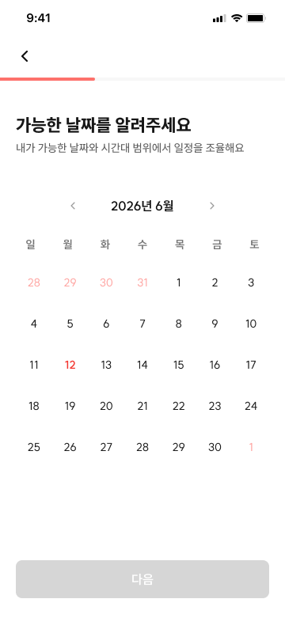
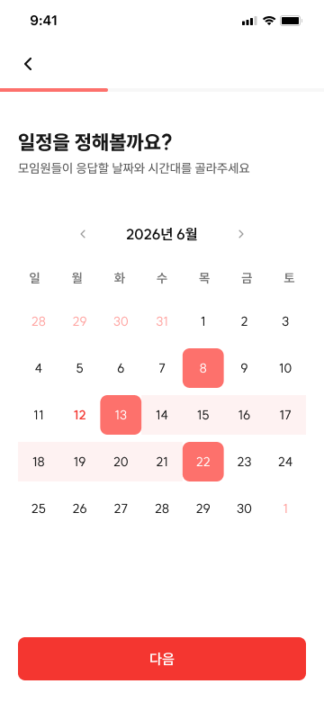
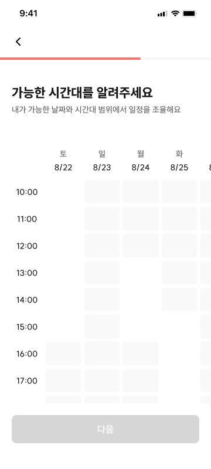
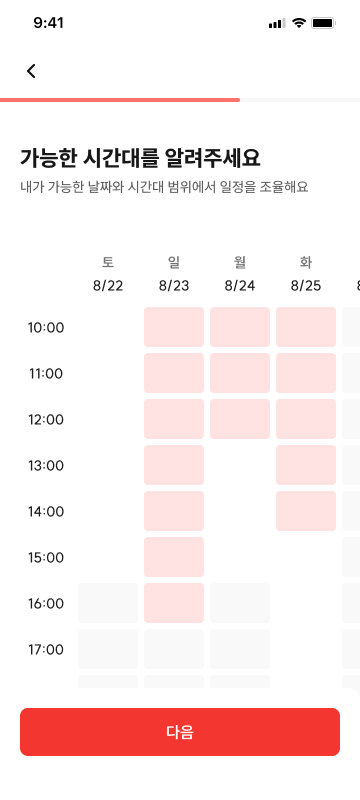

# INV-02 모임 참여 - 일정 입력

## 1. 화면 개요

| 항목        | 내용                                                                |
| ----------- | ------------------------------------------------------------------- |
| 화면 ID     | INV-02                                                              |
| 화면명      | 모임 참여 - 일정 입력                                               |
| 구분        | 날짜만 조율, 날짜와 시간대까지 조율                                 |
| 모임장 경로 | `/meetings/new/schedule/dates`, `/meetings/new/schedule/times`      |
| 참여자 경로 | `/i/[inviteToken]/respond/schedule`                                 |
| 진입 화면   | 모임장: CRT-06 · 참여자: INV-01                                     |
| 다음 화면   | 일정만 정하기: CRT-07 또는 INV-04 · 일정과 장소 모두 정하기: INV-03 |

모임장은 조율할 후보 날짜와 자신의 가능한 시간을 입력하고, 참여자는 모임장이 설정한 범위 안에서
자신의 가능한 날짜 또는 시간대를 입력한다.

- 날짜 캘린더는 일정 조율 모임을 생성할 때 항상 표시한다.
- 날짜 및 시간 블록은 생성·참여 모두 `DATE_AND_TIME`일 때만 표시한다. 모임 생성에서는 날짜
  캘린더 다음 단계인 별도 시간 화면(`schedule/times`)을 쓴다.
- 참여 시 `DATE_ONLY`이면 날짜 캘린더만, `DATE_AND_TIME`이면 날짜 및 시간 블록만 표시한다.
- `PLACE_ONLY`는 INV-02를 거치지 않는다.

최신 기능표의 "모임 생성 시 시간 블록이 항상 뜬다"는 문구는 실제 생성 분기(`step-config.ts`)와
어긋난다. 본 문서는 코드 기준으로 `DATE_AND_TIME`에만 표시하도록 기록했다(§9-2 확인 필요).

## 2. 근거 자료

- 최신 기능 명세 기준일: 2026년 7월 28일
- 상단 기획 메모:
  - 날짜만 조율, 시간대까지 조율로 구분
  - 불가능한 시간대로 입력하는 방식은 추후 고려
- Figma 화면:
  - [inv-02-A-1.png](./inv-02-A-1.png)
  - [inv-02-A-2.png](./inv-02-A-2.png)
  - [inv-02-B-1.png](./inv-02-B-1.png)
  - [inv-02-B-2.png](./inv-02-B-2.png)
- 실제 라우트:
  - 모임장 날짜: [`schedule/dates/page.tsx`](<../../../../apps/web/app/(protected)/meetings/new/schedule/dates/page.tsx>)
  - 모임장 시간: [`schedule/times/page.tsx`](<../../../../apps/web/app/(protected)/meetings/new/schedule/times/page.tsx>)
  - 참여자 일정: [`respond/schedule/page.tsx`](<../../../../apps/web/app/i/[inviteToken]/(participant)/respond/schedule/page.tsx>)
  - 참여자 초대 진입: [`[inviteToken]/page.tsx`](../../../../apps/web/app/i/[inviteToken]/page.tsx)
  - 참여자 출발지: [`respond/departure/page.tsx`](<../../../../apps/web/app/i/[inviteToken]/(participant)/respond/departure/page.tsx>)
  - 참여 완료: [`complete/page.tsx`](<../../../../apps/web/app/i/[inviteToken]/(participant)/complete/page.tsx>)
- 생성 흐름:
  - [`step-config.ts`](../../../../apps/web/src/features/meeting/create-meeting/model/step-config.ts)
  - [`back-button.tsx`](../../../../apps/web/src/features/meeting/create-meeting/ui/back-button.tsx)
- 관련 API:
  - [`meeting.ts`](../../../../apps/web/src/shared/api/generated/meeting/meeting.ts)
  - [`time.ts`](../../../../apps/web/src/shared/api/generated/time/time.ts)
- Orval 생성 스키마:
  - [`createMeetingRequest.ts`](../../../../apps/web/src/shared/api/generated/schemas/createMeetingRequest.ts)
  - [`createMeetingResponse.ts`](../../../../apps/web/src/shared/api/generated/schemas/createMeetingResponse.ts)
  - [`meetingInvitationResponse.ts`](../../../../apps/web/src/shared/api/generated/schemas/meetingInvitationResponse.ts)
  - [`memberJoinRequest.ts`](../../../../apps/web/src/shared/api/generated/schemas/memberJoinRequest.ts)
  - [`guestJoinRequest.ts`](../../../../apps/web/src/shared/api/generated/schemas/guestJoinRequest.ts)
  - [`scheduleResponseRequest.ts`](../../../../apps/web/src/shared/api/generated/schemas/scheduleResponseRequest.ts)
  - [`scheduleAvailabilityRequest.ts`](../../../../apps/web/src/shared/api/generated/schemas/scheduleAvailabilityRequest.ts)
  - [`serverTimeResponse.ts`](../../../../apps/web/src/shared/api/generated/schemas/serverTimeResponse.ts)

## 3. 기능 명세

| 구분 | 기능 ID    | 기능명            | 설명                                                                                                                                                                                                                                                                                                            | 참고                       | 우선순위 | 상태     | 완료 | 제외 | 수정일          |
| ---- | ---------- | ----------------- | --------------------------------------------------------------------------------------------------------------------------------------------------------------------------------------------------------------------------------------------------------------------------------------------------------------- | -------------------------- | -------- | -------- | ---- | ---- | --------------- |
| 공통 | INV-02-F01 | 날짜 캘린더       | • 날짜 선택 시 강조 표시<br>• 오늘 날짜 색상 강조<br>• 모임장이 설정한 후보 날짜 색상 강조(참여자)<br>• 모임장은 서버 기준 오늘 이전 날짜 선택 불가<br>• 참여자는 후보 날짜 범위 밖의 달·날짜로 이동 및 선택 불가<br>• 최대 21일까지 선택<br>• 모임 생성 시 항상 노출<br>• 모임 참여 시 날짜만 설정인 경우 노출 | `DATE_ONLY` 참여 화면      | P0       | 작업가능 | ☐    | ☐    | 2026년 7월 28일 |
| 공통 | INV-02-F02 | 날짜 및 시간 블록 | • 참여 시 모임장이 설정한 날짜와 시간대 범위 표시<br>• 모임 생성 시 이전 화면에서 선택한 날짜만 표시<br>• 가능한 시간대를 1시간 단위로 선택<br>• 드래그 선택 가능<br>• 모임 생성 시 `DATE_AND_TIME`인 경우 노출<br>• 모임 참여 시 날짜와 시간 설정인 경우 노출                                                  | `DATE_AND_TIME` 참여 화면  | P0       | 작업가능 | ☐    | ☐    | 2026년 7월 28일 |
| 공통 | INV-02-F03 | 다음 버튼         | • 현재 화면에서 필요한 날짜 또는 시간대를 선택해야 활성화<br>• 탭 시 케이스별 저장 또는 다음 단계 이동<br>• 일정 정하기는 모임 참여 완료(INV-04) 이동<br>• 둘 다 정하기는 출발지 입력(INV-03) 이동                                                                                                              | API 호출 시점은 §4·§7 참조 | P0       | 작업가능 | ☐    | ☐    | 2026년 7월 28일 |
| 공통 | INV-02-F04 | 뒤로가기 버튼     | • 좌상단 `<` 또는 `←` 버튼<br>• 참여자는 모임 참여 - 링크 진입(INV-01) 이동<br>• 모임장 날짜 화면은 모임 생성 완료 Bridge(CRT-06) 이동<br>• 모임장 시간 화면은 이전 날짜 화면 이동                                                                                                                              | 역할·현재 화면별 분기      | P0       | 작업가능 | ☐    | ☐    | 2026년 7월 28일 |

## 4. 라우트 및 화면 이동

### 실제 화면 경로

| 사용자 | 화면·조건                  | 실제 경로                                                                         |
| ------ | -------------------------- | --------------------------------------------------------------------------------- |
| 모임장 | INV-02 날짜 캘린더         | `/meetings/new/schedule/dates`                                                    |
| 모임장 | INV-02 날짜 및 시간 블록   | `/meetings/new/schedule/times`                                                    |
| 참여자 | INV-02 일정 입력           | `/i/[inviteToken]/respond/schedule`                                               |
| 참여자 | INV-01 초대 링크 진입      | `/i/[inviteToken]`                                                                |
| 공통   | INV-03 출발지 입력         | 모임장: `/meetings/new/departure`<br>참여자: `/i/[inviteToken]/respond/departure` |
| 참여자 | INV-04 참여 완료           | `/i/[inviteToken]/complete`                                                       |
| 모임장 | CRT-06 생성 정보 입력 완료 | `/meetings/new/created`                                                           |
| 모임장 | CRT-07 초대 링크 공유      | `/meetings/[meetingId]/invite`                                                    |

`[inviteToken]`은 현재 app 디렉터리의 동적 경로명이다. API는 같은 값을 `inviteCode`라는 이름으로
받으므로 화면 경로 파라미터를 API 호출 시 `inviteCode`로 전달한다.

### 노출 및 다음 이동

| 사용자 | `planningType`       | `scheduleInputType` | 화면 흐름 및 다음 동작                                                |
| ------ | -------------------- | ------------------- | --------------------------------------------------------------------- |
| 모임장 | `SCHEDULE_ONLY`      | `DATE_ONLY`         | CRT-06 → 날짜 캘린더 → `POST /api/meetings` → CRT-07                  |
| 모임장 | `SCHEDULE_ONLY`      | `DATE_AND_TIME`     | CRT-06 → 날짜 캘린더 → 시간 블록 → `POST /api/meetings` → CRT-07      |
| 모임장 | `SCHEDULE_AND_PLACE` | `DATE_ONLY`         | CRT-06 → 날짜 캘린더 → INV-03                                         |
| 모임장 | `SCHEDULE_AND_PLACE` | `DATE_AND_TIME`     | CRT-06 → 날짜 캘린더 → 시간 블록 → INV-03                             |
| 모임장 | `PLACE_ONLY`         | 없음                | CRT-06 → INV-03, INV-02 생략                                          |
| 참여자 | `SCHEDULE_ONLY`      | `DATE_ONLY`         | INV-01 → 신원 확보 → 날짜 캘린더 → 회원 또는 게스트 참여 API → INV-04 |
| 참여자 | `SCHEDULE_ONLY`      | `DATE_AND_TIME`     | INV-01 → 신원 확보 → 시간 블록 → 회원 또는 게스트 참여 API → INV-04   |
| 참여자 | `SCHEDULE_AND_PLACE` | `DATE_ONLY`         | INV-01 → 신원 확보 → 날짜 캘린더 → INV-03                             |
| 참여자 | `SCHEDULE_AND_PLACE` | `DATE_AND_TIME`     | INV-01 → 신원 확보 → 시간 블록 → INV-03                               |
| 참여자 | `PLACE_ONLY`         | 없음                | INV-01 → 신원 확보 → INV-03, INV-02 생략                              |

### 참여자 신원 확보

참여 API는 닉네임을 필수로 받으므로, 참여자는 INV-02에 들어오기 전에 신원이 확정돼 있어야 한다.
INV-02는 신원을 입력받지 않고 이미 확보된 값을 제출에만 사용한다.

| 참여자 유형 | 경유 화면                  | 경로                        | 확보하는 값            |
| ----------- | -------------------------- | --------------------------- | ---------------------- |
| 회원        | 모임 전용 닉네임 최초 설정 | `/i/[inviteToken]/nickname` | `nickname`             |
| 게스트      | 게스트 로그인              | `/i/[inviteToken]/guest`    | `nickname`, `password` |

- 회원은 이미 로그인된 상태이며 모임 전용 닉네임만 최초 1회 설정한다.
- 게스트는 닉네임과 비밀번호로 게스트 로그인을 거친다. 이 값이 그대로 `GuestJoinRequest`의
  `nickname`·`password`가 된다.
- 모임장은 생성 흐름에서 이미 로그인 상태이므로 별도 신원 확보 단계가 없다.

### 뒤로가기

| 현재 화면         | 사용자 | 이동 경로                      | 화면   |
| ----------------- | ------ | ------------------------------ | ------ |
| 날짜 캘린더       | 참여자 | `/i/[inviteToken]`             | INV-01 |
| 날짜 및 시간 블록 | 참여자 | `/i/[inviteToken]`             | INV-01 |
| 날짜 캘린더       | 모임장 | `/meetings/new/created`        | CRT-06 |
| 날짜 및 시간 블록 | 모임장 | `/meetings/new/schedule/dates` | INV-02 |

모임장 날짜 화면의 이전 스텝은 실제 `step-config.ts`에서도 `created`로 계산된다. 뒤로가기만으로
선택값을 서버에 제출하거나 생성 draft를 초기화하지 않는다.

### 관련 API

| 시점·용도                | Method | API 경로                                         | 요청·응답                                                    |
| ------------------------ | ------ | ------------------------------------------------ | ------------------------------------------------------------ |
| 서버 기준 현재 시각 조회 | GET    | `/api/time`                                      | `ServerTimeResponse.serverTime`                              |
| 참여자 초대 설정 조회    | GET    | `/api/meetings/invitations/{inviteCode}`         | `MeetingInvitationResponse`                                  |
| 모임장 최종 모임 생성    | POST   | `/api/meetings`                                  | multipart `request: CreateMeetingRequest`, 선택 `coverImage` |
| 로그인 회원 최종 참여    | POST   | `/api/meetings/invitations/{inviteCode}/members` | `MemberJoinRequest` → `ParticipantJoinResponse`              |
| 게스트 최종 참여         | POST   | `/api/meetings/invitations/{inviteCode}/guests`  | `GuestJoinRequest` → `ParticipantJoinResponse`               |

- `GET /api/time`은 오늘 이전 날짜의 비활성화 판단에 사용한다. 서비스 기준 시간대는
  `Asia/Seoul` 고정이며, 조회에 실패해도 브라우저 로컬 시각으로 대체하지 않는다.
- 참여자는 초대 조회 응답의 `planningType`, `scheduleMode`, `scheduleInputType`,
  `scheduleCandidateDates`, `availableStartTime`, `availableEndTime`,
  `participationStatus`를 사용한다.
- `SCHEDULE_ONLY`는 INV-02가 마지막 입력 화면이므로 다음 버튼에서 최종 생성·참여 API를 호출한다.
- `SCHEDULE_AND_PLACE`는 출발지까지 하나의 생성·참여 요청에 포함해야 하므로 INV-02에서는 API를
  호출하지 않고 INV-03으로 이동한다.
- 생성 성공 시 응답의 `meetingId`를 사용해 `/meetings/[meetingId]/invite`로 이동한다.
- 참여 성공 시 `/i/[inviteToken]/complete`로 이동한다.

### 진입 조건과 방어

INV-02 진입 자체를 막는 조건은 역할별로 다르다.

| 역할   | 조건                                           | 처리                                             |
| ------ | ---------------------------------------------- | ------------------------------------------------ |
| 모임장 | 앞 생성 스텝이 미완성                          | 생성 위저드 가드가 `/meetings/new`로 되돌린다    |
| 참여자 | `participationStatus.canJoin=false`            | INV-01에서 이미 차단되어 INV-02로 넘어올 수 없다 |
| 참여자 | `scheduleMode='NONE'` 또는 후보 날짜가 빈 배열 | 다음 화면으로 이동할 수 없다                     |

- `participationStatus`는 INV-01이 사용하는 값이다. `reason`이 `DEADLINE_PASSED`(마감 기한 지남)
  또는 `PARTICIPANT_LIMIT_EXCEEDED`(정원 초과)이면 INV-01의 상태 화면에서 참여하기 버튼이
  비활성화되므로, INV-02는 `canJoin=true`인 경우만 진입한다고 전제한다. INV-02가 이 값을 다시
  판정하지는 않는다.
- `scheduleMode`는 요청이 아니라 **응답 전용** 필드다. 모임장이 고르는 값이 아니라 서버가
  `planningType`에서 파생해 초대 조회 응답에 실어준다. 값은 `VOTE`(일정 조율)와 `NONE`(일정 없음)
  이며, `NONE`이면 `scheduleCandidateDates`가 빈 배열이다.
- 참여자 화면이 `scheduleMode='NONE'`이거나 `scheduleCandidateDates`가 빈 배열인 응답을 받으면
  선택할 수 있는 날짜가 없으므로 다음 버튼을 활성화하지 않는다.

## 5. 화면 입력 데이터

### 입력값과 API 필드

| 화면 입력               | 사용자 | API 요청 필드                            | 필수 조건           | 값·제약                                                           |
| ----------------------- | ------ | ---------------------------------------- | ------------------- | ----------------------------------------------------------------- |
| 모임장이 정한 후보 날짜 | 모임장 | `scheduleCandidateDates`                 | 일정 조율 모임      | `yyyy-MM-dd` 배열, 하나 이상, 중복 없음                           |
| 참여자가 가능한 날짜    | 참여자 | `scheduleResponse.availableDates`        | `DATE_ONLY`         | `scheduleCandidateDates`에 포함된 날짜만 허용                     |
| 날짜별 가능한 시간 범위 | 공통   | `scheduleResponse.availableTimeRanges[]` | `DATE_AND_TIME`     | 후보 날짜, 시작 시간, 종료 시간                                   |
| 시간 범위의 날짜        | 공통   | `availableTimeRanges[].candidateDate`    | 시간 범위를 보낼 때 | `scheduleCandidateDates` 중 하나                                  |
| 시간 범위 시작          | 공통   | `availableTimeRanges[].startTime`        | 시간 범위를 보낼 때 | 1시간 경계, 설정된 공통 시간 범위 안                              |
| 시간 범위 종료          | 공통   | `availableTimeRanges[].endTime`          | 시간 범위를 보낼 때 | 시작보다 뒤, 마지막 선택 블록 다음 시각, 설정된 공통 시간 범위 안 |

`availableStartTime`과 `availableEndTime`은 INV-02에서 새로 입력하는 값이 아니다. 모임장은
CRT-03에서 정하고, 참여자는 초대 조회 응답으로 받는다.

### 데이터 구분

- `scheduleCandidateDates`는 모든 참여자에게 제시할 후보 날짜다.
- `scheduleResponse`는 모임장 또는 참여자 한 사람의 가능 일정이다.
- `DATE_ONLY`의 모임장 생성 요청은 Orval 계약상 `scheduleCandidateDates`만 보내고
  `scheduleResponse`는 생략한다.
- `DATE_ONLY` 참여 요청은 `scheduleResponse.availableDates`를 보낸다.
- `DATE_AND_TIME`은 `scheduleResponse.availableTimeRanges`를 보내며 `availableDates`와 동시에
  보내지 않는다.
- 연속된 1시간 블록은 하나의 `[startTime, endTime)` 범위로 합친다. 떨어진 블록은 별도 범위로
  보낸다.

예를 들어 18시와 19시 블록을 연속 선택하면 다음과 같이 전송한다.

```json
{
  "scheduleResponse": {
    "availableTimeRanges": [
      {
        "candidateDate": "2026-07-30",
        "startTime": "18:00",
        "endTime": "20:00"
      }
    ]
  }
}
```

## 6. Figma 화면

### 날짜 캘린더 기본 화면



- 상단에 뒤로가기 버튼과 진행 표시가 있다.
- 안내 문구 아래에 월 단위 캘린더가 표시된다.
- 오늘, 선택 가능 날짜, 선택 날짜와 선택 불가 날짜를 서로 구분해 표시한다.
- 다음 버튼은 화면 하단에 표시된다.

### 날짜 캘린더 선택 화면



- 선택한 날짜가 강조된다.
- 복수 날짜를 선택할 수 있다.
- 하나 이상의 날짜가 선택되면 다음 버튼이 활성화된다.

### 날짜 및 시간 블록 기본 화면



- 모임장이 선택한 후보 날짜만 열로 표시한다.
- 설정된 공통 시간 범위를 1시간 단위 행으로 표시한다.
- 선택 가능한 블록과 선택 불가 블록을 시각적으로 구분한다.

### 날짜 및 시간 블록 선택 화면



- 탭 또는 드래그로 선택한 시간 블록이 강조된다.
- 서로 떨어진 복수 시간대를 선택할 수 있다.
- 하나 이상의 시간 블록이 선택되면 다음 버튼이 활성화된다.

정확한 색상, 간격, 크기와 타이포그래피는 Figma Dev Mode와 디자인 토큰을 구현 기준으로 한다.

## 7. 기능별 동작

### INV-02-F01 날짜 캘린더

- 모임 생성에서는 후보 날짜를 정하기 위해 항상 표시한다.
- 참여에서는 `scheduleInputType=DATE_ONLY`일 때 표시한다.
- 모임장은 서버 기준 오늘 이전 날짜를 선택할 수 없다.
- 참여자는 서버 기준 오늘 이전 날짜와 `scheduleCandidateDates` 밖의 날짜를 선택할 수 없다.
- 선택할 수 없는 날짜와 달로 이동하거나 해당 날짜를 탭·드래그해 선택할 수 없다.
- 날짜를 탭하거나 드래그해 복수 선택하고, 선택된 날짜를 다시 조작하면 선택을 해제한다.
- 오늘 날짜, 모임장이 설정한 후보 날짜와 사용자가 선택한 날짜를 구분해 강조한다.
- 최초 표시 월은 서버 기준 오늘이 속한 달이다. 사용자가 달을 넘긴 뒤에는 그 선택을 유지한다.
- 최대 21일까지 선택할 수 있다. 초과하는 조작은 반영하지 않고 "최대 21일까지 선택 가능"을
  제스처당 1회 토스트로 안내한다.
- 선택 결과가 없으면 다음 버튼을 비활성화한다.

**서버 시각 조회 상태** — 날짜 활성/비활성 판단이 `GET /api/time`에 의존하므로, 값을 받기 전에는
캘린더를 조작할 수 없어야 한다.

- 조회 중에는 캘린더 자리에 로딩 상태를 표시하고 다음 버튼을 비활성화한다.
- 조회에 실패하거나 `serverTime`을 해석할 수 없으면 실패 상태와 다시 시도 수단을 제공하고,
  재시도가 성공하면 캘린더로 복구한다.
- 어떤 경우에도 브라우저 로컬 시각으로 대체해 캘린더를 열지 않는다. 자정 경계에서 서버와
  다른 날짜가 활성화되면 선택값이 서버 검증에서 거부되기 때문이다.
- 로딩·실패 상태의 문구와 시각 표현은 기획 확정 전이다(§9-5).

### INV-02-F02 날짜 및 시간 블록

- 모임 생성의 `DATE_AND_TIME`에서는 날짜 캘린더 다음 화면으로 표시한다.
- 참여에서는 `scheduleInputType=DATE_AND_TIME`일 때 바로 표시한다.
- 모임장 화면은 앞 화면의 `scheduleCandidateDates`만 표시한다.
- 참여자 화면은 초대 조회로 받은 후보 날짜와 `availableStartTime` 이상
  `availableEndTime` 미만 범위만 표시·활성화한다.
- 한 블록은 1시간이며 탭으로 선택·해제할 수 있다.
- 드래그가 지나간 선택 가능 블록을 같은 선택 상태로 변경한다.
- 하나 이상의 블록을 선택해야 다음 버튼을 활성화한다.
- 참여자 화면은 초대 조회 응답을 받기 전에는 F01과 같은 로딩·실패 상태 규칙을 따른다. 후보
  날짜와 공통 시간 범위를 모르면 격자 자체를 그릴 수 없기 때문이다.

### INV-02-F03 다음 버튼

- 날짜 화면은 하나 이상의 날짜가 선택된 경우에만 활성화한다.
- 시간 화면은 하나 이상의 시간 블록이 선택된 경우에만 활성화한다.
- 서버 시각 또는 초대 조회가 아직 성공하지 않았으면 선택 여부와 무관하게 비활성화한다.
- 모임장 `SCHEDULE_ONLY`의 마지막 일정 화면에서는 `POST /api/meetings`를 호출한다.
- 참여자 `SCHEDULE_ONLY`에서는 회원 또는 게스트 참여 API를 호출한다. 요청에 필요한 `nickname`
  (게스트는 `password`까지)은 INV-02에서 입력받지 않고, §4 "참여자 신원 확보"에서 이미 확보한
  값을 그대로 싣는다.
- API 요청 중에는 중복 탭을 막고, 성공 시 각각 CRT-07 또는 INV-04로 이동한다.
- API 실패 시 현재 입력을 유지하고 재시도할 수 있게 한다.
- `SCHEDULE_AND_PLACE`에서는 출발지 입력이 남아 있으므로 INV-03으로 이동하고, 최종 API는
  INV-03에서 일정과 출발지를 함께 전송한다.

### INV-02-F04 뒤로가기 버튼

- 화면 좌상단에 `<` 또는 `←` 형태의 버튼을 표시한다.
- 참여자는 현재 일정 유형과 관계없이 `/i/[inviteToken]`의 INV-01로 이동한다. 실제 직전 화면은
  회원이면 닉네임 설정, 게스트면 게스트 로그인이라 최신 명세와 어긋난다(§9-3).
- 모임장 날짜 화면은 `/meetings/new/created`의 CRT-06으로 이동한다.
- 모임장 시간 화면은 `/meetings/new/schedule/dates`의 INV-02 날짜 화면으로 이동한다.
- 뒤로가기 자체로 기존 선택이나 생성 draft를 제거하지 않는다.
- API 제출 중에는 뒤로가기로 중복 제출 흐름을 만들 수 없게 한다.

## 8. 검증 기준

- [ ] 모임장 날짜 화면이 `/meetings/new/schedule/dates`에서 열린다.
- [ ] 모임장 시간 화면이 `/meetings/new/schedule/times`에서 열린다.
- [ ] 참여자 일정 화면이 `/i/[inviteToken]/respond/schedule`에서 열린다.
- [ ] 모임 생성 시 날짜 캘린더가 표시된다.
- [ ] 참여자 `DATE_ONLY`에는 날짜 캘린더만 표시된다.
- [ ] 참여자 `DATE_AND_TIME`에는 날짜 및 시간 블록이 표시된다.
- [ ] `PLACE_ONLY`는 INV-02를 거치지 않는다.
- [ ] 서버 기준 오늘 날짜와 선택 날짜가 구분되어 표시된다.
- [ ] 캘린더의 최초 표시 월이 서버 기준 오늘이 속한 달이다.
- [ ] 모임장은 서버 기준 오늘 이전 날짜를 선택할 수 없다.
- [ ] 후보 날짜를 21일까지 선택할 수 있고, 초과 조작은 반영되지 않으며 안내 토스트가 1회 뜬다.
- [ ] 서버 시각 조회 중에는 로딩 상태가 보이고 다음 버튼이 비활성화된다.
- [ ] 서버 시각 조회에 실패하면 다시 시도 수단이 보이고, 재시도 성공 시 캘린더로 복구된다.
- [ ] 서버 시각을 못 받은 상태에서 로컬 시각으로 캘린더가 열리지 않는다.
- [ ] 참여자는 모임장이 정한 후보 날짜 밖의 날짜를 선택할 수 없다.
- [ ] 후보 범위 밖의 달과 날짜로 이동하거나 해당 날짜를 선택할 수 없다.
- [ ] 참여자 응답의 `scheduleCandidateDates`가 빈 배열이면 다음 버튼이 활성화되지 않는다.
- [ ] 시간 블록을 1시간 단위로 탭 및 드래그 선택·해제할 수 있다.
- [ ] 날짜 또는 시간 선택이 없으면 다음 버튼이 비활성화된다.
- [ ] 연속 블록이 하나의 시작·종료 범위로 전송된다.
- [ ] `DATE_ONLY`는 `availableDates`, `DATE_AND_TIME`은 `availableTimeRanges`만 전송한다.
- [ ] 모임장 `SCHEDULE_ONLY`의 마지막 일정 화면에서 `POST /api/meetings`를 호출한다.
- [ ] 참여자 `SCHEDULE_ONLY`에서 역할에 맞는 회원 또는 게스트 참여 API를 호출한다.
- [ ] `SCHEDULE_AND_PLACE`의 다음 버튼은 API를 조기 호출하지 않고 INV-03으로 이동한다.
- [ ] 모임 생성 성공 시 응답 `meetingId`를 사용해 CRT-07로 이동한다.
- [ ] 참여 성공 시 INV-04로 이동한다.
- [ ] 참여자 뒤로가기는 INV-01로 이동한다.
- [ ] 모임장 날짜 화면 뒤로가기는 CRT-06으로 이동한다.
- [ ] 모임장 시간 화면 뒤로가기는 날짜 화면으로 이동한다.
- [ ] 참여 API 요청에 신원 확보 단계에서 받은 `nickname`(게스트는 `password` 포함)이 실린다.

## 9. 확인 필요

1. **“다음 탭 시 서버 저장, 클라이언트 저장 X”와 API 계약 충돌**
   - 최신 기능 명세는 다음 버튼을 탭할 때 서버에 저장하고 클라이언트에는 저장하지 않는다고
     설명한다.
   - 실제 생성 API는 모임 기본 정보, 일정, 출발지를 하나의 `POST /api/meetings` 요청으로 받는다.
   - 회원·게스트 참여 API도 일정과 출발지를 하나의 참여 요청으로 받는다.
   - 따라서 `SCHEDULE_AND_PLACE`에서 INV-02 다음 버튼을 누를 때 서버에 먼저 저장할 수 있는
     별도 일정 임시저장 API가 현재 Orval 계약에 없다.
   - 이 문서는 현재 API 계약에 맞춰 INV-03에서 최종 제출하도록 기록했으며, 기획 문구 수정 또는
     별도 임시저장 API 추가 여부를 확정해야 한다.
2. **모임 생성 시 시간 블록 “항상 뜸”의 의미**
   - 최신 기능표에는 모임 생성 시 날짜 및 시간 블록이 항상 뜬다고 되어 있다.
   - 실제 생성 분기는 `DATE_ONLY`일 때 시간 화면을 생략하고 `DATE_AND_TIME`일 때만
     `/meetings/new/schedule/times`를 포함한다.
   - “INV-02 기능이 생성 흐름에 항상 포함된다”는 의미인지, `DATE_ONLY`에서도 시간 블록을
     표시해야 한다는 의미인지 확인이 필요하다.
3. **참여자 뒤로가기 목적지**
   - 최신 명세의 뒤로가기 목적지는 INV-01이다.
   - 그런데 참여자의 실제 직전 화면은 회원이면 모임 전용 닉네임 설정
     (`/i/[inviteToken]/nickname`), 게스트면 게스트 로그인(`/i/[inviteToken]/guest`)이다.
   - 뒤로가기가 이 화면들을 건너뛰고 INV-01로 가는 것이 의도인지, 직전 화면으로 돌아가야 하는지
     확인이 필요하다. 게스트는 되돌아가면 다시 로그인해야 하므로 INV-01이 더 자연스러울 수 있다.
   - 본 문서는 최신 명세를 따라 INV-01로 기록했다.
4. **불가능한 시간 입력**
   - 상단 기획 메모에 따라 이번 범위에서는 가능한 시간대를 선택하는 방식만 기록했다.
   - 불가능한 시간대를 입력하는 역선택 방식은 후속 정책 확정이 필요하다.
5. **로딩·실패 상태의 표현**
   - §7 F01에 "무엇을 보장할지"(로딩 중 다음 비활성, 실패 시 재시도 가능, 로컬 시각 대체 금지)만
     확정해 두었다.
   - 로딩 표현의 형태와 실패 안내 문구, 재시도 버튼의 라벨과 배치는 시안이 없어 미확정이다.
   - 구현은 우선 최소 형태로 만들고, 시안이 나오면 문구와 시각 표현만 교체한다.

### 확정되어 §9에서 내려온 항목

| 항목               | 확정 내용         | 근거                                       |
| ------------------ | ----------------- | ------------------------------------------ |
| 최대 후보 날짜     | 21일              | `docs/features/INV-02/spec-fixed.md` §12-1 |
| 서비스 기준 시간대 | `Asia/Seoul` 고정 | `docs/features/INV-02/spec-fixed.md` §12-2 |

최대 21일은 `CRT-02/F01 spec-fixed §3-2`의 확정값을 재사용한 것이다. 두 값은 §3 F01·§7 F01·§8에
제약으로 반영했다.
