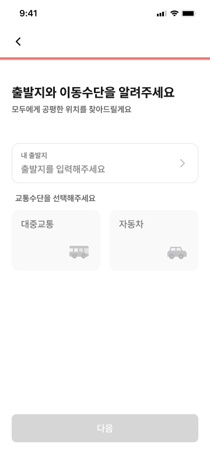
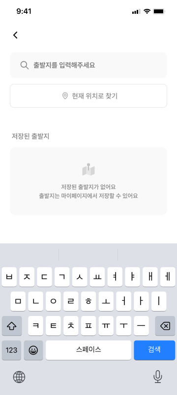
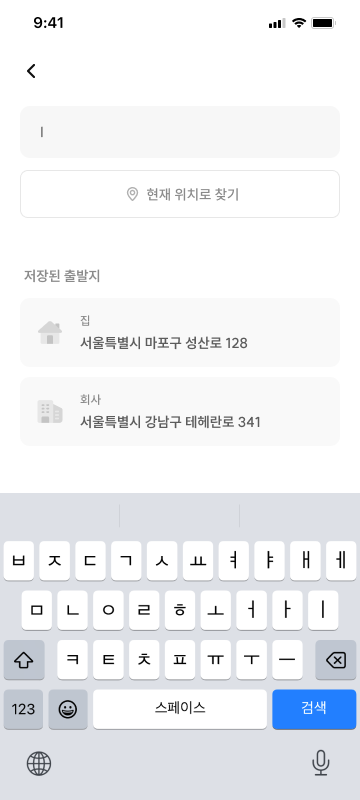
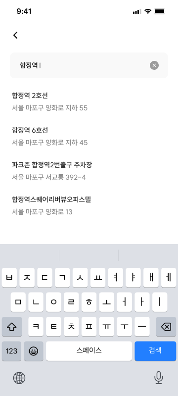
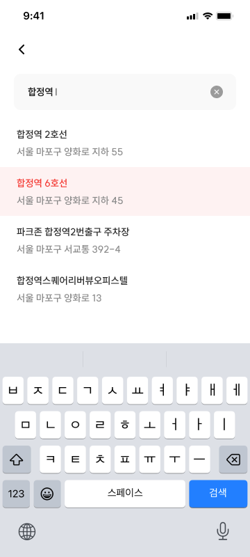
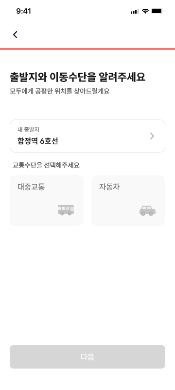
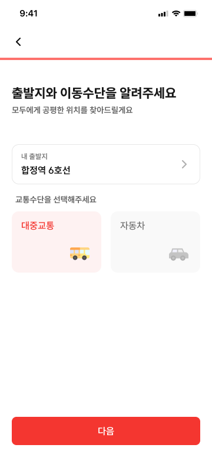

# INV-03 모임 참여 - 출발지 입력

## 1. 화면 개요

| 항목             | 내용                                                                                             |
| ---------------- | ------------------------------------------------------------------------------------------------ |
| 화면 ID          | INV-03                                                                                           |
| 화면명           | 모임 참여 - 출발지 입력                                                                          |
| 모임장 경로      | `/meetings/new/departure`                                                                        |
| 참여자 경로      | `/i/[inviteToken]/respond/departure`                                                             |
| 출발지 검색 경로 | 모임장: `/meetings/new/departure/search`<br>참여자: `/i/[inviteToken]/respond/departure/search`  |
| 진입 화면        | `SCHEDULE_AND_PLACE`: INV-02 일정 입력<br>`PLACE_ONLY`: CRT-06 또는 INV-01의 신원 확보 화면 이후 |
| 다음 화면        | 모임장: CRT-07 초대 링크 공유<br>참여자: INV-04 참여 완료                                        |

일정과 장소를 모두 정하거나 장소만 정하는 모임에서 출발지와 이동수단을 필수로 입력하고, 모임
생성 또는 참여 요청을 최종 제출하는 화면이다.

## 2. 근거 자료

- 최신 기능 명세 기준일: 2026년 7월 29일
- Figma 이미지:
  - [`INV-03-1-초기.png`](./INV-03-1-초기.png)
  - [`INV-03-2-검색모달-저장된-출발지x.png`](./INV-03-2-검색모달-저장된-출발지x.png)
  - [`INV-03-3-검색모달-저장된-출발지o.png`](./INV-03-3-검색모달-저장된-출발지o.png)
  - [`INV-03-5-검색모달-검색결과.png`](./INV-03-5-검색모달-검색결과.png)
  - [`INV-03-6-검색모달-검색결과-선택.png`](./INV-03-6-검색모달-검색결과-선택.png)
  - [`INV-03-7-출발지-입력.png`](./INV-03-7-출발지-입력.png)
  - [`INV-03-8-교통수단-입력.png`](./INV-03-8-교통수단-입력.png)
- 실제 라우트:
  - 모임장 출발지 입력:
    [`page.tsx`](<../../../../apps/web/app/(protected)/meetings/new/departure/page.tsx>)
  - 모임장 출발지 검색:
    [`page.tsx`](<../../../../apps/web/app/(protected)/meetings/new/departure/search/page.tsx>)
  - 참여자 출발지 입력:
    [`page.tsx`](<../../../../apps/web/app/i/[inviteToken]/(participant)/respond/departure/page.tsx>)
  - 참여자 출발지 검색:
    [`page.tsx`](<../../../../apps/web/app/i/[inviteToken]/(participant)/respond/departure/search/page.tsx>)
  - 참여 완료:
    [`page.tsx`](<../../../../apps/web/app/i/[inviteToken]/(participant)/complete/page.tsx>)
  - 초대 링크 공유:
    [`page.tsx`](<../../../../apps/web/app/(protected)/meetings/[meetingId]/invite/page.tsx>)
- Orval 생성 API 및 스키마:
  - [`meeting.ts`](../../../../apps/web/src/shared/api/generated/meeting/meeting.ts)
  - [`departure-place.ts`](../../../../apps/web/src/shared/api/generated/departure-place/departure-place.ts)
  - [`my-place.ts`](../../../../apps/web/src/shared/api/generated/my-place/my-place.ts)
  - [`departureRequest.ts`](../../../../apps/web/src/shared/api/generated/schemas/departureRequest.ts)
  - [`createMeetingRequest.ts`](../../../../apps/web/src/shared/api/generated/schemas/createMeetingRequest.ts)
  - [`memberJoinRequest.ts`](../../../../apps/web/src/shared/api/generated/schemas/memberJoinRequest.ts)
  - [`guestJoinRequest.ts`](../../../../apps/web/src/shared/api/generated/schemas/guestJoinRequest.ts)

## 3. 기능 명세

| 구분 | 기능 ID    | 기능명                    | 설명                                                                                                                                               | 참고                              | 우선순위 | 상태     | 완료 | 제외 | 수정일          |
| ---- | ---------- | ------------------------- | -------------------------------------------------------------------------------------------------------------------------------------------------- | --------------------------------- | -------- | -------- | ---- | ---- | --------------- |
| 공통 | INV-03-F01 | 출발지 입력 필드          | • 탭 시 **출발지 검색(INV-03-A)** 화면으로 이동<br>• 출발지 선택 후 복귀 시, 해당 필드에 표시명 + 상세주소로 표시                                  | 검색 경로는 §4 참조               | P0       | 작업가능 | ☐    | ☐    | 2026년 7월 29일 |
| 회원 | INV-03-F02 | 저장된 출발지 리스트      | • 사용자가 저장한 출발지 리스트<br>• 리스트 표시 내용: 장소 종류 아이콘, 표시명, 상세 주소<br>• 리스트에서 선택 시 필드에 표시명 + 상세주소로 표시 | 아이콘 기준은 §9-5 참조           | P0       | 작업가능 | ☐    | ☐    | 2026년 7월 29일 |
| 회원 | INV-03-F03 | 저장된 출발지 Empty State | • 저장된 출발지가 0건인 경우, 리스트 대신 안내 표시<br>• 1행: "저장된 출발지가 없어요"<br>• 2행: "출발지는 마이페이지에서 저장할 수 있어요"        | 저장 화면 부재는 §9 참조          | P0       | 작업가능 | ☐    | ☐    | 2026년 7월 29일 |
| 공통 | INV-03-F04 | 이동수단 선택 버튼        | • 이동수단: 대중교통 / 자동차 2개 중 단일 선택                                                                                                     | API 값: `PUBLIC_TRANSIT` / `CAR`  | P0       | 작업가능 | ☐    | ☐    | 2026년 7월 29일 |
| 공통 | INV-03-F05 | 다음 버튼                 | • 출발지 및 이동수단 입력해야 활성화<br>• 탭 시 서버에 입력 정보 저장 (클라이언트 저장 X)<br>• 탭 시 **모임 참여 - 참여 완료(INV-04)** 이동        | 모임장은 생성 성공 후 CRT-07 이동 | P0       | 작업가능 | ☐    | ☐    | 2026년 7월 29일 |
| 공통 | INV-03-F06 | 뒤로가기 버튼             | • 탭 시 **모임 참여 - 일정 입력(INV-02)** 이동<br>• 선택 여부와 상관없이 복귀 가능                                                                 | `PLACE_ONLY` 예외는 §9 참조       | P0       | 작업가능 | ☐    | ☐    | 2026년 7월 29일 |

## 4. 라우트 및 화면 이동

### 실제 화면 경로

| 사용자 | 화면                  | 실제 경로                                   |
| ------ | --------------------- | ------------------------------------------- |
| 모임장 | INV-03 출발지 입력    | `/meetings/new/departure`                   |
| 모임장 | INV-03-A 출발지 검색  | `/meetings/new/departure/search`            |
| 참여자 | INV-03 출발지 입력    | `/i/[inviteToken]/respond/departure`        |
| 참여자 | INV-03-A 출발지 검색  | `/i/[inviteToken]/respond/departure/search` |
| 모임장 | CRT-07 초대 링크 공유 | `/meetings/[meetingId]/invite`              |
| 참여자 | INV-04 참여 완료      | `/i/[inviteToken]/complete`                 |

`[inviteToken]`은 현재 `app` 디렉터리의 동적 경로명이다. 회원·게스트 참여 API에서는 같은 값을
`inviteCode` 경로 변수로 전달한다.

### 모임 유형별 진입과 제출

| 사용자 | `planningType`       | INV-03 진입 전 화면                     | 다음 버튼의 최종 요청     | 성공 시 이동                   |
| ------ | -------------------- | --------------------------------------- | ------------------------- | ------------------------------ |
| 모임장 | `PLACE_ONLY`         | CRT-06                                  | `POST /api/meetings`      | `/meetings/[meetingId]/invite` |
| 모임장 | `SCHEDULE_AND_PLACE` | INV-02 날짜 또는 시간 입력              | `POST /api/meetings`      | `/meetings/[meetingId]/invite` |
| 참여자 | `PLACE_ONLY`         | INV-01의 회원 닉네임 또는 게스트 로그인 | 회원 또는 게스트 참여 API | `/i/[inviteToken]/complete`    |
| 참여자 | `SCHEDULE_AND_PLACE` | INV-02 날짜 또는 시간 입력              | 회원 또는 게스트 참여 API | `/i/[inviteToken]/complete`    |

`SCHEDULE_ONLY`에는 출발지 정보가 필요하지 않으므로 INV-03을 노출하지 않는다. `PLACE_ONLY`는
INV-02를 거치지 않고 INV-03으로 진입한다. `SCHEDULE_AND_PLACE`는 INV-02에서 선택한 일정과
INV-03에서 선택한 출발지를 최종 요청 하나에 함께 전송한다.

### 출발지 검색 이동

- 출발지 입력 필드를 누르면 사용자 역할에 맞는 `/departure/search` 경로로 **일반 페이지 이동**한다.
- 검색 결과 또는 저장된 출발지를 선택하면 장소 값을 반영한 뒤 INV-03 입력 화면으로 되돌아간다.
- 검색 화면을 선택 없이 벗어나면 기존 출발지 값을 변경하지 않는다.
- 선택한 출발지는 생성 draft에 있으므로 검색 화면을 오갈 때 입력값을 잃지 않는다.

### Intercepting Routes 구조

검색 URL을 담당하는 일반 `search/page.tsx`를 유지하고, INV-03 레이아웃의 병렬 슬롯에서 같은 URL을
가로챈다.

```text
meetings/new/departure/
├─ layout.tsx
├─ page.tsx
├─ search/page.tsx
└─ @modal/
   ├─ default.tsx
   └─ (.)search/page.tsx

i/[inviteToken]/(participant)/respond/departure/
├─ layout.tsx
├─ page.tsx
├─ search/page.tsx
└─ @modal/
   ├─ default.tsx
   └─ (.)search/page.tsx
```

- `layout.tsx`는 기본 화면인 `children`과 병렬 슬롯 `modal`을 함께 렌더링한다.
- `@modal/default.tsx`는 검색이 열리지 않은 경로에서 `null`을 반환한다.
- `@modal/(.)search/page.tsx`는 INV-03에서 `/departure/search`로 이동할 때 모달을 렌더링한다.
- 일반 `search/page.tsx`와 intercepted page는 같은 화면 내용을 써서 동작 차이가 생기지 않게 한다.

### 왜 일반 라우트가 아니라 인터셉팅인가

**위저드 레이아웃 때문이다.** `meetings/new/layout.tsx`가 앱 바와 진행바를 모든 하위 라우트에
씌우므로, 검색을 평범한 하위 라우트로 두면 검색 화면 자체의 앱 바와 겹쳐 **헤더가 두 겹**이 된다.
레이아웃이 "어떤 자식이 전체 화면인지" 알게 만드는 우회는 암묵적 결합이라 피한다.

병렬 슬롯의 모달은 위저드 셸과 **형제**로 그려져 이 문제가 구조적으로 없다. 덤으로 `children`이
언마운트되지 않아 검색을 오갈 때 입력 화면 상태가 유지되고, 새로고침·직접 진입은 독립
`search/page.tsx`가 받는다.

> ⚠️ **모달은 앱 셸 폭 안에 있어야 한다.**
> `fixed inset-0`으로 덮으면 `.app-shell`(최대 480px)을 벗어나 데스크톱에서 화면 전체를 가린다.
> `shared/ui/overlay`의 `useOverlayContainer()`가 셸 폭에 맞춘 오버레이 루트를 제공하므로
> 거기에 포탈한다.

브라우저 히스토리에 남고 뒤로가기로 닫히는 이점은 실제 라우트라 그대로 얻는다.

> ⚠️ **안드로이드 하드웨어 뒤로가기는 별도 배선이 필요하다.**
> `react-native-webview`는 기본적으로 하드웨어 뒤로가기를 WebView 히스토리로 연결하지 않는다.
> 현재 `apps/native`에 `BackHandler` 처리가 없어 뒤로가기를 누르면 앱이 종료된다.
> 이 화면과 무관하게 선행돼야 하는 작업이다.

### 뒤로가기

| 사용자 | `planningType`       | `scheduleInputType`              | 이동 경로                           |
| ------ | -------------------- | -------------------------------- | ----------------------------------- |
| 모임장 | `SCHEDULE_AND_PLACE` | `DATE_ONLY`                      | `/meetings/new/schedule/dates`      |
| 모임장 | `SCHEDULE_AND_PLACE` | `DATE_AND_TIME`                  | `/meetings/new/schedule/times`      |
| 모임장 | `PLACE_ONLY`         | 없음                             | `/meetings/new/created`             |
| 참여자 | `SCHEDULE_AND_PLACE` | `DATE_ONLY` 또는 `DATE_AND_TIME` | `/i/[inviteToken]/respond/schedule` |
| 참여자 | `PLACE_ONLY`         | 없음                             | 확인 필요 (§9)                      |

브라우저 방문 기록만 사용하지 않고 모임 유형과 일정 입력 유형을 기준으로 목적지를 결정한다. 뒤로가기
자체로 서버 요청을 호출하지 않으며, 선택 여부와 상관없이 이동할 수 있다.

### 관련 API

| 용도                          | 메서드와 경로                                         | 요청·응답                                                                   |
| ----------------------------- | ----------------------------------------------------- | --------------------------------------------------------------------------- |
| 출발지 검색                   | `POST /api/departure-places/searches`                 | 요청: `DeparturePlaceSearchRequest`<br>응답: `DeparturePlaceSearchResponse` |
| 회원의 저장된 출발지 조회     | `GET /api/me/places`                                  | 응답: `SavedPlaceListResponse`                                              |
| 모임 생성 및 모임장 정보 저장 | `POST /api/meetings`                                  | 요청의 `departure`: `DepartureRequest`<br>응답: `CreateMeetingResponse`     |
| 로그인 회원 참여              | `POST /api/meetings/invitations/{inviteCode}/members` | 요청: `MemberJoinRequest`                                                   |
| 게스트 참여                   | `POST /api/meetings/invitations/{inviteCode}/guests`  | 요청: `GuestJoinRequest`                                                    |

INV-03에서 저장된 장소를 새로 등록하거나 수정·삭제하지 않는다. F02는 `GET /api/me/places` 조회
결과를 선택 후보로만 사용한다.

## 5. 화면 입력 데이터

| 화면 용어   | 요청 필드                      | 필수 여부              | 제약                                | 미입력 시 처리                                    |
| ----------- | ------------------------------ | ---------------------- | ----------------------------------- | ------------------------------------------------- |
| 출발지 라벨 | `departure.name`               | 선택                   | 최대 30자, `null` 또는 생략 가능    | 주소를 표시 이름으로 사용                         |
| 상세 주소   | `departure.address`            | 필수                   | 최대 255자                          | 다음 버튼 비활성화                                |
| 위도        | `departure.latitude`           | 검색 결과 선택 시 전송 | -90 이상 90 이하                    | 선택 장소 데이터에 좌표가 있으면 경도와 함께 전송 |
| 경도        | `departure.longitude`          | 검색 결과 선택 시 전송 | -180 이상 180 이하                  | 선택 장소 데이터에 좌표가 있으면 위도와 함께 전송 |
| 이동수단    | `departure.transportationMode` | 필수                   | `PUBLIC_TRANSIT` 또는 `CAR` 중 하나 | 다음 버튼 비활성화                                |

출발지는 검색 결과 또는 회원의 저장된 출발지 중 하나를 선택하여 확정한다. 텍스트 필드에 주소 문자열만
직접 입력해 확정하는 동작은 현재 기능 명세에 없다.

## 6. Figma 화면

### INV-03-1 초기



- 출발지는 비어 있고 이동수단은 선택되지 않은 상태다.
- 두 필수값이 모두 미입력이므로 다음 버튼은 비활성화된다.

### INV-03-2 검색 화면 - 저장된 출발지 없음



- 회원의 저장된 출발지가 0건이면 목록 대신 "저장된 출발지가 없어요"를 표시한다.

### INV-03-3 검색 화면 - 저장된 출발지 있음



- 회원의 저장된 출발지를 아이콘, 라벨 이름, 상세 주소와 함께 표시한다.
- 항목을 선택하면 해당 장소가 INV-03 출발지 입력에 반영된다.

### INV-03-5 검색 화면 - 검색 결과



- 검색어에 대응하는 출발지 후보 목록을 표시한다.

### INV-03-6 검색 화면 - 검색 결과 선택



- 선택한 검색 결과의 표시명, 주소와 좌표를 INV-03 입력에 반영하고 입력 화면으로 복귀한다.
- 검색 입력 아래의 "현재 위치로 찾기"는 이번 범위에서 제외한다(§9-6).

### INV-03-7 출발지 입력



- 선택한 출발지의 라벨 또는 표시명과 상세 주소를 입력 필드에 표시한다.
- 이동수단이 비어 있으면 다음 버튼은 계속 비활성화된다.

### INV-03-8 교통수단 입력



- 대중교통 또는 자동차 중 한 항목만 선택 상태로 표시한다.
- 출발지와 이동수단이 모두 선택되면 다음 버튼이 활성화된다.

정확한 간격, 크기, 색상과 타이포그래피는 이미지 픽셀 추정이 아니라 Figma Dev Mode와 디자인
토큰을 기준으로 구현한다.

## 7. 기능별 동작

### INV-03-F01 출발지 입력 필드

- 입력 필드를 누르면 사용자 역할에 맞는 INV-03-A 검색 경로로 이동한다. 전체 화면 페이지다.
- 검색 결과나 저장된 출발지를 선택하고 복귀하면 표시명과 상세 주소를 함께 표시한다.
- 표시명은 `alias` → `displayName` → `address` 순으로 있는 값을 쓴다.
  저장된 출발지의 `alias`와 검색 결과의 `displayName`이 모두 선택 필드이기 때문이다.
- 장소를 다시 선택하면 기존 출발지 값을 새 선택값으로 교체한다.
- 표시용 라벨뿐 아니라 최종 요청에 필요한 주소와 검색 결과의 위도·경도를 함께 유지한다.

### INV-03-F02 저장된 출발지 리스트

- 로그인 회원에게 `GET /api/me/places`로 조회한 저장 장소를 최근 저장순으로 표시한다.
- 각 항목에는 장소 종류에 맞는 아이콘, 표시명, `address`를 표시한다.
- 아이콘은 `type`(`STATION`·`ADDRESS`·`PLACE`)을 기준으로 고른다.
  시안의 집·회사 아이콘에 대응하는 필드가 API에 없다(§9 참조).
- 항목 선택 시 표시명, `address`, `latitude`, `longitude`를 출발지 값으로 사용한다.
- 게스트는 회원 전용 저장 장소 목록의 노출 대상이 아니다.

### INV-03-F03 저장된 출발지 Empty State

- 회원의 저장 장소 조회가 성공하고 `places`가 비어 있으면 안내 두 줄을 표시한다 —
  "저장된 출발지가 없어요" / "출발지는 마이페이지에서 저장할 수 있어요".
- 조회 중 또는 조회 실패 상태를 빈 목록으로 오인해 Empty State를 먼저 표시하지 않는다.
- 저장 장소가 없어도 검색 입력과 일반 장소 검색은 계속 사용할 수 있다.

### INV-03-F04 이동수단 선택 버튼

- 대중교통과 자동차를 동시에 선택할 수 없는 단일 선택으로 제공한다.
- 대중교통 선택값은 API 계약의 `PUBLIC_TRANSIT`, 자동차는 `CAR`로 저장한다.
- 다른 이동수단을 누르면 기존 선택을 해제하고 새 항목만 선택한다.

### INV-03-F05 다음 버튼

- 유효한 출발지와 이동수단이 모두 선택된 경우에만 활성화한다.
- 활성화된 버튼을 누르면 현재 화면이 해당 흐름의 마지막 단계이므로 최종 API를 호출한다.
- 모임장은 앞 단계의 생성 정보, 일정 정보와 현재 `departure`를 묶어
  `POST /api/meetings`를 호출한다.
- 참여자는 앞 단계에서 확보한 신원 정보, 필요한 경우 일정 응답과 현재 `departure`를 묶어 회원 또는
  게스트 참여 API를 호출한다.
- 요청 중에는 버튼에 로딩 상태를 표시하고 버튼을 비활성화하여 중복 제출을 막는다. 입력 내용을
  확인해야 하는 화면이므로 전체 AppShell 로딩 화면으로 전환하지 않고 현재 화면을 유지한다.
- 모임 생성 성공 시 응답의 `meetingId`로 `/meetings/[meetingId]/invite`에 이동한다.
- 참여 성공 시 `/i/[inviteToken]/complete`로 이동한다.
- 요청 실패 시 출발지와 이동수단 선택을 유지하고 현재 화면에 머무르며, 제출하지 못했다는 토스트를
  표시한다. 로딩 상태를 해제하여 사용자가 다시 시도할 수 있게 한다.

### INV-03-F06 뒤로가기 버튼

- 선택 여부와 관계없이 뒤로갈 수 있다.
- `SCHEDULE_AND_PLACE`는 모임장과 참여자 모두 자신의 INV-02 일정 입력 화면으로 이동한다.
- 모임장 `PLACE_ONLY`는 INV-02가 없으므로 실제 위저드의 이전 단계인 CRT-06으로 이동한다.
- 참여자 `PLACE_ONLY`의 목적지는 최신 명세만으로 확정할 수 없어 §9에 기록한다.
- API 요청 중에는 뒤로가기와 다음 버튼의 반복 조작으로 중복 요청이 발생하지 않게 한다.

## 8. 검증 기준

- [ ] 모임장 INV-03이 `/meetings/new/departure`에서 열린다.
- [ ] 참여자 INV-03이 `/i/[inviteToken]/respond/departure`에서 열린다.
- [ ] `PLACE_ONLY`와 `SCHEDULE_AND_PLACE`에만 INV-03이 노출된다.
- [ ] 출발지 입력을 누르면 역할에 맞는 `/departure/search` 경로로 이동한다.
- [ ] 검색 화면에서 뒤로가기를 누르면 INV-03 입력 화면으로 돌아온다.
- [ ] 검색 화면을 선택 없이 벗어나면 기존 출발지 값이 유지된다.
- [ ] 검색 결과를 선택하면 표시명과 상세 주소가 입력 화면에 표시된다.
- [ ] 저장된 출발지에 `alias`가 없으면 `displayName`, 그것도 없으면 `address`를 표시한다.
- [ ] 검색 결과의 주소와 좌표가 최종 `departure`에 반영된다.
- [ ] 회원에게 저장된 출발지 목록이 아이콘, 라벨과 상세 주소로 표시된다.
- [ ] 저장된 출발지가 0건이면 "저장된 출발지가 없어요"와 마이페이지 안내 문구가 표시된다.
- [ ] 게스트에게 회원 전용 저장 출발지 목록을 요청하거나 노출하지 않는다.
- [ ] 대중교통과 자동차 중 하나만 선택할 수 있다.
- [ ] 대중교통은 `PUBLIC_TRANSIT`, 자동차는 `CAR`로 전송된다.
- [ ] 출발지 또는 이동수단 중 하나라도 없으면 다음 버튼이 비활성화된다.
- [ ] 두 필수값이 모두 있으면 다음 버튼이 활성화된다.
- [ ] 모임장 `PLACE_ONLY`와 `SCHEDULE_AND_PLACE`에서 INV-03 다음 버튼이
      `POST /api/meetings`를 호출한다.
- [ ] 참여자는 역할에 맞는 회원 또는 게스트 참여 API를 호출한다.
- [ ] `SCHEDULE_AND_PLACE` 최종 요청에는 INV-02의 일정 응답과 INV-03의 출발지가 함께 실린다.
- [ ] 제출 중 다음 버튼이 로딩 및 비활성화되고 중복 요청이 발생하지 않는다.
- [ ] 제출 실패 시 토스트가 표시되고 입력값을 유지한 채 현재 화면에 머무른다.
- [ ] 실패 후 다시 제출할 수 있다.
- [ ] 생성 성공 시 응답 `meetingId`를 사용해 CRT-07로 이동한다.
- [ ] 참여 성공 시 INV-04로 이동한다.
- [ ] `SCHEDULE_AND_PLACE` 뒤로가기는 일정 유형에 맞는 INV-02 화면으로 이동한다.
- [ ] 모임장 `PLACE_ONLY` 뒤로가기는 CRT-06으로 이동한다.
- [ ] 참여자 `SCHEDULE_AND_PLACE` 뒤로가기는 `/i/[inviteToken]/respond/schedule`로 이동한다.

## 9. 확인 필요

1. **참여자 `PLACE_ONLY` 뒤로가기 목적지**
   - 최신 F06은 뒤로가기를 INV-02로 정의하지만 `PLACE_ONLY`는 INV-02를 거치지 않는다.
   - 참여자의 실제 직전 신원 확보 화면은 회원이면 `/i/[inviteToken]/nickname`, 게스트면
     `/i/[inviteToken]/guest`일 수 있다.
   - INV-01(`/i/[inviteToken]`)로 통일할지 신원 유형별 직전 화면으로 보낼지 기획 확인이 필요하다.

2. **제출 실패 토스트 문구**
   - 실패 시 현재 화면 유지, 입력값 보존, 재시도 가능이라는 동작은 정의했지만 사용자에게 노출할 정확한
     문구는 확정되지 않았다.

3. **최종 요청의 중복 생성·중복 참여 방지**
   - 요청 중 버튼 비활성화로 연속 탭은 막을 수 있다.
   - 네트워크 응답 유실 뒤 재시도처럼 클라이언트 제어 밖의 중복 요청을 처리할 서버 멱등성 정책은 별도
     확인이 필요하다.

4. **저장된 출발지를 만들 경로가 없다**
   - `POST /api/me/places`는 존재하지만 저장 장소를 등록하는 화면이 이번 MVP에 없다.
     INV-03도 조회만 하고 등록·수정·삭제하지 않는다(§4).
   - 등록 경로가 없으면 목록은 계속 비어 있고, **F02는 사실상 도달할 수 없으며 F03이 기본 상태**가 된다.
   - Empty State의 "출발지는 마이페이지에서 저장할 수 있어요" 안내가 **존재하지 않는 화면**을
     가리키게 된다. 문구를 바꿀지, 마이페이지 저장 화면을 범위에 넣을지 확인이 필요하다.

5. **집·회사 아이콘에 대응하는 API 필드가 없다**
   - 시안은 집·회사·빌딩 아이콘을 구분하지만 `SavedPlaceResponseType`은
     `STATION`(지하철역)·`ADDRESS`(도로명·지번)·`PLACE`(일반 장소)뿐이다.
   - 이 `type`은 **원본 검색 결과의 성격**이고, 집·회사는 **사용자가 부여하는 역할**이라 축이 다르다.
     한 장소가 `PLACE`이면서 동시에 "집"일 수 있어 같은 enum으로 표현할 수 없다.
   - `alias`는 자유 문자열이라 "집"인지 판별할 근거가 되지 못한다.
   - 백엔드에 역할 필드(`HOME`·`WORK` 등) 추가 계획이 있는지 확인이 필요하다.
     그때까지는 `type` 기준 아이콘으로 구현한다(§7 F02).

6. **현재 위치로 찾기(GPS)는 이번 범위에서 제외한다**
   - 시안 검색 화면에 "현재 위치로 찾기" 버튼이 있으나 기능 명세(§3)에 대응 항목이 없었다.
   - 위치 권한 요청·거부 처리, 좌표→주소 역변환 경로까지 얽혀 범위가 커진다.
   - 별도 이슈로 분리한다. 이번 구현에서는 버튼을 렌더링하지 않는다.
